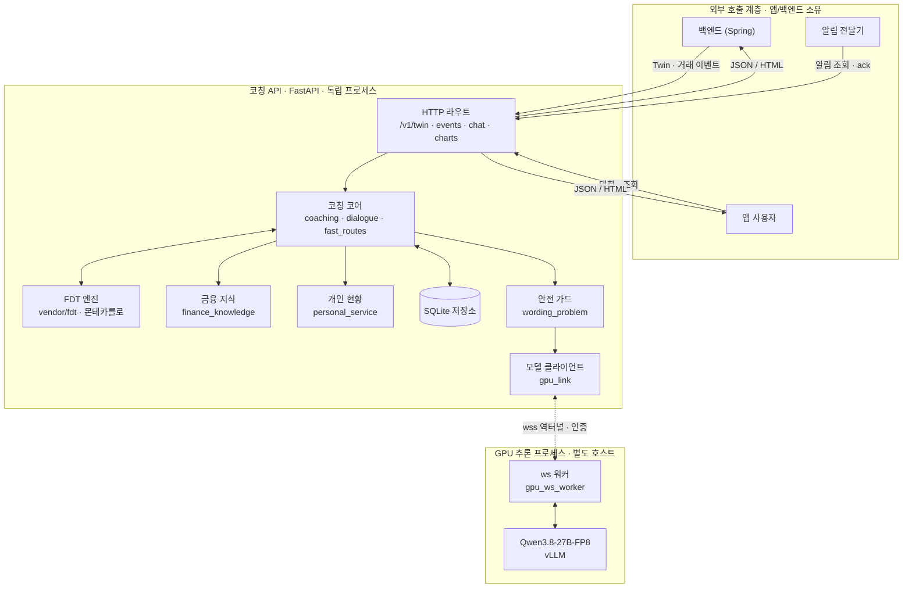
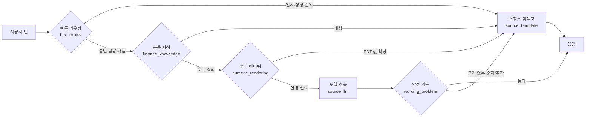
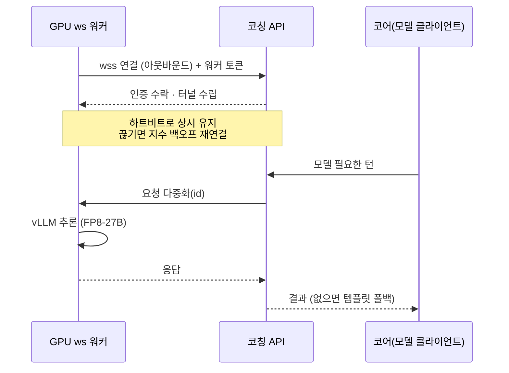

# KeyFin 코칭 AI

거래 이벤트를 받아 예산 초과 징후를 감지하고, 코칭 카드·대화·수치 분석·차트를 돌려주는 독립 Python 서비스입니다. 금액과 예측 구간은 금융 디지털 트윈(FDT)이 계산하고, 언어 모델은 분류와 설명만 맡습니다. 숫자는 엔진이 만들고 모델은 말로 옮긴다 — 이 경계가 서비스 전체의 설계 원칙입니다.

## 핵심 설계

- **FDT가 숫자, 모델은 언어.** 예산 잔액·예측 오차 같은 정량 값은 전부 FDT 엔진(몬테카를로 요일정렬 7일 블록 부트스트랩)이 낸다. 모델은 의도 분류와 문장 생성만 담당해, 모델이 지어낸 숫자가 사용자에게 새어 나가지 못한다.
- **결정론 캐스케이드로 모델 호출 최소화.** 빠른 라우팅 → 금융 지식 → 수치 렌더링을 먼저 태우고, 모델은 정말 필요한 턴에서만 부른다. 실측상 전체 턴의 약 16%만 모델을 거친다. 나머지는 GPU 없이도 즉시 응답한다.
- **안전 가드가 출력을 최종 검문.** `wording_problem()`이 모델 문장에서 근거 없는 숫자·주장·행동·서식을 잡아내면 결정론 문구로 폴백한다. 가드를 통과하지 못한 모델 출력은 사용자에게 도달하지 않는다.
- **GPU는 역터널로 붙는다.** GPU 추론 프로세스가 API로 아웃바운드 연결을 걸어(WebSocket) 방화벽·NAT 뒤에서도 인바운드 개방 없이 동작한다. 워커가 끊기면 API는 즉시 템플릿으로 폴백해 200을 유지한다.

## 시스템 구조



## 요청 처리 캐스케이드

들어온 턴은 값싼 결정론 단계부터 차례로 통과하고, 앞 단계가 답을 확정하면 모델을 건너뛴다. 응답에는 답의 출처(`wording_source`)가 항상 표시된다.



## GPU 역터널 (ws)

GPU 박스가 코칭 API로 먼저 다이얼아웃해 상시 연결을 유지한다. 별도 포트를 열 필요 없이 API 자신의 경로(`/internal/gpu-link`)를 쓰고, 토큰으로 워커를 인증한다.



## 디렉터리 구조

```
.
├── src/coaching_service/   # API·코어·대화·FDT 배선·차트·안전 가드
├── scripts/                # GPU 워커·런타임·레지스트리(gpu_*, run_gpu_ws_worker.sh)
├── vendor/
│   ├── fdt/                # 금융 디지털 트윈 시뮬레이션(몬테카를로)
│   └── keyfin_chart/       # 차트 엔진
├── tests/                  # pytest 스위트(계약·가드 회귀핀·개선 검증)
├── docs/                   # 아키텍처·연구/검증 로그(architecture.md 등)
├── examples/               # 호출 예시
├── Dockerfile              # 코칭 서비스 컨테이너(레포 빌드)
└── pyproject.toml          # 의존성·ruff·basedpyright 설정
```

## 기술 스택

- **서비스**: Python 3.11–3.13, FastAPI, uvicorn, pydantic, anyio, httpx, websockets, jsonschema
- **엔진**: numpy 기반 FDT 몬테카를로(CPU) — 외부 가중치 없이 결정론적으로 재현
- **추론**: vLLM 0.19 + torch 2.10(cu128), Qwen3.8-27B-FP8, GPU 핀(UUID) 격리
- **품질 게이트**: pytest, ruff, basedpyright(typeCheckingMode=all), `uv build --wheel`

## 실행

Python 3.11–3.13과 [`uv`](https://docs.astral.sh/uv/)가 필요합니다.

```bash
uv sync
uv run uvicorn --factory coaching_service.api:from_environment
```

품질 게이트:

```bash
uv run python -m pytest -q
uv run ruff check src tests
uv run basedpyright
```

## 문서

- [아키텍처](docs/architecture.md) — 전체 구성·FDT 내부 계산·차트 생성 순서(Mermaid)
- [외부 호출 인계 계약](docs/app-integration.md) — 앱·백엔드 연동 계약
- [일반 챗봇 응답 경로](docs/general-chat-cascade-r26.md) — 모델 미호출 경로 구조
- [승인 금융 개념 빠른 경로](docs/deterministic-finance-fast-path-r21.md)
- [응답 검증 보고서](docs/chat-response-validation.md) — 수정 전후 실모델 결과 비교
