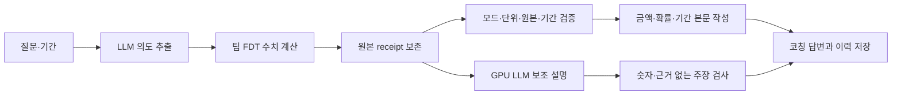

# 답변 수치 누락 수정과 실제 은행 원장 예측 실험

2026-09-14 실행 결과입니다. **GPU 코칭 답변의 필수 수치 전달을 0/14개에서 14/14개로 고쳤고, 공개된 실제 은행 원장에서 7일 총 출금 예측의 평균 절대오차를 기준 모델보다 17.59% 줄였습니다.** 30일에서는 개발 단계가 단순 기준을 선택했습니다. 현재 한국 고객의 소비·잔액 정확도를 확보했다는 결과는 아닙니다.

합성 질문 144/144건과 엔진 회귀 32/32건을 예측 정확도로 바꾸어 해석하지 않습니다. 이번에는 **답변에 계산값이 전달되는가**와 **실제 미래 원장 금액을 얼마나 맞히는가**를 서로 다른 정답으로 측정했습니다. 제품에 반영하는 변경은 검증된 FDT 수치의 답변 조립입니다. 공개 원장의 출금 예측기를 서비스의 소비·잔액 FDT로 교체하지 않습니다.

## 1. 답변에서 빠지던 계산 결과를 수정했다

`Dialogue`가 FDT의 `numeric_result`를 receipt에 보관하고 있었지만, 최종 `rendering.py`는 이를 읽지 않았습니다. LLM에는 금융 수치를 생성하지 못하게 한 상태여서, HTTP 200과 숫자 없는 안전한 문장이 나와도 사용자가 질문한 예측액은 본문에서 빠졌습니다.

새 `numeric_rendering.py`가 모드별로 FDT 수치를 검증해 본문에 넣습니다. 예측에는 소비 평균·분위수·기간말 현금, 위험에는 부족 경로 비율·부족액, 목표에는 목표액·달성 조건·부족액, 가정 비교에는 같은 경로의 금액 차이, 최적화에는 탐색 후보 수·가능 후보 수·선택 결과를 표시합니다. LLM은 보조 설명을 작성합니다.

금액 단위, 유한수, 정수 원화, 확률 범위, 분위수 순서뿐 아니라 원본 Twin의 identity·revision·digest·기준일·요청 모드·예측 기간이 일치해야 수치를 출력합니다. 잘못되거나 누락된 결과를 0으로 바꾸지 않습니다. 현금 정보가 없는 자원 대리값은 현금 잔액으로 표현하지 않으며, 최적화는 유한 후보 탐색으로 설명합니다.

추가 검토에서는 같은 Twin·기간이라도 목표액·가정·난수 조건이 다른 결과를 거부하는 검사가 빠져 있었습니다. FDT가 기록한 `model.request_digest`와 기본값까지 정규화한 현재 요청 해시를 대조하도록 보강했습니다. 목표·가정·seed 변경 3건을 먼저 실패 재현했고, 정상 5모드와 기본값 생략을 포함한 수치 렌더러 테스트 **28/28건**을 통과했습니다.

### 같은 요청의 실제 GPU 실행 전후

수정 전과 수정 후에 실제 HTTP 실행기를 실행했고, 요청 해시 검증까지 보강한 최종본으로 한 번 더 실행했습니다. 같은 24개 시나리오에서 수치 분석 POST 7개를 별도 채점했습니다. GET 재조회는 중복 집계하지 않았습니다. 수정 전과 최종본의 질문·구조화 입력·수치 결과·기간은 7/7쌍에서 정확히 같았습니다. 아래 수정 후 수치는 최종 재실행에서도 동일하게 확인됐습니다.

| 측정 대상 | 수정 전 | 수정 후 | 의미 |
| --- | ---: | ---: | --- |
| 필수 수치 14개 전달 | 0/14 | **14/14** | 모드별 핵심 2개가 올바른 항목·단위와 함께 본문에 있는가 |
| 수치·기간·조건부 한계를 모두 전달한 답변 | 0/7 | **7/7** | risk 2, forecast 2, goal 1, what-if 1, optimize 1 |
| HTTP 계약 검사 | 612/612 | 612/612 | 24시나리오·206 HTTP의 연결·저장·소유권·오류 경계 |
| 생성 요청 HTTP 200 | 41/41 | 41/41 | write 27 + judge 5 + route 9; 문장 품질과 다름 |
| write 문장 채택 / 템플릿 대체 | 23 / 4 | 23 / 4 | 모델이 답했어도 검사에 실패하면 대체 |
| 토큰 사전 검사 HTTP 200 | 41/41 | 41/41 | 이번 실행에서 413 입력 길이 거부 없음 |

대체 4건은 금지된 수치 표현 3건과 근거 없는 주장 1건입니다. GPU 경로는 합성 fault 메타데이터를 실제 모델 오류로 주입하지 않으므로 **자연 발생 모델 출력의 거부**로 집계합니다. 41/41을 LLM 문장 100% 채택으로 해석하면 안 됩니다.

예를 들어 “잔액이 앞으로 어떻게 흘러갈지 예측 결과를 살펴보고 싶습니다”라는 질문에 수정 후에는 **2026-09-15~09-21**, 소비 평균 **3,500원**, 소비 P10·P50·P90 **0원·0원·0원**, 기간말 현금 P10·P50·P90 **1,450,000원**이 본문에 표시됩니다. 희소한 큰 지출 경로 때문에 평균과 분위수는 다를 수 있습니다. 모두 해당 합성 사례의 조건부 계산값입니다.

평가기 `benchmarks/coaching/answer_quality.py`는 제품 렌더러를 가져오지 않고 receipt와 실제 응답 문자열을 비교합니다. 다만 발견한 누락을 대상으로 만든 **회귀 기준**이므로, 비공개 질문 일반화·사람이 느끼는 유용성·금융 예측 정확도의 독립 검증 점수는 아닙니다. 7/7을 전체 코칭 품질 100%라고 부르지 않습니다.

### 원격 API 반영과 복구 검증

최종 wheel을 기존 독립 API에 반영했습니다. 기존 차트 JSON **14/14개가 바이트 단위로 일치**했고, 새 forecast 답변의 소비·현금 수치 7개, 기준일 다음 날부터의 7일 기간, 원본 identity, 코칭 GET, 세션 이력의 본문이 일치했습니다. DB는 사전 온라인 백업과 `quick_check`를 거쳤으며 구조가 유지됐습니다. 기존 모델 프로세스의 소유자·작업 디렉터리·명령·환경·health를 전후 대조했습니다.

최종 시도만 남기지 않고 아래 세 번의 배포 검증을 보존했습니다.

| 시도 | 관측 결과 | 처리 |
| --- | --- | --- |
| 1 | inline 차트 입력은 Twin을 저장하지 않아 대화용 검토 요청이 404 | 기존 API 자동 복구 확인; 같은 합성 입력을 정식 bootstrap 경로로 등록 |
| 2 | 수치 7개는 표시됐지만 GPU 문구가 `unsupported_claim`으로 거부되어 template 반환 | 기존 API 자동 복구 확인; 전부 LLM 채택이어야 한다는 배포 검사와 안전한 응답 계약을 분리 |
| 3 | 수치·원본·기간·저장·기존 차트 검사 통과, 이번 문구는 LLM 채택 | 수정 API 유지, 수치 검증과 문구 채택을 별도 필드로 기록 |

분리한 배포 기준은 모델 HTTP 응답 뒤의 `unsupported_claim`·`numeric_output`만 안전한 문구 대체로 인정하며, 연결 실패·시간 초과·입력 거부는 통과시키지 않습니다. 대체일 때 문구 채택 성공은 반드시 false입니다. **실제 forecast까지 도달한 배포 smoke 2건 중 문구 채택 1건·대체 1건**을 관측했습니다. 이를 위 고정 GPU 실험의 23/27과 합치거나 최종 1건만으로 안정적인 문구 품질을 주장하지 않습니다. develop 머지·상시 운영 자동 복구까지 완료한 배포라는 뜻도 아닙니다.

## 2. AI가 정하지 않은 실제 미래 출금을 정답으로 썼다

[PKDD'99 Berka 공개 은행 자료 설명](https://webpages.charlotte.edu/mirsad/itcs6265/group1/domain.html)과 [거래 필드 설명](https://webpages.charlotte.edu/mirsad/itcs6265/group1/transaction_domain.html)을 대조했습니다. 1993~1998년 체코 은행 원장 **1,056,320행·4,500계좌**입니다. [고정 revision의 미러](https://github.com/jlacko/berka-dataset/tree/77e9972a1ead107e5f42a91dd989d587bff055a4)에서 원본을 받고 SHA256을 확인했습니다.

정답은 기준일 이후 `VYDAJ` 거래액을 정수 소액 단위로 합산한 **총 계좌 출금(CZK)**입니다. LLM·FDT 계산 함수를 정답 생성에 사용하지 않았습니다. 내부 이체·현금 인출도 계좌 출금일 수 있으므로 소비로 해석하지 않습니다. 사람의 독립 정답 승인이 완료된 원장 감사와도 구분합니다.

문서에 정의되지 않은 `type=VYBER` 16,666행이 존재했습니다. 이를 출금이나 0으로 임의 치환하지 않고, 해당 거래가 한 번이라도 있는 **1,144계좌 전체를 제외**했습니다. 나머지 중 개설일 조건을 통과한 2,674계좌를 분리했습니다. 전체 기간 품질로 계좌를 고르는 후향적 선택 편향이 있습니다.

| 구분 | 계좌 | 기간과 용도 |
| --- | ---: | --- |
| 추가 학습 | 2,374 | 1997-01-01~12-31 일별 365개; 개발·평가 계좌 제외 |
| 개발 | 100 | 기준일 1998-01-31, 03-31, 05-31 × 7·30일 = 600사례; 후보 선택 |
| 최종 평가 | 200 | 기준일 1998-07-31, 09-30, 11-30 × 7·30일 = 1,200사례; 고정 후 점수 계산 |

모든 입력은 **기준일을 포함한 과거 365일**, 정답은 **기준일 다음 날부터 7일 또는 30일**입니다. 예를 들어 1998-07-31 마감의 30일 예측은 08/01~08/30이며 달력상의 8월 전체가 아닙니다. 학습·개발·평가는 계좌와 시간 모두 분리했고, 같은 계좌의 반복 사례는 독립 고객으로 세지 않았습니다. 분할 키는 가명 계좌 해시이며 재식별 불가능한 익명화라는 뜻은 아닙니다.

GPU에는 `model_inputs.json`만 전달했고 개발·평가 정답 파일은 전달하지 않았습니다. 실행 입력·원본·프로토콜·예측을 해시로 고정하고, 개발 정답만으로 `selection.json`을 저장한 다음 별도 명령에서 최종 정답을 열었습니다. 선택·예측 변조, 누락 사례, 잘못된 분할과 날짜는 거부합니다. 실행 당시 소스 사본을 runtime 해시와 대조하고 계산 함수·입력 계약 12개 선언의 AST도 직접 검증했습니다.

최종 공개 후에는 평가 모듈을 import하지 않는 별도 계산으로 원본 미래 출금을 다시 집계했습니다. **1,200개 정답이 모두 정확히 일치**했고, 선택 예측의 MAE·WAPE·편향과 계좌 bootstrap 신뢰구간도 재현됐습니다. 이 재검산은 코드의 산술 검증이며 독립 인간 정답 승인을 뜻하지 않습니다.

## 3. 실제 GPU 추론과 두 조건 추가 학습

6개 단순 기준과 4개 신경망 후보를 같은 1,800개 개발·평가 입력에 실행했습니다. 모델은 **실행 때 해시를 기록한 로컬 `Chronos2Pipeline` 체크포인트**입니다. `base`라는 내부 후보명만으로 공식 원본 가중치와 정확히 동일하다고 주장하지 않습니다. 정확한 체크포인트 해시는 이번 프로토콜에 사전 등록하지 않았고, 런타임에서 기록했습니다.

- 공통: context 365, prediction length 30, batch 64, seed 712, cross-learning 비활성화.
- 기본 일별 후보: SDK 점예측 출력의 음수를 0으로 제한한 뒤 기간 합계. 아래 구현상 의미를 확인해야 함.
- 기본 누적 후보: 누적 시계열의 미래 종점 P50에서 마지막 관측 누적값을 뺌. 하한 0.
- 추가 학습: 각각 새 기본 체크포인트에서 full fine-tuning, 학습률 `1e-6`와 `3e-6`, min-past 60, **128 steps 요청**. 일별 자료로 학습하고 일별 합계로 평가.
- 개발에서 10개 단일 후보와 사전 지정한 4개 50:50 혼합을 비교해 기간별 MAE 최소 선택. 평가 점수를 본 후 다른 후보로 교체하지 않음.

**프로토콜 표현과 SDK 구현의 차이:** 설치된 chronos-forecasting 2.3.1의 `predict_quantiles()`는 반환값 이름을 `mean`이라고 하지만 실제로는 학습 분위수의 **0.5, 즉 일별 중앙값**을 반환합니다. 실행 소스 확인에서 이를 발견했습니다. 따라서 이번 일별 후보는 **일별 P50을 합한 점예측**이며 기대 출금액이나 기간 전체 P50을 산출한 것이 아닙니다. 프로토콜의 “일별 평균”이라는 표현은 부정확했습니다. 실행 코드·예측·선택·점수는 변경하지 않았고, 다음 프로토콜에서는 이 차이를 사전에 명시해야 합니다.

두 fit 호출은 완료됐고 학습 전후 가중치 해시가 달랐습니다. 학습 호출 전체 시간은 각각 **11.25초·10.37초**, 최대 예약 메모리는 **3.46·3.45GiB**였습니다. 1,800개 추론 시간은 기본 일별 1.00초, 누적 0.65초, 학습 후보 0.52초·0.52초입니다. 모델 적재·전송·전처리 전체 서비스 지연을 뜻하지 않습니다.

라이브러리 로그에는 학습 runtime 8.121초·8.326초와 학습 loss 2.137·2.005가 남았습니다. loss는 미래 금액 오차나 고객 정확도가 아닙니다. 별도 trainer state가 남지 않아 **optimizer 갱신이 정확히 128회였다는 독립 검증은 하지 못했습니다.** 근거는 128 steps 요청, fit 완료, 가중치 변경, 후속 추론 완료까지입니다. 실험 패키지는 torch 2.7.1+cu128, transformers 5.16.1, chronos-forecasting 2.3.1, numpy 2.5.3이었습니다.

## 4. 선택을 고정한 뒤 얻은 최종 결과

기간마다 **같은 평가 계좌 200개 × 기준일 3개 = 600사례**입니다. 각 금액은 CZK이며 원화로 바꾸어 표시하지 않았습니다.

| 기간 | 개발에서 고정한 선택 | MAE(CZK) ↓ | WAPE ↓ | 평균 편향(CZK) |
| --- | --- | ---: | ---: | ---: |
| 7일 비교 기준 | 과거 같은 일자 평균 | 2,014.76 | 69.05% | +64.57 |
| 7일 선택 | 같은 일자 평균 + 추가 학습 `3e-6`, 50:50 | **1,660.33** | **56.90%** | **−649.56** |
| 30일 비교 기준 = 선택 | 과거 365일 일평균 | **3,898.31** | **36.74%** | +1,181.87 |

7일 MAE는 **354.42 CZK, 상대 17.59% 감소**했습니다. WAPE는 **12.15%p 감소**했습니다. 계좌 단위 2,000회 paired bootstrap에서 `선택 WAPE − 기준 WAPE`의 95% 구간은 **−19.26~−6.35%p**입니다. 이번 코호트에서 오차 감소 근거가 있지만, 평균 **649.56 CZK 과소 예측**이 남았고 편향은 기준보다 악화했습니다. 현금 부족 위험까지 개선했다고 판단할 수 없습니다.

30일은 개발 단계에서 단순 기준을 선택했으므로 추가 학습 채택 근거가 없습니다. 이 결과를 “전 기간 성능 개선”으로 묶지 않습니다.

### 모든 단일 후보의 평가 결과

선택 뒤 공개한 진단표입니다. 아래 순위를 이용해 최종 승자를 재선택하지 않았습니다.

| 후보 | 7일 MAE | 7일 WAPE | 30일 MAE | 30일 WAPE |
| --- | ---: | ---: | ---: | ---: |
| 최근 28일 평균 | 3,460.06 | 118.58% | 4,952.66 | 46.68% |
| 최근 90일 평균 | 3,331.70 | 114.18% | 4,341.92 | 40.92% |
| 최근 365일 평균 | 3,291.71 | 112.81% | 3,898.31 | 36.74% |
| 요일·전체 평균 혼합 | 3,291.60 | 112.81% | 3,899.59 | 36.75% |
| 과거 같은 일자 평균 | 2,014.76 | 69.05% | 3,915.36 | 36.90% |
| 같은 일자·최근 평균 혼합 | 2,498.06 | 85.61% | 3,995.97 | 37.66% |
| 로컬 체크포인트 일별 | 1,841.94 | 63.13% | 5,961.36 | 56.19% |
| 로컬 체크포인트 누적 | 1,983.32 | 67.97% | 3,964.79 | 37.37% |
| 추가 학습 `1e-6` | 1,996.72 | 68.43% | 6,371.10 | 60.05% |
| 추가 학습 `3e-6` | 1,862.01 | 63.81% | 5,571.03 | 52.51% |

학습한 모델 하나만으로 기본 일별 모델보다 7일 오차가 낮아진 것은 아닙니다. 개선은 개발에서 고른 **달력 평균과 학습 모델의 점예측 조합**에서 발생했습니다. “파인튜닝 자체가 17.59% 개선했다”는 설명은 틀립니다.

### 수치 읽는 법

- **MAE** = `평균(|예측 출금−실제 출금|)`. 7일 1,660.33은 한 계좌의 한 7일 구간에서 평균적으로 그만큼 틀렸다는 뜻입니다. 하루 오차가 아닙니다.
- **WAPE** = `절대오차 합 / 실제 출금 합`. 7일 실제 합은 1,750,745 CZK, 30일은 6,365,956.9 CZK입니다. WAPE는 100%를 넘을 수 있고, `100−WAPE`는 정확도가 아닙니다.
- **편향** = `평균(예측−실제)`. 음수는 과소 예측, 양수는 과다 예측입니다. 평균 절대오차 개선과 별도로 봅니다.
- **95% bootstrap 구간**은 같은 계좌의 세 기준일을 묶어 재표집한 비교의 변동성입니다. 개별 미래 금액의 95% 예측 구간이 아닙니다. 고객 복수 계좌와 공통 달력 충격의 의존성을 모두 제거하지는 못합니다.
- 이번 후보들은 점 예측만 평가했습니다. SDK의 일별 P50 합계를 점예측 후보로 사용했지만 이를 기간 P50 또는 확률 구간으로 해석하지 않습니다. 구간 포함률·WIS·현금 부족 확률은 이번 점수에 없습니다.

## 5. 채택과 남은 검증

**제품 답변에는 수치 조립 수정을 반영합니다.** 예측·위험·목표 등 FDT 계산이 사용자에게 누락 없이 전달되는 회귀 증거를 확보했습니다. 모델의 근거 없는 문장 거부 4/27과 사람의 코칭 유용성 평가는 별도 개선 대상입니다.

**공개 출금 연구에서는 7일 혼합 후보를 기록하고 30일 기준 모델을 유지합니다.** 체코 출금의 입력·타깃은 한국 서비스의 소비 봉투·잔액과 다릅니다. 따라서 이 결과만으로 제품 FDT를 교체하거나 Jira 104의 실제 고객 예측 검증을 완료 처리하지 않습니다.

다음 실험은 기존 시험을 재사용해 성과를 올리는 방식으로 진행하지 않습니다. 학습 자료의 0일 비율이 88.47%인 점을 근거로, 새로운 미사용 계좌·시간에서 **지출 발생과 양수 금액 분리**, **과거 7·30일 합계의 중앙값**, **기준일 전에 이미 알려진 예정 결제**를 사전 등록해 비교할 수 있습니다. R7 SEED에서는 기준일 이후 등장한 등록금 거래가 큰 오차를 만들었지만, 미래 정답의 예정 표시를 과거 입력으로 넣는 보정은 하지 않았습니다.

현재 한국 고객 수준으로 검증하려면 거래 발생일 외에 수신 시각 `available_at`, 수집 누락 여부, 취소·이체·카드 대금의 별도 원장 정답, 예측 전에 알려진 예정 결제, 실제 미래 잔액이 필요합니다. 예측을 먼저 저장하고 실제 7·30일이 지난 뒤 정산해야 합니다. [실제 고객 검증 계약과 Jira 범위](real-customer-validation.md)를 따릅니다.

공개 자료에는 수신 시각·폐쇄 시각이 없고 기록 없는 날을 0으로 두었습니다. 지원되지 않는 거래 계좌 제외, 국가·시대 차이, 계좌와 고객의 불일치, 공개 자료의 모델 사전학습 포함 여부 미확인도 한계입니다. 코드·분할·출처에 대한 별도 검토 패스와 지표 재검산을 수행하지만, 독립 인간 정답 승인이나 별도 외부 금융 감사가 완료됐다는 뜻은 아닙니다.

## 재현 코드와 증거 보관

최종 소스 전체 테스트는 **529개 통과**했고, Ruff와 제품 코드 basedpyright는 오류 없이 통과했습니다. Starlette 테스트 도구의 `anyio.abc.BlockingPortal` 별칭 사용에 대한 외부 의존성 deprecation 경고 1건이 남았습니다. 제품 wheel을 빌드하고 실험 코드·테스트·원자료가 패키지에 포함되지 않는지 확인했습니다.

실행 코드는 `benchmarks/coaching/answer_quality.py`와 [`benchmarks/forecast/public_bank/`](../benchmarks/forecast/public_bank/README.md), 코드 자체의 검사는 `tests/test_answer_quality.py`, `tests/test_numeric_rendering.py`, `tests/forecast/test_public_bank*.py`입니다. 원자료·개별 예측·GPU 원문 응답·체크포인트·배포 비밀 설정은 Git에 포함하지 않습니다. 재현 명령과 수집 규약은 각 실험 README를 따릅니다.

| 보관된 증거 | SHA256 |
| --- | --- |
| 수정 전 GPU HTTP 보고서 | `0d0b0473aa2e8244811eea0449f33e114fe816c477c97a748f55b46efa5e7359` |
| 첫 수정 후 GPU HTTP 보고서 | `f2faaa48657b75cbdd547a811675d93c22439805d5951f5eabe71f28032d4d63` |
| 요청 해시 검증 포함 최종 GPU HTTP 보고서 | `dc7f7b14b567e62c620c51302a470dfcd5ecf39da61931558301e404a98dc741` |
| 공개 원장 model_inputs | `50614232afa766928eddc43ee2b0ad1bf9fda68739850b35b7fedfe73df86a89` |
| 고정 프로토콜 | `d2f6e58339ca22e7986967a703312799dbcebe5f05f18bc6122e25e71505032b` |
| 최종 평가 정답 | `f0504f42dc03bd5a6ab9a28f3b1aedfe5df5ff4941f7c30660b1ed136c173afb` |
| 최종 출금 평가 보고서 | `c32183393603b7761399e424e1bec55ef8a3d17a1d7b6621fdd4ceecdf666897` |
| 실행 당시 소스 수집본 | `b1cc48aebe0fa686c17c65d2c99bc334b66152e071915e105298b94baaf9db47` |
| 원본 정답·선택 점수 별도 재계산 스크립트 | `7bb58324e6b05b4ad57481d28e91f7e5586aa2ce15465eb10480b2885e3ba8ea` |
| 기본 가중치 결합 해시 | `b96c19c79a8698273c16adcb1342830cd0070dd31adec771ac8f8ddea4490e9d` |
| 최종 API wheel | `3683d41e9fe5f21d06989fc810e6a01532c07ddbf490a71472b5aca9a95b50cb` |
| 최종 API 배포·조회 검증 기록 | `a2681cd181fc3e62f28b32ed5b14f9eaaa8a5c868aab6a41cbd54672a143eef5` |

해시는 자료의 출처·수집 무결성을 대조하는 수단이며 정답의 외부 승인이나 보고 내용의 독립적 진실성을 대신하지 않습니다.
