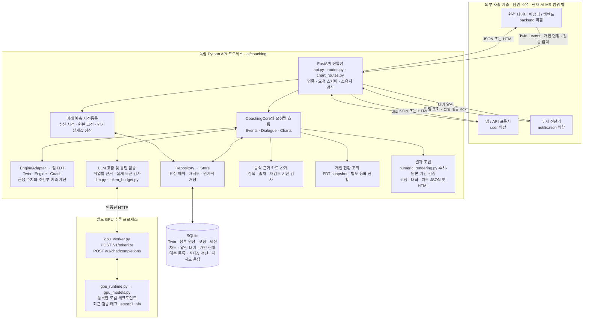
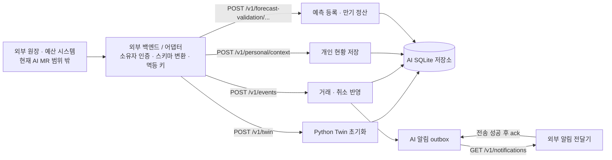
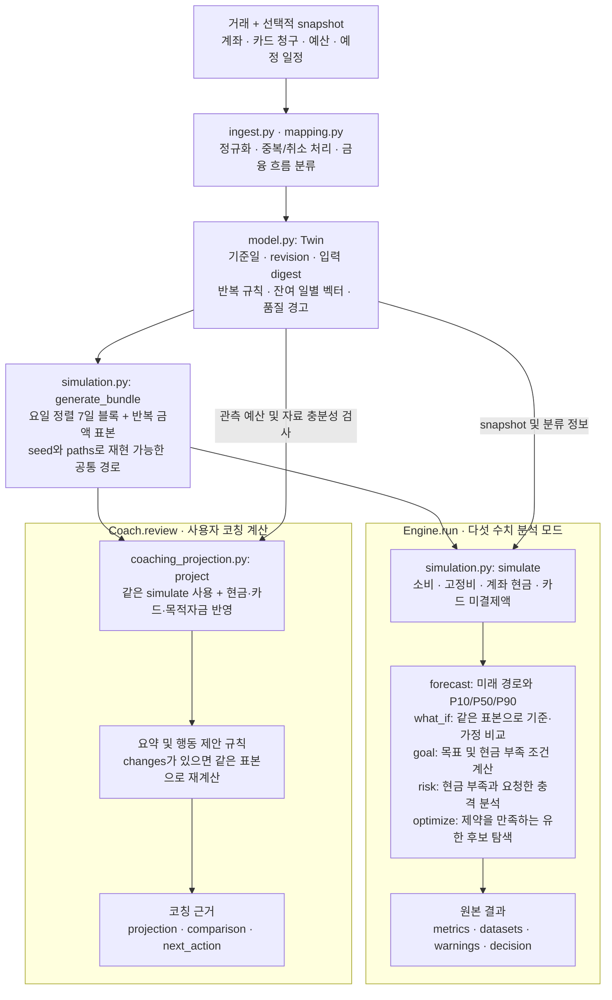
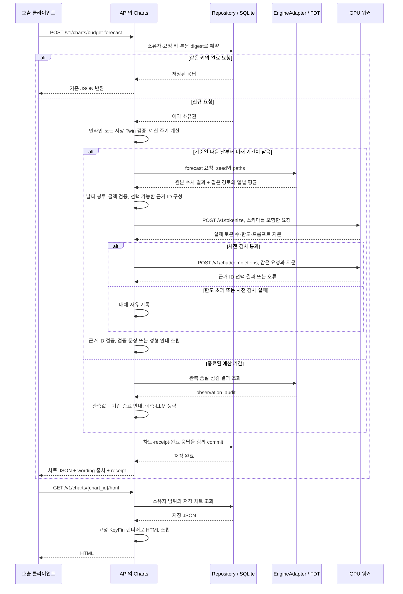

# AI·FDT 구조와 기간 계약

**현재 구조는 Python 코칭 API 안의 FDT 계산 엔진, 별도 GPU 추론 프로세스, SQLite 저장소로 구성됩니다.** FDT의 `Twin`은 거래·잔액·반복 규칙·행동 통계를 표현하는 객체이고, SQLite는 이 상태와 코칭 결과를 보관합니다. 금융 예측 수치는 FDT가 계산하며 LLM은 판단·라우팅·근거 선택·보조 설명을 맡습니다.

2026-09-15 현재 AI MR의 `ai/coaching` 구현을 기준으로 작성했습니다. 도식의 외부 호출 계층은 인계 경계이며 앱·백엔드 구현이 이 MR에 포함됐다는 뜻이 아닙니다. 파일명은 아래 코드 연결 표와 대응합니다.

GitLab에서 첫 로드에 `Syntax error in text`가 보이면 페이지를 새로고침해 확인합니다. 검증 중 같은 Mermaid 원문이 첫 로드에서는 실패하고 재로딩 후 정상 표시되는 경우를 관찰했습니다. 유사 현상은 [GitLab 이슈 #370176](https://gitlab.com/gitlab-org/gitlab/-/work_items/370176)에 기록되어 있으며, 이 문서 변경이 GitLab 렌더러의 간헐적 오류까지 해결한 것은 아닙니다.

## 전체 구성

`CoachingCore`가 FDT 어댑터·모델 클라이언트·저장소를 연결하고, 요청 종류에 따라 `Events`, `Dialogue`, `Charts`가 호출 순서를 정합니다. FDT는 API 프로세스 안에서 스레드 실행 제한을 두고 호출하는 Python 코드입니다. 별도 FDT HTTP 서버를 호출하는 구성이 아닙니다.

대화의 `numeric_result`는 `numeric_rendering.py`에서 원본 Twin과 요청 기간에 일치하는지 검사한 뒤 본문에 들어갑니다. 금액·확률을 LLM이 재작성하지 않습니다. R12에서 수정한 수치 누락과 실제 응답 비교는 [답변·예측 개선 결과](answer-forecast-improvement.md)에 있습니다.

알림은 SQLite의 outbox에 저장한 뒤 조회·ack API로 전달 여부를 관리합니다. 실제 푸시 발송, 금융기관 데이터 자동 동기화, 자동 재시작 운영은 별도 연결이 필요합니다. 엔진이나 LLM이 실제 이체·결제를 실행하지 않습니다.

앱·백엔드 구현은 현재 AI MR의 소유 범위가 아닙니다. [외부 호출 인계 계약](app-integration.md)은 이들이 Python API에 제공해야 할 인증 역할·데이터·호출 순서만 정의합니다. 금융 검색은 [자료 관리](knowledge-retrieval.md), 개인 현황은 [조회 범위](personal-context.md)를 따릅니다. [예측 검증 API](forecast-validation.md)는 생성 시점의 원본 예측을 고정하고 만기가 지난 뒤 동일 기간 원거래를 별도 코드로 합산합니다. 이 기능의 구현·합성 테스트 성공은 실고객 미래 예측 정확도 확보를 의미하지 않습니다.

## 외부 원천 연동 경계

Python API는 외부 원천 DB를 직접 조회하지 않으며 Spring·JDBC·JPA 원천 어댑터나 외부 재시도 worker를 포함하지 않습니다. 외부 호출 계층이 권위 있는 소유자와 원천 데이터를 확정해 API 스키마로 변환해야 합니다. AI API가 보유한 outbox는 코칭 알림의 조회·ack 저장소이며 실제 푸시 전송은 수행하지 않습니다. 이전 R15의 외부 원천 동기화 실험은 [과거 검증 보고서](coaching-completion-r15.md)에 현재 MR 제외 범위를 명시해 보존합니다.

[R15 GPU 연구](aggregate-forecast-r15.md)의 추가학습 모델은 위 제품 실행 경로와 별도의 후보입니다. 과거 체코 총출금 개선을 한국 7봉투 FDT 교체나 실고객 검증 완료로 연결하지 않습니다.

## FDT 안에서 예측과 코칭을 계산하는 방법

현재 팀 엔진의 모델 버전은 **`calendar-block-bootstrap/2.0`**입니다. 거래에서 반복 일정과 나머지 일별 금융 흐름을 만들고, 요일이 맞는 과거 7일 블록을 재표본추출합니다. 충분한 블록이 없으면 요일별 일 표본으로 대체하고 경고를 남깁니다. 입력 이력 길이는 거래 자료로 결정하며 항상 과거 365일로 고정하지 않습니다.

수치 분석과 코칭 검토는 같은 `Twin`·표본 생성·시뮬레이터를 사용하지만 반환 형식과 추가 계산이 다릅니다. `EngineAdapter.numeric()`은 `Engine.run()`, `EngineAdapter.review()`는 `Coach.review()`에 연결됩니다. 코칭의 자료 부족·기준일 불일치 처리는 일부 계산이나 행동 제안을 중단할 수 있습니다.

차트는 `Engine`을 상속한 `ChartEngine`으로 `forecast`를 한 번 실행합니다. 전체 소비 P50을 계산한 **동일한 Simulation**에서 날짜별·7개 봉투별 평균을 얻습니다. 누적 P50을 나누어 미래 일별 막대를 만드는 방식이 아니며, 일별 평균의 합과 누적 P50을 억지로 일치시키지 않습니다.

잔액·카드 정산 정보가 부족하면 절대 현금 예측이 `null` 또는 자료 부족으로 표시됩니다. 모델 확률과 분위수는 실세계 정확도가 보장된 값이 아닙니다. `optimize`의 최적성 범위는 요청한 유한 격자 후보이며 실제 금융 행동을 실행하지 않습니다.

## 요청 종류에 따른 실행 경로

| 요청 | 호출 순서 | 저장 또는 응답 |
| --- | --- | --- |
| 초기 입력·거래 이벤트 | `Events` → FDT 정규화/갱신 → `Ledger` 결제·취소 처리 | Twin·봉투 원장·revision을 원자적으로 반영 |
| 결제 후 코칭 | 결제 규칙 감지 → `Coach.review` → 모호한 경우 LLM `judge` → 검증된 설명 | 코칭 발생 시 코칭과 알림 outbox를 원장 변경과 함께 저장 |
| 코칭 검토 | `Dialogue.review` → `Coach.review` → LLM 보조 설명 | 원본 receipt와 코칭 저장; 알림은 만들지 않음 |
| 후속 질문 | 명시적 `analysis.mode=forecast|risk`는 경로 확정, 그 밖의 요청은 LLM `route`; 분석일 때 기간 검사 → `Coach.review` → 필요한 `Engine.run` | 개념·소비는 답변과 세션, FDT 분석은 원본 receipt와 세션·코칭 저장 |
| 예산 차트 | `Charts.forecast` → `ChartEngine` → 차트 계약 검사 → LLM 근거 ID 선택 | 차트 JSON·원본 receipt 저장, 별도 GET에서 HTML 조립 |

LLM의 자동 라우팅 값은 현재 `review`, `forecast`, `risk`, `finance`, `history`, `personal`, `other`입니다. [일반 금융 질문과 소비 조회의 분기 구조](chat.md)는 이전 코칭 없이도 동작합니다. `what_if`, `goal`, `optimize`도 엔진에 구현되어 있지만, 대화에서는 호출자가 요청의 구조화된 `analysis`에 조건을 제공해야 합니다. 모든 자연어 질문에서 다섯 모드의 조건을 자동으로 완성하는 기능으로 표현하지 않습니다. 일반 기간은 `period_request.py`·`periods.py`가, 차트 주기는 `chart_contract.py`가 검사합니다.

## 차트 한 건이 만들어지는 순서

금융 입력·계산 계약 위반은 오류 응답으로 끝나며 차트를 저장하지 않습니다. LLM 실패는 수치를 유지한 정형 안내와 `fallback_reason`으로 구분합니다. 긴 추론 중 DB 쓰기 트랜잭션을 열어두지 않고, 마지막 commit에서 예약 소유권을 다시 검사합니다. `wording.source=llm`인 차트도 GPU가 금액이나 HTML 코드를 자유롭게 생성한 결과가 아니라, 허용된 근거 ID 선택을 채택했다는 뜻입니다.

## 도식에서 실제 코드로 이동하기

| 도식 요소 | 코드 |
| --- | --- |
| API·요청별 흐름 | [`api.py`](../src/coaching_service/api.py), [`coaching.py`](../src/coaching_service/coaching.py), [`events.py`](../src/coaching_service/events.py), [`dialogue.py`](../src/coaching_service/dialogue.py), [`charts.py`](../src/coaching_service/charts.py) |
| FDT 연결·차트 경로 추출 | [`engine.py`](../src/coaching_service/engine.py), [`chart_engine.py`](../src/coaching_service/chart_engine.py) |
| Twin·다섯 모드·시뮬레이션 | [`vendor/fdt/model.py`](../vendor/fdt/model.py), [`engine.py`](../vendor/fdt/engine.py), [`simulation.py`](../vendor/fdt/simulation.py) |
| FDT 코칭 계산 | [`coaching.py`](../vendor/fdt/coaching.py), [`coaching_projection.py`](../vendor/fdt/coaching_projection.py) |
| 근거·모델 검증 | [`evidence.py`](../src/coaching_service/evidence.py), [`chart_wording.py`](../src/coaching_service/chart_wording.py), [`llm.py`](../src/coaching_service/llm.py), [`token_budget.py`](../src/coaching_service/token_budget.py) |
| 추론 워커·모델 로딩 | [`gpu_worker.py`](../scripts/gpu_worker.py), [`gpu_runtime.py`](../scripts/gpu_runtime.py), [`gpu_models.py`](../scripts/gpu_models.py) |
| 저장·차트 출력 | [`repository.py`](../src/coaching_service/repository.py), [`store.py`](../src/coaching_service/store.py), [`chart_projection.py`](../src/coaching_service/chart_projection.py), [`chart_rendering.py`](../src/coaching_service/chart_rendering.py) |

추론 모델·revision·NF4/BF16 조합은 [운영 설정](operations.md)에 있습니다. `benchmarks/`의 후보 비교·추가 학습·점수 산출은 [오프라인 실험 경로](../benchmarks/README.md)이며 API 요청 중 실행되지 않습니다. 이번 도식은 현재 배포 구조를 설명하며 과거 실험 모델을 모두 동시에 호출하는 구성으로 그리지 않았습니다.

2026-09-17 갱신: 서빙에 FP8 옵션(`prod27_fp8`)과 결정론 라우팅 확대가 추가됐습니다. 지연 지배항은 라우팅/선택 LLM 호출이며, 이를 결정론 경로로 줄이고 남는 호출은 FP8+vLLM 연속 배칭으로 가속했습니다(동시 8요청 실측 9.1배, 정확도 무회귀). 종합 결과·응답 흐름도는 [성능·기능 고도화 개요](performance-r53/README.md)에 있습니다. 기본 서비스 모델은 바뀌지 않았고 FP8는 태그로 선택하는 옵션입니다.

## 책임 구분

FDT 원본은 commit `307de59c9d1fde01774388257da27730754e5118`에서 가져온 21개 파일입니다. 시작 시 [`ENGINE_MANIFEST.json`](../ENGINE_MANIFEST.json)의 SHA-256으로 확인합니다. 엔진 갱신은 파일과 manifest를 함께 검증하는 별도 변경으로 진행합니다.

LLM은 결제 상황이 코칭 대상인지 판단하는 보조 분류, 질문의 분석 종류·조건 추출, FDT 결과 설명을 맡습니다. 모델 출력은 곧바로 거래·잔액·알림 확정값이 되지 않습니다. 원장의 사용자 격리, 중복 이벤트, 버전 충돌과 수치 검사는 API가 처리합니다. 서버가 보관한 원본 FDT 결과는 설명에 필요한 일부 근거를 선택하더라도 유지합니다.

추론 실패·잘못된 숫자·규격 위반은 템플릿으로 대체됩니다. 따라서 **API 성공률, LLM 설명 채택률, 미래 소비 예측 오차는 서로 다른 지표**입니다.

## 입력 길이 계약

과거에는 근거 JSON의 글자 수만 검사해 서비스 요청은 통과했지만 추론 서버에서 `HTTP 413: input_token_limit`이 발생했습니다. 현재는 중복 근거를 줄이고 작업에 필요한 필드만 보내며, 같은 요청 본문을 `/v1/tokenize`로 먼저 측정합니다.

추론 서버는 채팅 템플릿과 응답 규격까지 포함한 실제 토큰 수, 요청 해시, 프롬프트 해시를 반환합니다. 서비스는 서버 한도와 일치하는 요청만 생성에 사용합니다. 현재 워커의 최대 입력은 8,192토큰, 최대 출력은 1,536토큰입니다. 글자 수와 HTTP 본문 크기 제한도 별도로 유지합니다. 다른 모델/토크나이저를 연결할 때도 이 계약을 충족해야 합니다.

## 기준일과 예측 기간

`as_of`는 관측을 마친 날짜입니다. 기본 미래 예측은 **다음 날부터 종료일까지**입니다. 입력은 날짜 전용 `YYYY-MM-DD`이며 시간 문자열은 받지 않습니다.

| 요청 `period` | 2026-09-10 기준 의미 | 미래 계산 날짜 |
| --- | --- | --- |
| `{"kind":"rolling_days","days":30}` | 앞으로 30일 | 9월 11일~10월 10일 |
| `{"kind":"rolling_days","days":30,"include_reference_date":true}` | 기준일을 포함한 달력 30일 | 관측일을 제외한 9월 11일~10월 9일, 미래 29일 |
| `{"kind":"month_end"}` | 이번 달 말까지 | 9월 11일~9월 30일 |
| `{"kind":"through_date","end_date":"2026-10-10"}` | 명시한 목표일까지 | 9월 11일~10월 10일 |

응답의 해석된 기간과 종료일을 화면에 함께 표시해야 합니다. ‘이번 달 예산’에 자동으로 30일 예측을 붙이지 않습니다. 분석 요청의 구조화된 기간과 질문에서 추출한 기간이 충돌하면 명확한 계약 검사를 거칩니다.

미래 기간은 1~90일을 지원합니다. 계산할 미래 날짜가 없거나 범위를 넘으면 422입니다. 그레고리력 월말과 윤년의 2월 29일은 처리하지만 음력 윤달과 공휴일 출금일 조정은 구현 범위에 포함하지 않습니다. 90일 요청 지원과 90일 예측 정확도 입증은 별개이며, 현재 데이터로 후자는 확인하지 못했습니다.
