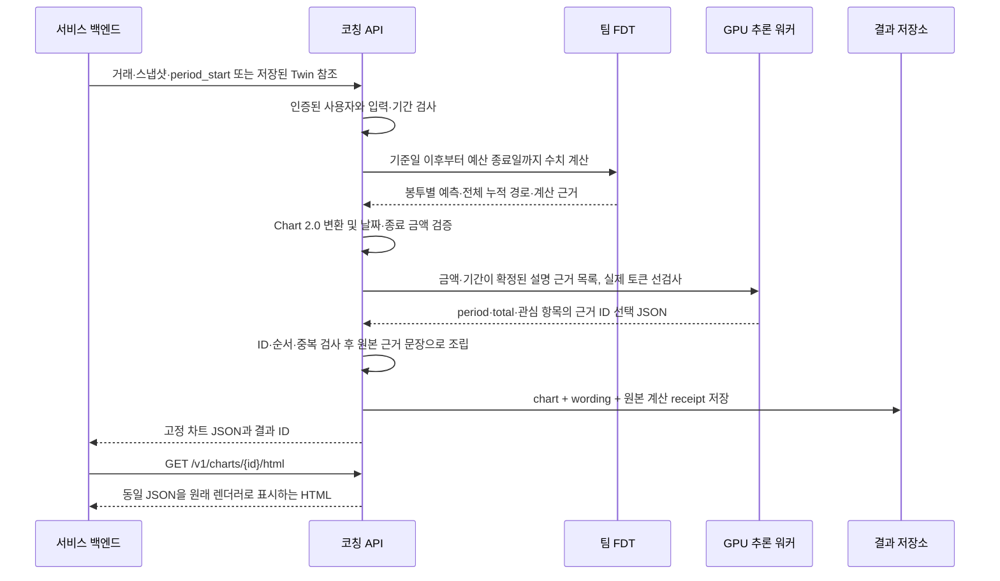

# 거래 입력에서 KeyFin 차트까지

`POST /v1/charts/budget-forecast`에 거래·기준일·예산 시작일을 보내면, 서버가 FDT 예측을 계산하고 연결된 GPU 모델에 설명을 요청한 뒤 **고정된 KeyFin Chart 2.0 JSON**을 반환합니다. 같은 결과를 원래 차트 형식의 독립 HTML로 조회할 수 있습니다. 프런트엔드에서 금액을 다시 예측하거나 LLM에 HTML을 작성시키지 않습니다.

## 요청과 결과의 흐름



예측 금액은 기존 비교에서 채택한 팀 FDT가 담당합니다. **GPU 모델은 설명에 넣을 근거를 선택**하며, 서버가 검증된 문장으로 조립합니다. `wording.source=llm`은 이 선택이 채택됐다는 뜻이며, 모델이 금액을 계산하거나 자유롭게 금융 문장을 작성했다는 뜻이 아닙니다. 이번 연결에서 소비 예측 모델을 새로 학습하거나 교체하지 않았습니다.

모델 출력은 `{"selected_fact_ids":["period","total","category:외식"]}`처럼 주어진 ID만 허용합니다. 재질문, 알 수 없는 ID, 중복, 추가 금액 필드 등은 거절합니다. 모델이 없거나 검증에 실패하면 차트의 수치는 유지하고 원본 근거로 정형 안내를 만들며 `wording.source=template`과 `fallback_reason`을 남깁니다. 예산 기간이 이미 끝났으면 관측 결과만 반환하고 모델을 호출하지 않습니다.

## API 사용

| API | 권한과 동작 |
| --- | --- |
| `POST /v1/charts/budget-forecast` | backend 토큰, `Idempotency-Key` 필수. 생성 후 결과 저장 |
| `GET /v1/charts/{id}` | 같은 소유자의 user 또는 backend 토큰. 저장한 JSON 반환 |
| `GET /v1/charts/{id}/html` | 같은 소유자만 독립 HTML 조회. 다른 사용자에게는 404 |

예측·구매 검토 대화(`Coaching`)는 이 엔드포인트로 보낼 본문을 `chart_hint`로 미리 알려줄 수 있습니다. `chart_hint.period_start`(대화 기준일이 속한 예산 월의 1일)와 `question`을 그대로 사용하면 같은 예산 월의 차트를 얻습니다. 대화와 차트 엔드포인트는 분리되어 있어(옵션 b), 서버는 대화에서 두 번째 시뮬레이션을 돌리지 않습니다. 자세한 대화 계약은 [대화 API](chat.md)를 참고합니다.

`data`는 기존 [`Bootstrap`](../src/coaching_service/schemas.py)의 `as_of`, `transactions`, `snapshot`, `envelopes` 구조입니다. 인라인 `data`를 보내면 해당 요청의 원장으로 계산하고, 저장된 Twin 원장을 덮어쓰지 않습니다. `data`를 생략하면 `POST /v1/twin`으로 저장해 둔 인증 사용자 원장을 사용합니다. 사용자 ID를 본문에 바꾸어 넣어 다른 사람의 원장으로 실행할 수 없습니다.

서비스 디렉터리에서 [시작 안내](../README.md)의 개인 테스트 토큰을 유지한 상태로 호출합니다. 아래 예시는 기존 합성 입력을 재사용하며 실제 고객 자료가 아닙니다.

```powershell
$taskChartInput = Get-Content -Raw -Encoding UTF8 examples/bootstrap.json | ConvertFrom-Json
$taskChartBody = @{
    data = $taskChartInput
    period_start = '2026-09-01'
    question = '예산 기간이 끝날 때까지 예상 소비를 보여 주세요.'
    paths = 400
    seed = 42
} | ConvertTo-Json -Depth 30
$taskChartHeaders = @{
    Authorization = "Bearer $taskDemoToken"
    'Idempotency-Key' = [guid]::NewGuid().ToString('N')
}
$taskChart = Invoke-RestMethod -Method Post `
    -Uri 'http://127.0.0.1:8000/v1/charts/budget-forecast' `
    -Headers $taskChartHeaders -ContentType 'application/json; charset=utf-8' `
    -Body ([System.Text.Encoding]::UTF8.GetBytes($taskChartBody))
New-Item -ItemType Directory -Force artifacts/chart-preview | Out-Null
Invoke-WebRequest -Uri "http://127.0.0.1:8000/v1/charts/$($taskChart.id)/html" `
    -Headers $taskChartHeaders -OutFile artifacts/chart-preview/index.html
```

같은 사용자·키·입력으로 재시도하면 같은 저장 결과를 돌려주며 모델을 다시 호출하지 않습니다. 입력이 달라졌으면 새 키를 사용합니다. 모델 연결에는 기존 [운영 설정](operations.md)의 `COACHING_MODEL` JSON에 주소·토큰·모델 이름을 지정합니다. HTML에 인증 토큰을 넣지 않으며, `/html`도 인증 없이 공개되지 않습니다.

## 구매 what-if 모드

요청에 `purchase` 블록(`envelope`·`amount_krw`·`on_date`)을 넣으면 예정 구매 한 건을 반영한 **구매 전/후 누적 소비선**을 함께 받습니다. `envelope`은 7개 카테고리 중 하나, `amount_krw`는 양수, `on_date`는 기준일 다음 날부터 예산 종료일까지의 미래 날짜여야 합니다. 그 밖은 422(`chart_purchase_out_of_period`·`chart_purchase_envelope_unknown`·`chart_purchase_period_closed`)로 거부합니다.

```json
{ "period_start": "2026-09-01", "purchase": { "envelope": "외식", "amount_krw": 50000, "on_date": "2026-09-20" } }
```

두 번째 시뮬레이션을 돌리지 않습니다. 팀 FDT의 페어드 CRN 예측은 모든 경로에 같은 난수 묶음을 쓰고 구매일에 고정 금액 A만 더하므로, P50도 정확히 A만큼 이동합니다. 따라서 결정적으로 겹쳐 그립니다.

`planned_cum_p50(t) = baseline_cum_p50(t) + (A if t ≥ on_date else 0)`, `terminal_planned = terminal_baseline + A`.

응답의 `balance.forecast`는 **구매 후 예측선(기본 선)**, 새 `balance.baseline`은 **구매 전 기준 예측선(연한 선)**입니다. `totalForecast`·`terminal`·구매 봉투의 `categories[].forecast`는 구매 후 값이며 `meta.purchase`에 적용한 구매, `meta.purchase_note`에 관점 주의 문구를 담습니다. 렌더러(`keyfin-flow.js`)는 이미 `baseline` 배열을 연한 점선으로 그리므로 렌더러·`CHART_MANIFEST.json` 변경은 없습니다. `purchase`가 없으면 `balance.baseline`은 비어 있어 기존 예측 요청과 완전히 동일합니다.

**의미 렌즈 주의**: 이 선은 **예산·소비 관점**입니다. 계획 구매를 변동소비 누적선에 더한 값이며 **계좌 잔액이나 결제 가능 여부(현금 관점)를 보장하지 않습니다.** 카드 결제 시점 등 현금 흐름은 이 곡선에 영향을 주지 않으므로, 부족액 판정이 필요하면 구매 검토(review)의 현금 부족액 문장을 따로 확인해야 합니다.

## 프런트엔드 계약

응답의 `chart`를 원래 `KeyFinChart.mount(container, chart, options)`에 전달합니다. 누적선과 일별 구성은 각각 `KeyFinFlow.svg(chart, style)`, `KeyFinFlow.dailySvg(chart)`로 그립니다. JSON은 [`chart_contract.py`](../src/coaching_service/chart_contract.py), 렌더러 타입은 [`keyfin-chart.d.ts`](../vendor/keyfin_chart/keyfin-chart.d.ts)가 기준입니다.

| 응답 | 의미 |
| --- | --- |
| `chart.categories` | 원래 순서의 7개 카테고리, 예산·현재 소비·기간 말 총소비 |
| `chart.totalCurrent`, `chart.totalForecast` | 기간 내 현재까지 총소비와 기간 종료 시점의 전체 P50 |
| `chart.balance` | `kind=cumulative_expense`. 실제 누적 기록과 미래 누적 P50 경로 |
| `chart.balance.baseline` | 구매 what-if의 구매 전 기준 예측선(연한 점선). 구매 요청이 아니면 빈 배열이라 렌더러가 그리지 않음 |
| `chart.balance.daily` | 입력 관측 시작일부터 종료일까지 날짜별 7개 금액. 기준일까지 입력 관측값, 이후 같은 시뮬레이션의 경로 평균. 첫 입력 이전 날짜는 미관측으로 제외 |
| `chart.answer`, `wording` | 검증된 AI 설명 또는 대체 안내와 출처·사유 |
| `receipt` | FDT·렌더러 커밋, 원장 식별자·버전·해시, 수치 요청과 원본 계산 결과 |
| `receipt.daily_forecast` | `keyfin-daily-forecast/1` 확장. `empirical_path_mean` 통계·포함 범위·반올림 규칙·미래 일별 금액. 종료 기간은 `null` |
| `chart.meta.quality` | 이력 일수·원본 경고 코드·현재/미래 미분류 소비 안내. 전체 안내는 GPU `context_notes`와 화면에 전달 |
| `chart.meta.observation_start` | 예산 기간 안에서 입력 이력이 시작하는 날. 그 전날까지의 관측 점은 만들지 않음 |
| `receipt.observation_audit` | 종료 기간의 원본 FDT 관측 자료 점검. 미래 예측이나 모델 호출 없이 분류·정산 경고를 보존 |

독립 HTML은 원래 미리보기의 차트와 숫자 안내를 유지하고, 기준일 아래에 `wording.text`와 같은 해설을 표시합니다. 앱의 코칭 영역에도 이 값을 그대로 표시할 수 있습니다. `/html`은 다운로드해 보는 미리보기이며 CSP의 `frame-ancestors 'none'`에 따라 iframe 삽입은 허용하지 않습니다. 앱 안에는 인증된 백엔드가 조회한 `chart`를 기존 컴포넌트로 표시합니다.

## 기간과 금액을 읽는 기준

예산 기간은 시작일을 포함하고, **다음 달 같은 날짜의 전날**에 끝납니다. 다음 달에 같은 날짜가 없으면 다음 시작일을 그달 마지막 날로 보정합니다. 고정 30일 예측과 다른 계약입니다.

| 시작일 | 다음 시작일 | 포함되는 종료일 |
| --- | --- | --- |
| 2026-08-16 | 2026-09-16 | 2026-09-15 |
| 2028-01-31 | 2028-02-29 | 2028-02-28 |
| 2028-02-01 | 2028-03-01 | 2028-02-29 |
| 2026-12-16 | 2027-01-16 | 2027-01-15 |

기준일은 위 기간 안에 있어야 합니다. 기준일까지는 관측 기록, **기준일 다음 날부터 종료일까지**는 예측입니다. 그래프 연결을 위해 기준일의 실제 누적 금액을 예측선의 첫 점으로 넣지만 그날 소비를 다시 예측·가산하지 않습니다.

차트 범위는 **고정비를 제외한 구매 시점의 변동소비**입니다. 카드 사용과 카드 대금 출금을 함께 소비로 더하지 않으며 이체·고정비·취소 또는 비활성 거래를 제외합니다. 원장의 `expense.amount_krw` 기준으로 집계하므로, 예산 반영에서 제외하는 별도 태그를 둔 구매도 소비 금액에는 들어갑니다. 계좌 잔액이나 모든 현금 유출 차트로 해석하지 않습니다.

미분류·분류 대기 소비는 전체 현재 소비와 `unallocatedCurrent`에 남기고 임의 카테고리에 배정하지 않습니다. 일별 카테고리 막대는 분류된 변동소비만 포함하므로 미분류가 있으면 전체 소비와 범위가 다릅니다.

과거 입력이 예산 시작일보다 늦게 시작하면 앞선 날짜는 **미관측**입니다. 해당 날짜의 0원 점을 만들지 않고 `observation_start`부터 일별·누적 기록을 전달합니다. 이 경우 현재와 기간 말 금액에도 누락된 과거 소비가 포함되지 않으므로 자료 안내를 함께 표시해야 합니다. 이력 시작 이후 거래가 없는 날을 0으로 처리하는 가정은 유지하며, 거래 수신의 완전성을 검증했다는 뜻은 아닙니다.

`meta.quality`는 새 요청으로 생성한 결과에 명시합니다. 예전 저장 JSON과 같은 키 재시도에는 이 필드를 소급해 덧붙이지 않습니다. 예전 결과의 HTML에는 자료 점검 요약이 없는 버전임을 안내하며, 상세 정보가 필요하면 새 키로 재계산합니다. R10의 누락 재현과 조치·검증 기준은 디버깅 보고서에 있습니다.

미래 일별 막대는 FDT가 기존 누적 P50을 계산한 **동일한 시뮬레이션**에서 추출합니다. `by_envelope[경로, 날짜, 카테고리]`를 경로 방향으로 산술평균한 뒤 각 칸을 원 단위로 반올림합니다(정확히 0.5원이면 짝수 정수). 경로 3개의 하루 소비가 0원·1원·8원이면 막대는 평균 3원이며 중앙값 1원이 아닙니다. 실제로 0인 예측일도 날짜를 삭제하지 않습니다. `meta.daily_forecast_statistic=empirical_path_mean`이며 화면에서 연한 막대로 구분합니다.

따라서 **미래 일별 평균 막대의 합은 기간말 전체 P50이나 카테고리별 P50과 일치할 필요가 없습니다.** 원 단위 반올림 오차도 존재합니다. 기간말 P50을 일정 비율로 나누거나 참고 HTML의 합성값을 복사하지 않습니다. 서비스의 [`ChartEngine`](../src/coaching_service/chart_engine.py)이 고정 엔진의 `_base` 호출에서 같은 시뮬레이션을 읽으며, 원본 계산 결과와 vendor 소스는 수정하지 않습니다. 배열 크기·유한값·비음수·`분류 소비 합 + 미분류 소비 = 전체 소비`·미래 날짜 연속성을 검사하고 위반 시 502를 반환합니다.

예를 들어 시작일 08/16·기준일 09/03·종료일 09/15라면 관측 19일과 미래 12일을 함께 표시합니다. 과거에 저장한 차트는 당시 결과를 보존하므로, 수정된 차트는 **새 `Idempotency-Key`로 POST**하여 생성합니다. 과거 결과 ID나 같은 키의 재조회가 새 예측을 실행하지는 않습니다.

전체 P50은 FDT가 함께 시뮬레이션한 전체 경로의 중앙값입니다. 각 카테고리 중앙값의 합과 같을 필요가 없어 `forecastAggregation=joint_p50`으로 명시합니다. 없는 예산은 `null`이며, 7개 예산이 모두 확인될 때만 전체 예산을 제공합니다. 임의의 예산 또는 P10/P90 일별 구간을 만들지 않습니다.

거래가 없는 날은 **입력 자료 안에서** 0으로 집계합니다. 자료가 누락되지 않았는지는 확인할 수 없어 `history_coverage_verified=false`입니다. 수신 누락이 가능한 원장은 먼저 완전성을 확인해야 하며, 이 차트의 선을 실측 잔액이나 실제 미래 결과로 표현하지 않습니다.

## 원본과 실행 파일 관리

원본은 `feature/analysis-visualization`의 `924c5555032f902d2f77e417dd611593f5ec7576`입니다. 요청에 언급된 `23b7e5cc`와 이 버전의 차트 실행 자산은 같습니다. [`CHART_MANIFEST.json`](../CHART_MANIFEST.json)에 원본 경로·SHA-256을 기록하고, 렌더링에 필요한 6개 자산만 `vendor/keyfin_chart/`에 넣었습니다. 원본 자산을 수정하면 해시 검사에서 거부합니다. 별도 조립 코드가 해설 문단, 한국어 단어 단위 줄바꿈과 `기타은` 조사 오류 교정을 덧붙이며 차트 컴포넌트·색상·데이터 계약은 보존합니다. 사용률 축의 글자가 겹치면 0%·100%를 우선하여 보조 눈금만 생략하고, 개별 항목의 사용률 수치는 유지합니다. 종료된 기간은 제목·카드·표·키보드 선택 안내까지 관측 표현으로 표시합니다.

API 코드는 `src/coaching_service/chart*.py`, 테스트는 `tests/test_chart*.py`, 실제 HTTP 실행기는 `benchmarks/coaching/chart_e2e.py`에 있습니다. 생성한 차트 JSON·HTML·스크린샷·로그·wheel·개인 인증 설정은 `artifacts/` 또는 저장소 밖에 보관합니다. 원본 차트의 과거 `qa/`, `test/`, 최적화 부산물은 복사하지 않았습니다.

## 재현과 검증 범위

각 입력 사례는 `{id, owner, request}` 형식이며 `request`가 위 POST 본문입니다. `COACHING_CHART_TOKENS_FILE`은 `{ "사용자 ID": "개인 backend 토큰" }` 파일의 경로입니다. 원장과 토큰은 커밋하지 않습니다. 새 결과 디렉터리를 지정합니다.

```powershell
$env:COACHING_CHART_URL = 'http://127.0.0.1:8000'
$env:COACHING_CHART_TOKENS_FILE = '<개인 토큰 파일의 절대 경로>'
uv run python -m benchmarks.coaching.chart_e2e '<검증 입력 파일>' artifacts/chart-e2e-new
```

2026-09-11에는 설치한 wheel을 실제 추론 워커에 연결해 SEED 4명 × 시작일 2개 = 8개 입력을 확인했습니다. 결과·지연·화면 검증은 [검증 보고서](validation.md)에 분모와 함께 기록했습니다. 이 검증은 차트 연결과 수치 전달의 검증이며 실제 고객 예측 정확도나 전문가 코칭 품질 검증이 아닙니다. 현재 서버 검증은 별도로 띄운 API에서 수행했고 기존 운영 endpoint 전환, 재시작 자동 복구, 서비스 백엔드·앱 통합은 별도입니다.
