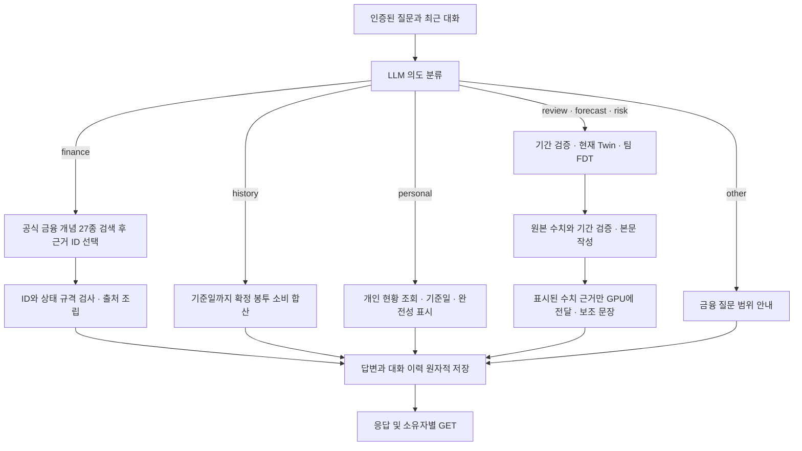

# 금융 질문·소비 조회·예측 대화 API

일반 금융 개념은 거래 연결이나 이전 코칭 없이 질문할 수 있습니다. 개인 소비 조회는 연결된 확정 거래를 합산하고, 미래 질문은 기존 팀 FDT를 호출합니다. 세 경로의 응답 근거와 상태를 구분해 표시해야 합니다.

## 클라이언트 호출

모든 경로는 기존 사용자 인증을 적용합니다. POST에는 `Idempotency-Key`가 필요합니다. 같은 키·본문의 재전송은 저장된 결과를 반환하며, 다른 본문으로 키를 재사용하면 409입니다.

| 목적 | 요청 | 응답·재조회 |
| --- | --- | --- |
| 금융 개념 단건 | `POST /v1/finance/questions`에 `{"question":"복리가 뭐야?"}` | `ChatAnswer`; `GET /v1/answers/{id}` |
| 먼저 대화 시작 | `POST /v1/sessions`에 `{}` | `Session`; `coaching_id=null` 허용 |
| 기존 코칭에서 시작 | `POST /v1/sessions`에 `{"coaching_id":"기존 ID"}` | 기존 소유자 검사 유지 |
| 이어서 질문 | `POST /v1/sessions/{id}/messages`에 `{"question":"이번 달 내 지출은 얼마야?"}` | `ChatAnswer` 또는 기존 `Coaching` |
| 예측 질문 | 같은 메시지 API에 `{"question":"이번 달 말까지 잔액 예측해줘"}` | `Coaching`; `GET /v1/coaching/{id}` |
| 대화 이력 | `GET /v1/sessions/{id}` | 전달된 질문·답변 원문; 다른 사용자는 조회 불가 |

**메시지 응답이 이제 두 형식입니다.** 클라이언트가 모든 응답에 `receipt`가 있다고 가정하면 수정해야 합니다. `answer_type`이 있으면 `ChatAnswer`, `receipt`가 있으면 기존 `Coaching`으로 처리합니다. 기존 코칭·차트의 응답 필드는 유지했습니다. 최신 스키마는 실행 중인 `/docs`와 `routes.py`, `chat_answers.py`에 있습니다.

예측 대화(`Coaching`)는 선택적 `chart_hint`를 함께 반환할 수 있습니다. `mode=forecast` 예측이나 구매 검토 대화처럼 예산 차트가 의미 있는 경우에만 채워지며, 그 밖의 대화는 `chart_hint=null`입니다. 값이 있으면 `{"endpoint":"/v1/charts/budget-forecast", "period_start", "question", "purchase"}` 형태로, 이 대화와 같은 예산 월의 차트를 얻기 위해 앱이 그대로 [`POST /v1/charts/budget-forecast`](charts.md)로 보낼 본문입니다. `period_start`는 대화 기준일이 속한 예산 월의 1일이라 그 기준일을 포함하는 유효한 예산 주기입니다. `purchase`는 구매 검토 대화에서 확정한 예정 구매가 예산 월·기준일 이후 조건을 만족할 때 `{envelope, amount_krw, on_date}`로 채워지며, 그 밖에는 `null`입니다. 서버는 힌트를 만들 때 두 번째 시뮬레이션이나 차트 저장을 하지 않으므로, 시각화가 필요할 때만 앱이 한 번 더 호출합니다. 엔드포인트는 그대로 분리되어 있습니다.

`ChatAnswer`는 `id`, `answer_type`, `status`, `text`, `wording_source`, `model`, `fallback_reason`, `evidence`, `created_at`을 반환합니다.

소비 조회(`answer_type=spending_history`) 응답은 봉투별 합계를 1급 필드로도 제공합니다. `rows`는 `{"envelope", "total_krw", "count"}` 배열이고 `total_krw`는 집계 총액입니다. 같은 값은 이전과 동일하게 `evidence.spending.rows`·`evidence.spending.total_krw`에도 그대로 남아 있어 기존 클라이언트는 영향을 받지 않습니다. 집계가 없는 상태(`needs_data`·`needs_clarification`)와 다른 모든 `answer_type`은 `rows=[]`, `total_krw=null`을 유지합니다. 앱은 `rows`로 봉투별 표를, `text`로 사람 문장을 그립니다.

새로 저장되는 assistant 메시지는 `response: {"kind":"chat" 또는 "coaching", "id":"원본 답변 ID"}`도 보존합니다. `chat`은 `/v1/answers/{id}`, `coaching`은 `/v1/coaching/{id}`로 조회해 재접속 후에도 출처·자료 상태·예측 기간을 복원합니다. 참조와 원본 답변은 같은 트랜잭션에 저장되며 각 GET은 같은 소유자 검사에 따릅니다. 사용자 메시지의 참조는 허용하지 않습니다. 이전 버전에 저장한 메시지는 `response=null`이며 본문에서 원본 ID를 추측하지 않습니다.

| 상태 | 화면에서 해석할 뜻 |
| --- | --- |
| `answered` | 해당 경로가 답변을 만들었음. 질문 해결의 독립 심사나 예측 정확도 점수가 아님 |
| `needs_source` | 등록 근거가 없거나 최신 상품·금리·규정 확인이 필요함 |
| `needs_data` | 개인 자료가 없거나 조회 결과를 확정할 자료가 부족함 |
| `needs_clarification` | 과거 소비 질문의 기간·필터 문법을 지원하지 않음; 임의 조건으로 합산하지 않음 |
| `out_of_scope` | 금융 외 질문 |
| `unavailable` | 모델 실패 또는 근거 선택 규격 위반; 실제 원인은 `fallback_reason` 확인 |

`wording_source=llm`인 금융 개념 응답은 LLM이 허용된 근거 ID를 선택했고 서버가 설명과 출처를 조립했다는 뜻입니다. `engine`인 소비 조회는 확정 원장 집계입니다. `template`은 실패·범위·자료 안내입니다. HTTP 200, 근거 ID의 유효성, 질문을 해결한 비율은 각각 따로 집계합니다.

## 현재 지원 범위

일반 개념은 [공식 자료 27종을 검색](knowledge-retrieval.md)해 이번 질문에 필요한 최대 8개를 GPU에 전달하고, 모델이 최대 3개 근거 ID를 선택합니다. 버전·출처·재검토 기한을 검사하고 이번 입력에 없던 ID의 채택을 막습니다. **실시간 웹 검색이나 모든 금융 주제에 답하는 챗봇은 아닙니다.** 최신 금리·대출 한도·개인 상품 추천·미지원 개념은 자료 보완 경로로 안내합니다. 검색된 자료 중 의미상 잘못 선택하는 오류까지 규격 검사가 모두 막지는 못합니다.

소비 조회는 오늘·어제·이번 달·지난달·현재까지와 7봉투 범주를 지원합니다. 예를 들어 “이번 달 내 지출은 얼마야?”는 **Twin 기준일이 속한 달의 1일부터 기준일 마감까지** 연결된 확정 봉투 소비를 합산합니다. 서버 시계의 오늘이나 미래 예측값을 쓰지 않습니다. 취소·미확정·제외 거래, 고정비, 본인계좌 이체, 카드대금 정산, 현금 인출, 대출 상환은 이 집계에 포함하지 않습니다. 제삼자 이체형 소비는 원 엔진의 봉투 매핑을 따릅니다.

`coverage=unknown`은 전체 계좌·월 전체의 거래 수집 완전성을 확인하지 못했다는 뜻입니다. 관측이 없으면 0원으로 단정하지 않습니다. 가맹점·결제수단·제외 조건·여러 기간 비교 등 미지원 필터가 있으면 `needs_clarification`으로 반환합니다.

확정 소비 이력 조회는 봉투 소비에 한정합니다. 계좌·자산·부채·예정 결제는 기존 Twin의 snapshot, 보험·등록 소득·고정비·목표는 인증된 백엔드의 개인 현황 자료를 조회하는 `personal` 경로로 분리합니다. [개인 현황 계약](personal-context.md)에 지원 범위와 결측·불완전 자료의 표시를 설명합니다. 실제 연동 없이 개인 금액을 추정해 답하지 않습니다.

구조화된 `period`는 **미래 예측 기간** 계약입니다. `finance`·`history`·`personal`·`other` 의도에 이를 주고 명시적 `analysis`가 없으면 `422 period_not_supported_for_intent`로 거절합니다. 과거 소비 필터로 해석하거나 조용히 무시하지 않습니다. 명시적 `analysis`는 일반 의도 분기보다 우선하며 기존 금융 계산·기간 검사를 받습니다.

### 구매 검토 되묻기 코드

"닌텐도 스위치 사고싶어"처럼 구매 의도는 분명하지만 금액·품목 봉투·결제 수단·구매 시점 중 하나가 빠지거나 애매하면, 서버는 금액을 추정하지 않고 소비 조회의 되묻기와 같은 방식으로 **`200` `ChatAnswer`(`answer_type=purchase_review`, `status=needs_clarification`)** 한 턴을 돌려줍니다. `text`에 아래 표의 후속 질문 문장이 그대로 담기므로 앱은 이를 대화 말풍선으로 바로 렌더링하면 됩니다. 이 턴은 정상 대화 한 턴으로 저장되며(재전송 시 같은 `Idempotency-Key`로 동일 결과), 모델은 호출되지 않습니다. 어떤 필드가 필요한지 기계적으로 분기하려면 `fallback_reason`(원 코드)이나 `evidence.purchase.clarification`을 읽습니다.

| 코드(`fallback_reason`) | 뜻 | `text`로 반환되는 후속 질문 |
| --- | --- | --- |
| `purchase_amount_required` | 금액이 없거나 두 개 이상이라 특정 불가 | "얼마짜리 구매인지 금액을 알려주시면 이번 예산에 미치는 영향을 확인해 드릴게요." |
| `purchase_envelope_required` | 어떤 소비 봉투에 넣을 품목인지 특정 불가 | "어떤 항목의 지출인지 알려주시면 해당 봉투 기준으로 살펴볼게요." |
| `purchase_payment_method_required` | 현금·카드가 함께 나오거나, 실제 결제 수단·카드 결제일이 특정 불가 | "현금·계좌 결제인지 카드 결제인지 알려주세요. 카드라면 결제 예정일도 함께 알려주시면 정확히 반영할 수 있어요." |
| `purchase_installment_unsupported` | 할부는 Phase 1 범위 밖(단건 결제만 지원) | "할부 구매는 아직 지원하지 않아요. 일시불 기준으로 다시 여쭤봐 주시면 확인해 드릴게요." |
| `purchase_date_required` | 구매 시점(오늘·내일·이번주·YYYY-MM-DD)을 특정 불가 | "언제 구매할 예정인지 알려주세요. 오늘·내일·이번주처럼 시점을 알려주시면 그 기준으로 확인해 드릴게요." |

## 처리 구조



금융 개념 단건 API는 의도 분류 단계를 생략하고 바로 근거 선택을 호출합니다. 대화 의도 분류는 최근 4개 메시지를 각각 최대 800글자까지 사용하고, 예측 보조 문장은 최근 2개 메시지를 사용합니다. 저장된 전체 이력과 원본 receipt는 줄이지 않습니다. 세션은 24시간, 최대 20회 질문·답변의 기존 제한을 유지합니다.

월말 예측의 중복 JSON을 보조 작성기에 다시 보내던 경로는 수정했습니다. 숫자는 먼저 검증해 본문에 표시하고, GPU에는 그 표시 내용을 한 번만 전달합니다. 실제 토크나이저의 입력 한도 검사를 계속 적용합니다. 큰 원본의 기존 불완전 근거 차단과 잘못된 수치·보장 문구의 거절도 유지합니다.

실제 GPU 비교, 지연, 회귀 증거와 Jira 잔여 작업은 [응답 검증 보고서](chat-response-validation.md)에 있습니다.

## 위험·가정 대화의 봉투별 표 데이터 (`numeric_rows`)

위험(risk)·가정(what-if) 수치 대화의 `Coaching` 응답은 `text`와 별개로 봉투별 구조화 행을 1급 필드 `numeric_rows`로 함께 내려, 앱이 소비 조회 `rows`처럼 표로 그릴 수 있게 합니다. 서버가 수치를 새로 만들지 않고 엔진이 이미 계산한 값(`receipt.numeric_result.datasets`)을 그대로 노출하므로 같은 값이 receipt에도 남아 계약 보증이 이중입니다. `text`는 변하지 않습니다.

```json
"numeric_rows": {
  "mode": "risk",                       // "risk" | "what_if"
  "envelope_spend": [                    // 두 모드 모두. 봉투별 예측 소비 분위수
    {"envelope": "외식", "p10_krw": 90000, "p50_krw": 150000, "p90_krw": 230000}
  ],
  "budget_risk": [                       // 위험 대화 + 스냅샷에 예산이 있을 때만
    {"envelope": "외식", "budget_krw": 200000, "observed_used_krw": 136300,
     "projected_used_p50_krw": 210000, "p_over_budget": 0.62}
  ]
}
```

- `numeric_rows`는 위험·가정 대화에서만 채워지고 그 외 대화는 `null`입니다. 근거가 없는 행은 비웁니다(빈 배열).
- `budget_risk`는 위험 대화에서 스냅샷에 봉투 예산이 있을 때만 채워집니다(없으면 `[]`).
- 앱은 `numeric_rows`로 봉투별(외식·교통비·의료·취미·쇼핑 등) 표를, `text`로 사람 문장을 그립니다. 백엔드는 DTO를 통과시켜 앱에 `numericRows`(camelCase)로 내려주면 됩니다.

## 봉투별 장부 잔액 표 (`envelope_balances`)

대화 턴(소비 리뷰·구매 검토 등)에서 봉투가 둘 이상이면, 봉투마다 "현재 수신 이벤트까지 반영한 … 장부 잔액은 N원입니다." 문장을 반복하지 않고 표 행으로 싣습니다. `text`에는 표를 설명하는 한 줄("봉투별 남은 잔액은 아래 표에 정리했어요. …")만 남습니다.

```json
"envelope_balances": [
  {"envelope": "외식", "balance_krw": 343700},
  {"envelope": "교통비", "balance_krw": 150000}
]
```

- 기본값은 `[]`입니다. 봉투가 하나뿐인 턴, 결제 이벤트 코칭(푸시 알림 문장으로도 쓰임), 과거 코칭 후속 질문은 기존처럼 문장으로 답하고 표는 비웁니다.
- 수치 턴(위험·가정·예측)은 잔액 목록 자체를 싣지 않습니다(봉투별 수치는 `numeric_rows`).
- `balance_krw`는 초과 사용이면 음수일 수 있습니다. 백엔드는 앱에 `envelopeBalances`(`envelope`, `balanceKrw`)로 통과시킵니다. 이 필드를 모르는 백엔드는 무시하므로(`ignoreUnknown`) 오류는 나지 않지만, 표를 그리는 앱 빌드 전에 코칭이 먼저 나가면 본문은 "아래 표"라고 하는데 표가 보이지 않습니다. 백엔드·앱을 먼저(또는 함께) 내보낸 뒤 코칭을 올립니다.

## 예산 주기 시작일 (`Bootstrap.budget_start_day`)

`POST /v1/twin` 부트스트랩의 **최상위**(as_of·envelopes와 같은 위치)에 선택적 `budget_start_day`(정수 **1–28**)를 실으면, "이번 달" 등 예산 주기와 예산 차트가 **그 시작일 기준**으로 계산되고 질문 기준일 변화를 따라갑니다. 고정 FDT snapshot(`additionalProperties:false`)은 건드리지 않으려고 최상위에 둡니다.

```json
{ "as_of": "2026-09-22", "transactions": [/* … */], "snapshot": {/* … */},
  "envelopes": [/* … */], "budget_start_day": 15 }
```

- 예: `budget_start_day=15`, 기준일 2026-09-20 → 예산 주기 2026-09-15~2026-10-14. 기준일 2026-09-10 → 시작일 이전이라 직전 주기 2026-08-15~2026-09-14.
- **생략하면 서비스가 저장하지 않고 기간 계산이 1일로 폴백**해 기존 호출자 동작이 그대로 유지됩니다(하위호환).
- 값은 서비스측 `BudgetConfig`(`budget/config`)로 한 번 보관되며 Twin/원장과 분리돼 이벤트마다 재구성되지 않습니다. `chart_hint.period_start`도 이 시작일을 반영합니다.
- 백엔드는 사용자 설정값(예: `user_settings.budget_anchor_day`)을 이 필드로 실어 보내면 됩니다.

## 코치 말투와 제안 굵게 (`persona`)

KeyFin 코치는 고양이라 사용자에게 보이는 문장의 끝을 "~다냥"으로 바꿔 내보냅니다(예: "잔액이에요." → "잔액이다냥."). 숫자·금액·날짜·괄호 안 내용은 바뀌지 않습니다.

- 저장본은 중립 문장이고, 말투는 **응답을 낼 때** 입힙니다. 대화 턴, 이력(GET 세션), 코칭 조회, 답변 조회, 리뷰, `POST /v1/events`의 `coaching`에 모두 같은 규칙이 적용되므로 재시도·재조회 결과가 같습니다.
- 제안 문장은 `**…**`로 감쌉니다(예: "**남는 만큼은 저축이나 비상금으로 옮겨 두면 좋다냥.**"). 앱은 이 표시만 굵게 그립니다(마크다운 라이브러리 불필요). 짝이 맞지 않는 `**`는 글자 그대로 둡니다.
- **푸시 알림**(`GET /v1/notifications`, 확인 응답)은 굵게를 그릴 수 없으므로 `**`를 항상 제거해 내보냅니다. 백엔드가 채팅 `reply`를 푸시로 재사용할 때도 `**`를 제거해야 합니다.
- 설정 `COACHING_PERSONA`(기본 `cat`)를 `plain`으로 두면 말투 없이 중립 문장만 나가고 `**`도 제거됩니다.
