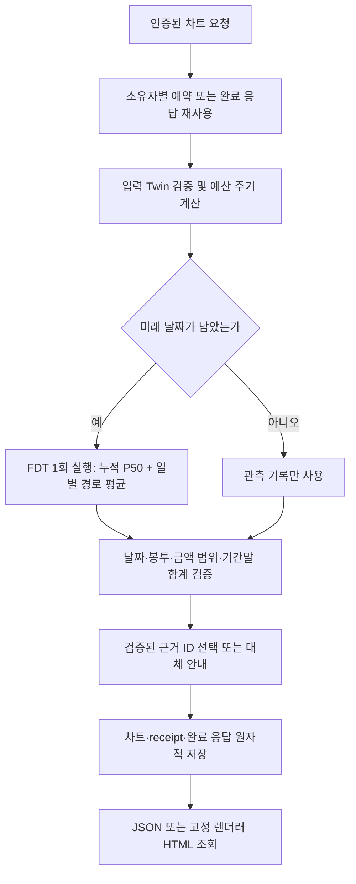

# AI 코칭 코드 리뷰 안내

이 API는 팀 FDT의 금융 계산 결과를 보존하고, LLM에 라우팅·판단·근거 선택·보조 설명을 맡깁니다. **API 성공, 모델 문장 채택, 금융 계산의 정확성, 실제 미래 예측 정확성은 서로 다른 검증 항목입니다.**

먼저 [AI·FDT 구조도](architecture.md)에서 API·FDT·GPU·DB의 경계와 차트 요청 순서를 확인한 뒤 아래 파일을 읽으면 됩니다.

## 먼저 읽을 코드

| 순서 | 진입점 | 확인할 계약 |
| --- | --- | --- |
| 1 | [`api.py`](../src/coaching_service/api.py), [`routes.py`](../src/coaching_service/routes.py), [`chart_routes.py`](../src/coaching_service/chart_routes.py) | 인증, 소유자 범위, 요청·응답 스키마, 오류 상태 |
| 2 | [`charts.py`](../src/coaching_service/charts.py), [`events.py`](../src/coaching_service/events.py), [`dialogue.py`](../src/coaching_service/dialogue.py) | 차트·결제·대화의 호출 순서와 저장 시점 |
| 3 | [`engine.py`](../src/coaching_service/engine.py), [`chart_engine.py`](../src/coaching_service/chart_engine.py) | 고정 FDT 호출, 같은 시뮬레이션에서 추출한 일별 예측 |
| 4 | [`periods.py`](../src/coaching_service/periods.py), [`period_request.py`](../src/coaching_service/period_request.py), [`chart_projection.py`](../src/coaching_service/chart_projection.py) | 관측/예측 날짜 경계, 원 단위 금액, P50와 일별 평균의 차이 |
| 5 | [`llm.py`](../src/coaching_service/llm.py), [`token_budget.py`](../src/coaching_service/token_budget.py), [`gpu_worker.py`](../scripts/gpu_worker.py) | 근거·응답 검증, 실제 토큰 검사, 모델 실패 시 대체 사유 |
| 6 | [`repository.py`](../src/coaching_service/repository.py), [`store.py`](../src/coaching_service/store.py), [`payments.py`](../src/coaching_service/payments.py) | 원자적 저장, 재시도, 취소 환불, 삭제 후 늦은 쓰기 방지 |

함수 주석은 입력 단위, 정책의 이유, 불변 조건, 실패 시점에 집중합니다. 위에서 아래로 읽을 때 계산 도중의 임시 상태와 실제 DB 반영을 구분할 수 있도록 작성했습니다.

R14는 [금융 검색](knowledge-retrieval.md) → [개인 조회](personal-context.md) → [예측 검증](forecast-validation.md) → [외부 호출 인계 계약](app-integration.md) 순서로 읽습니다. 현재 리뷰 범위의 실행 코드는 `ai/coaching/src/`, 회귀는 `ai/coaching/tests/`, 실제 GPU 평가 실행기는 `ai/coaching/benchmarks/coaching/flow`와 `knowledge_response`에 있습니다. 앱·백엔드 구현은 현재 AI MR 범위가 아닙니다. 실행 산출물은 Git에서 제외한 `artifacts/r14/`에 있으며, 공식 금융 JSON은 평가 정답 파일이 아닌 실행용 지식 자료입니다.

R13 대화 변경은 [대화 API 계약](chat.md)을 먼저 읽고 `dialogue.py`의 의도 분기, `chat_answers.py`의 응답 두 형식, `finance_knowledge.py`의 공식 근거·선택 검증, `spending_history.py`의 기간·소비 포함 기준을 확인합니다. `coaching.py`의 `supplementary_evidence`는 표시된 수치를 작성기에 한 번만 전달하며 원본 receipt를 변경하지 않습니다. E2E는 이 새 입력 계약을 독립적으로 재구성하고 원본 엔진 결과 대조를 계속합니다.

## 차트 요청의 흐름

엔진·입력 계약 위반은 저장 전에 중단합니다. LLM 연결 실패나 문구 미채택은 수치 결과를 바꾸지 않고 `wording.source`와 `fallback_reason`에 남습니다. 종료된 기간은 모델을 호출하지 않습니다. `/healthz`의 `model_configured`는 연결 설정 유무일 뿐 추론 성공 표시가 아닙니다.

## 숫자와 날짜를 읽는 기준

- 기준일은 관측 마감값입니다. 예측은 다음 날부터 종료일까지 포함합니다. 달력 월말, 고정 일수, 특정 종료일은 [`기간 계약`](architecture.md)에 따라 구분합니다.
- 차트 예산 주기는 시작일부터 다음 달 같은 일자 직전까지입니다. 다음 달에 그 일자가 없으면 말일을 경계로 삼습니다. 예를 들어 8월 16일 시작은 9월 15일 마감이며, 1월 31일 시작은 평년 2월 27일 마감입니다. 달력 월과 같다고 가정하지 않습니다.
- 누적선·기간말 값은 전체 소비 분포의 P50입니다. 일별 막대는 같은 시뮬레이션의 날짜별·봉투별 평균을 원 단위로 반올림한 값입니다. 둘의 합이 같도록 강제하면 통계 의미가 바뀝니다.
- 미분류 소비는 전체 금액에는 포함하지만 7개 봉투 막대에는 포함하지 않습니다. 고정비는 이 변동소비 차트에서 제외됩니다. 입력 이전 날짜는 미관측이며, 거래 없는 날이 수집 누락이 없음을 증명하지 않습니다.
- 관측액과 미래액이 각각 유효하더라도 합계는 JavaScript 안전 정수 범위 `±(2^53−1)`를 넘을 수 있습니다. 금액을 잘라내지 않고 `chart_money_range_limit`으로 거부합니다.

## 고정값이 있는 이유

| 값/위치 | 의미 | 변경 시 함께 확인할 것 |
| --- | --- | --- |
| FDT commit·엔진 21개 파일·차트 6개 자산 해시 | 팀 구현과 렌더러의 버전 고정 | 원본 계약, manifest, wheel 포함 여부 |
| 7개 봉투와 표시 순서 | FDT ↔ KeyFin 차트 스키마 | 일별 배열 순서·봉투별 금액·범례 |
| 기본 `seed=42`, `paths=400` | 재현 가능한 시뮬레이션 기본값; 요청으로 변경 가능 | 동일 입력 재현과 경로 수의 자원 비용 |
| 일반 수치 분석 최대 미래 90일·계산량 2,000,000 | 지원 기간·계산 자원 상한; 차트는 한 예산 주기의 잔여일 | 입구 검증과 실제 엔진 자원 사용 |
| 결제 50%, 40%, 주간 5회+20% | 코칭 발생 정책 | 경계값·취소·중복 결제 테스트 |
| 판단 `confidence >= 0.8` | 모델 판단을 알림에 채택하는 정책 | 교정된 확률이나 80% 정확도로 설명하지 않기 |
| 150초 작업·180초 예약 | 처리 시간 제한과 늦은 쓰기 방지 | 시간 초과·삭제·예약 만료·재시도 |
| 메시지 32,000자·합계 48,000자 | 스키마를 합친 입력의 크기 상한 | 실제 tokenizer의 별도 토큰 상한과 혼동하지 않기 |
| 벤치마크 후보·기간·seed | 사전에 고정한 비교 계획 | 예측 누락·학습/검증 분리·평가 분모 |

예시의 고객·날짜·거래 값은 `examples/`, `tests/`, `benchmarks/`의 입력입니다. 운영 계산은 `src/`와 `scripts/`에서 요청 데이터와 개인 운영 설정을 사용합니다. [실험 안내](../benchmarks/README.md)의 결과를 실제 사용자 정확도로 확대해석하지 않습니다.

## 회귀를 확인할 테스트

| 위험 | 확인할 파일 |
| --- | --- |
| 결제·취소 실패가 원장이나 재시도 키를 오염시킴 | [`test_review_regressions.py`](../tests/test_review_regressions.py) |
| 기간 경계 또는 미래 일별 막대 누락 | [`test_chart_projection.py`](../tests/test_chart_projection.py), [`test_chart_api.py`](../tests/test_chart_api.py) |
| 숨은 문자·근거 없는 단정·모델 실패 | [`test_llm.py`](../tests/test_llm.py) |
| 스키마를 더한 입력 길이·잘못된 헤더·토큰 검사 | [`test_gpu_prompt_limits.py`](../tests/test_gpu_prompt_limits.py), [`test_token_preflight.py`](../tests/test_token_preflight.py) |
| 원문 변조·후보 누락·0원 실제값 | [`tests/forecast/`](../tests/forecast/) |
| 배포 묶음과 평가 사례 수 | [`test_e2e.py`](../tests/test_e2e.py) |

실행 파일은 `scripts/`·`benchmarks/`, 검증 코드는 `tests/`, 생성된 로그·예측값·HTML·패키지는 Git에서 제외하는 `artifacts/`에 둡니다. 실험 보고는 [검증 결과](validation.md)에 요약하며 원시 로그를 저장소에 추가하지 않습니다.
