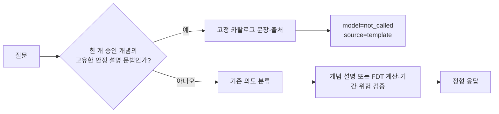

# R21 D1 / R26: 승인된 금융 개념의 결정론적 빠른 경로

검증일: 2026-09-16  
적용 상태: `ModelConfig.deterministic_finance_fast_path=true`가 기본값이다.

이 경로는 승인된 한 개의 금융 개념을 정확히 정의해 달라는 질문과, 고유한 제목·안전한 별칭·약어
신호가 있는 안정 설명형 바꿔 말하기만 카탈로그 문장과 출처로 응답한다. 개인 금액·계산·최신
조건·추천·복수 주제·예측·위험 분석은 이 경로로 좁히지 않는다. 그 경우에는 기존 모델 라우팅과
FDT 수치 검증 흐름을 그대로 사용한다. R26의 추가 검증 범위는
[일반 챗봇 응답 경로](general-chat-cascade-r26.md)에 분리해 기록한다.

## 채택 기준과 기능 검증

동일한 동결 서비스와 같은 32개 정의 질문을 동시 요청 수 1·4·8에서 각각 실행했다. 따라서
총 96개는 독립 고객 96명이 아니라 **32개 질문의 동시성 반복**이다. 비교 전과 후의 입력
시나리오와 서비스 패키지는 같고, 달라진 것은 이 좁은 경로의 활성화뿐이다.

| 항목 | 기존 모델 경로 | D1 빠른 경로 | 뜻 |
| --- | ---: | ---: | --- |
| HTTP 200 | 96 / 96 | 96 / 96 | HTTP 응답 수신 여부만 뜻함 |
| 사용 가능한 정형 답변 | 93 / 96 | 96 / 96 | 대체·미사용 상태 없이 답변 계약을 만든 요청 수 |
| 정의 질문 규격 통과 | 78 / 96 | 96 / 96 | 예상한 카탈로그 답변·출처·상태를 모두 만족한 요청 수 |
| 본문 요청의 모델 작업 | route 96, write 93 | 0 | 이 정의 범위의 모델 호출 수 |

이 표는 **정의 질문의 응답 계약과 모델 미호출 여부만** 입증한다.

### 철회한 지연 주장

이 문서의 이전 밀리초 비교표와 감소율은 실사용 서비스의 응답 성능 근거로 사용할 수 없어
제거했다. 그 표본은 좁은 정의 질문을 동결된 조건에서 실행한 값이며, 사용자가 실제로 호출한
서비스의 배포 버전·질문 종류·입력 근거·동시성·네트워크 경로와 연결되지 않았다.

일반 대화, 개인별 금융 조언, FDT 예측, 실제 고객 정확도, 서비스 SLA의 지연은 이 문서에서
주장하지 않는다. 그 성능은 실행 중인 서비스에서 같은 요청을 대상으로 API 전체 시간과
모델 대기·토큰 사전검사·생성 시간을 함께 수집한 뒤에만 판단한다.

## 안전 경계

- 카탈로그에서 검색된 ID가 완전하지 않거나 중복·미지 ID가 있으면 빠른 경로를 사용하지 않는다.
- 정확한 정의 외의 바꿔 말하기는 제목·세 글자 이상 한국어 별칭·약어의 고유한 승자만 허용한다.
  본문 유사도나 키워드 포함 여부만으로 선택하지 않는다.
- 개인·최신·수치·추천·복수 주제·대화 이력이 있으면 빠른 경로를 사용하지 않는다. `내면`,
  `내는` 같은 일반 동사 어미는 개인 소유 표현으로 오인하지 않는다.
- 기간 객체가 함께 오면 기존 의도·기간 계약이 먼저 거부한다.
- `deterministic_finance_fast_path=false`를 명시하면 이전의 모델 기반 카탈로그 선택 경로로
  되돌아간다.
- 모델·FDT·숫자 계약 실패는 기존의 결정론적 대체 응답으로 끝나며, 이 경로가 금액·잔액·예측값을
  만들지 않는다.

## 코드 검증

`tests/test_deterministic_finance_fast_path.py`는 기본 설정의 세션 대화와 명시 금융 질문이
모델 호출 없이 카탈로그 출처를 유지하는지, 개인·계산·예측 혼합 질문이 기존 경로로
되돌아가는지, 안정 바꿔 말하기와 한국어 개인 경계가 작동하는지, 명시적 비활성화가
작동하는지를 검증한다. 원문 요청·응답과 실행 증적은
비공개 실험 보관소에 두고, 이 문서에는 집계값과 범위만 기록한다.

같은 테스트는 서로 다른 8개 사용자 세션을 동시에 처리해도 모델 호출 없이 정형 답변이
돌아오는지 확인한다. 반면 같은 사용자의 변경 요청은 금융 상태와 멱등성 보존을 위해
저장소 lease로 직렬화된다. 이 직렬화는 모델 병렬 처리 성능 수치에 포함하지 않으며,
별도의 상태 일관성 계약이다.
