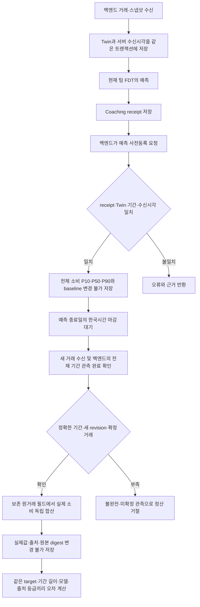

# 실제 미래 결과와 예측을 대조하는 API

이 기능은 **이미 저장된 FDT 예측을 먼저 고정하고, 예측 기간이 끝난 뒤 들어온 거래로 오차를 계산**한다. 합성 질문의 경로 선택 성공률을 금융 예측 정확도로 바꾸는 기능이 아니다. 현재 완료한 것은 실제 예측 receipt를 사용하는 사전등록·후정산 기능과 재현 시험이며, 실제 고객의 미래 관측 성능은 아직 확보하지 않았다.

월별 평가는 선택 사항으로 추가됐다. 기존 전체 변동소비 평가를 유지하면서, **동일 달력 월의 7봉투별 원래 편성·당시 예측·확정 소비**를 함께 보존한다. 별도 편성 자료가 없으면 예산은 `null`이며 현재 봉투 잔액이나 과거 소비를 원래 예산으로 대신 쓰지 않는다. 사용 방법과 지표의 차이는 아래 [월별 7봉투 평가](#월별-7봉투-평가)를 따른다.

## 무엇을 예측하고 무엇과 비교하는가

첫 지원 대상은 `total_variable_consumption / purchase_time_consumption/v1`, 원 단위 전체 변동소비다. 현금 잔액·봉투 예산 잔액·고정비를 합친 총출금이 아니다. 저장된 `Coaching.receipt.numeric_result`의 `total_expense_p10_krw`, `total_expense_p50_krw`, `total_expense_p90_krw`를 그대로 사용한다. 각 지표의 단위 `KRW`와 근거 `simulation_consumption_only`도 검사한다. 봉투별 또는 날짜별 분위수를 합산하지 않는다.

| 원거래 | 이 검증의 변동소비 | 이유 |
| --- | --- | --- |
| 정상 확정 카드 구매·계좌 소비 | 포함 | 구매 시점의 소비 |
| 제3자에게 보낸 축의금·회비 등 | 포함 | 본인 계좌 이체와 구분 |
| `DUTCH`·`EMERGENCY`·`CARRYOVER`가 붙은 구매 | 포함 | 봉투 예산에서는 제외될 수 있으나 FDT 전체 소비에는 포함 |
| 카드 청구대금 납부 | 제외 | 앞서 발생한 구매를 다시 소비로 세지 않음 |
| 본인 계좌 이체·명시적 `TRANSFER`·저축투자 이체 | 제외 | 자산 이동 |
| ATM 출금·대출 상환·입금 | 제외 | 현재 예측 타깃의 변동소비가 아님 |
| 월세·관리비·공과금·통신·보험·세금·구독 등 확정 고정비 | 제외 | FDT의 별도 고정비 타깃 |
| 취소된 거래 | 제외 | 현재 관측 원장에서 취소됨 |
| 미확정 소비 | 정산 거절 | 금액을 확정하거나 0으로 간주할 수 없음 |

`forecast_validation_observations.py`는 보존된 `transactions[].raw`의 날짜·종류·방향·상태·분류·원금액을 직접 읽어 합산한다. `fdt.normalize`, FDT 예측·분류 함수, 모델 생성 답변을 정답 계산에 호출하지 않는다. 다만 **같은 제품 개발자가 명세를 옮긴 계산기**이므로 `independent_human_oracle=false`이다. 사람이 승인한 독립 정답을 확보했다는 뜻은 아니다.

현재 팀 엔진은 `vendor/fdt/model.py`의 관측 첫날부터 `as_of`까지 달력을 만들고 `vendor/fdt/simulation.py`에서 그 이력을 표집한다. 비교 기준도 같은 시작일·종료일·소비 정의를 사용한다. 과거 별도 연구의 365일 고정 실험과 구분해야 한다.

```text
baseline = 과거 관측 기간의 변동소비 합계 / 관측 달력 일수 × 예측 일수
```

Baseline은 `observed_calendar_day_mean/v1`이다. 관측 기간에 거래가 없는 날짜도 분모에 포함한다. 짧은 이력이나 과거 데이터의 누락 가능성은 baseline이 해결하지 않는다. 사전등록 결과에 실제 사용한 이력 시작일·종료일·일수·소비 합계를 남겨 검토할 수 있게 한다. 이력의 미확정 소비도 0으로 치환하지 않아 등록을 거절한다.

## 처리 구조



이 Mermaid는 처리 구조 설명용 소스다. 미래 기간이 끝나지 않았다면 시스템이 기다린 척 정답을 생성하지 않는다.

## 호출 순서

모든 쓰기 요청은 `Idempotency-Key` 헤더가 필요하다. 인증 주체는 기존 `Client`의 소유자와 역할을 사용하며 본문에서 임의 사용자를 선택할 수 없다.

### 1. 저장된 예측 등록 — 백엔드 권한

`POST /v1/forecast-validation/registrations`

```json
{
  "coaching_id": "앞서_저장된_예측_ID",
  "data_origin": "backend_attested_real",
  "source_reference": "내부_동의및데이터수집기록_식별자"
}
```

등록자는 예측 금액, 발행 시각, cutoff, 모델 버전, 분위수 또는 baseline을 요청에 넣을 수 없다. 서버가 원본 receipt와 현재 Twin에서 가져온다. 동일 coaching을 다른 키로 다시 등록하거나 출처만 바꿔 덮어쓰면 409다. 같은 키·같은 본문 재시도는 최초 결과를 돌려준다.

등록 시 확인하는 항목:

- receipt·현재 Twin의 사용자, twin ID, revision, input digest, 기준일 일치
- 원본 엔진 커밋, forecast 모드, horizon, 실제 다음 날부터 끝나는 날짜 계약
- 등록 이전에 서버가 받은 동일 revision의 수신 기록, 예측 발행 시각의 선후관계
- 등록 시각 이후의 날짜·시각을 가진 입력 거래나 미래 cutoff가 없음
- 전체 변동소비의 순서가 맞는 원 단위 P10 ≤ P50 ≤ P90
- 동일 미래 조건이 아닌 scenario 개입은 등록 대상에서 제외

등록에는 전체 receipt digest, 모델 정보와 digest, 정확한 기간, 데이터 출처 진술, 수신 시각, baseline을 보존한다. 기존 전체 receipt 자체는 원래 코칭 저장소에서 계속 읽을 수 있다.

### 2. 기간이 끝난 뒤 관측 완료 정산 — 백엔드 권한

`POST /v1/forecast-validation/registrations/{id}/settlement`

```json
{
  "coverage_start": "2026-09-10",
  "coverage_end": "2026-09-11",
  "complete": true,
  "source_reference": "해당기간_전체계좌및카드_관측완료기록"
}
```

실제 금액을 본문으로 받지 않는다. 서버는 현재 저장된 거래에서 합산한다. 위 기간은 예시이며 등록된 기간과 정확히 일치해야 한다.

서버의 한국시간이 종료일 다음 날 00:00보다 이르면 409다. 따라서 9월 10~11일 예측은 9월 12일 00:00부터 정산할 수 있다. 현재 Twin이 종료일 이후까지 갱신됐고 등록 당시보다 새 revision이어야 한다. 그 revision의 서버 수신 기록도 등록 이후여야 한다. 미확정 거래가 남거나 `complete=false`이면 점수를 만들지 않는다.

**관측된 실제 0원과 데이터가 안 들어온 것은 다르다.** 새 revision과 정확한 기간의 관측 완료 진술이 있어야 거래가 없는 기간을 0원으로 정산할 수 있다. `complete=true`는 인증된 백엔드의 진술이며, 이 API가 모든 금융기관·계좌의 수집 완결성을 외부에서 독립 확인하는 것은 아니다.

정산은 변경 불가다. 이후 취소·정정이 수신되어도 이미 평가한 실제값을 조용히 덮어쓰지 않는다. 대신 **새 metrics 요청마다 현재 원거래에서 같은 기간의 소비 합계와 건수를 다시 합산**한다. 고정된 실제값·건수와 달라지면 `409 validation_observation_revised`로 새 집계를 차단한다. 새로 미확정 소비가 생겨 실제값을 확정할 수 없는 경우도 집계하지 않는다. 기간 밖에서 이후의 일반 거래가 추가돼 전체 Twin digest만 달라진 경우는 거절하지 않는다.

기존 `GET .../settlement`는 최초 정산 당시의 기록을 그대로 반환한다. 이는 현재 정정된 실제값의 평가라는 뜻이 아니다. 취소·정정을 반영한 새 정답 버전과 승인 이력을 관리하는 별도 절차가 필요하며, 이 API는 원래 정산을 임의 수정하지 않는다.

### 3. 조회·지표 — 사용자 또는 백엔드 권한

- `GET /v1/forecast-validation/registrations/{id}`: 고정된 예측
- `GET /v1/forecast-validation/registrations/{id}/settlement`: 고정된 실제값과 출처
- `POST /v1/forecast-validation/metrics`에 `{"registration_ids":["id1","id2"]}`: 명시한 정산 결과 비교

동일 소유자의 완료된 ID를 1~100개 명시한다. 모르는 ID·미정산 ID는 404이며 중복 ID는 거절한다. 목록 저장소의 100개 조회 상한으로 결과를 몰래 자르지 않는다. 모든 요청 ID를 개별 읽어 확인한다. 전체 고객 모집단에 대한 자동 표본이 아니므로 `selection=explicit_settled_ids_not_population_sample`을 함께 반환한다.

예측 길이, 타깃 버전, 모델 digest, 엔진 커밋, 출처 등급·종류, baseline 방식이 다른 결과는 한 점수로 합치지 않는다. 각 출처 참조와 등록 ID도 결과에 포함된다. 같은 길이라도 창이 겹칠 수 있으므로 `overlapping_windows`, `non_overlapping_window_count`를 함께 반환한다. 겹치지 않는 창도 같은 사용자의 시계열이므로 통계적 독립 표본이라고 부르지 않는다.

## 숫자가 뜻하는 것

P50 예측을 `m`, 실제 소비를 `y`, P10을 `l`, P90을 `u`라고 한다. 여러 건의 아래 값을 평균한다.

| 지표 | 계산 | 해석 |
| --- | --- | --- |
| `mae_krw` | 평균 `abs(m-y)` | 평소 몇 원 틀렸는지, 낮을수록 좋음 |
| `wape` | `sum(abs(m-y)) / sum(y)` | 실제 소비 합계 대비 총 절대 오차의 비율. 0.2는 20%이며, 실제 합계가 0이면 null |
| `bias_krw` | 평균 `m-y` | 양수는 과대 예측, 음수는 과소 예측 |
| `coverage80` | `l <= y <= u`인 비율 | 중앙 80% 예측 구간 안에 실제값이 들어온 빈도 |
| `mean_interval_width_krw` | 평균 `u-l` | 불확실성 구간의 폭. coverage와 함께 해석해야 함 |
| `wis80_krw` | 아래 식 | 구간 폭과 벗어난 실제값의 벌점을 함께 계산. 낮을수록 좋음 |
| `baseline_mae_krw`, `baseline_wape`, `baseline_bias_krw` | 같은 실제값과 baseline 비교 | 복잡한 모델이 단순 과거 평균보다 나은지 비교 |

```text
IS80 = (u-l) + 10 × max(l-y, y-u, 0)
WIS80 = (0.5 × abs(m-y) + 0.1 × IS80) / 1.5
```

중앙 80% 구간 하나와 중앙값을 사용하는 WIS 정의다. 여러 분위수를 촘촘하게 평가한 전체 분포 점수라고 주장하지 않는다. 정의는 [Bracher 등, Evaluating epidemic forecasts in an interval format](https://journals.plos.org/ploscompbiol/article?id=10.1371/journal.pcbi.1008618)을 따른다. Baseline은 점 예측이므로 존재하지 않는 구간·WIS를 만들지 않는다.

예를 들어 구간 `[40, 80]`, 중앙값 `60`에서 실제값 `100`이면 절대 오차 40원, 편향 -40원, 구간 폭 40원, IS80 240원, WIS80 약 29.33원이다. 이를 실제값 50인 두 번째 사례와 함께 평가하면 MAE 25원, 편향 -15원, WAPE 1/3, coverage 0.5, 평균 WIS80 약 17.67원이다. 테스트는 이 숫자를 제품 함수로 다시 만들어 기대값으로 쓰지 않고 손계산 상수로 비교한다.

## 근거 등급과 아직 필요한 검증

| `data_origin` | 서버가 정하는 등급 | 근거의 한계 |
| --- | --- | --- |
| `synthetic` | `synthetic` | 가상 데이터 실험 |
| `historical_real` | `replay` | 역사 데이터 재생이며 사전 발행 증명이 아님 |
| `backend_attested_real` | 시각·수신 기록 조건 충족 시 `prospective_attested`, 아니면 거절 | 미래 시작 전 등록 및 백엔드 출처 진술. 독립기관·담당자의 진실성 승인은 아님 |

모든 등급에서 `real_accuracy_validated=false`다. 클라이언트가 `real`이라는 말을 보내는 것만으로 사람의 검증·동의·독립 감사를 확보할 수 없다. 수신 스탬프는 서버가 언제 데이터를 받았는지를 입증하며 공급자가 만든 시각·일 마감 상태·모든 계좌의 실제 존재와 누락 여부까지 인증하지 않는다. 과거 수신 스탬프가 없는 기존 receipt는 재생 평가로만 등록할 수 있다.

실제 고객 정확성을 주장하려면 동의와 공급자 출처 확인, 누락·지연·취소 처리 정책, 변경 전 고정한 평가 집단, 실제 만기가 지난 데이터, 여러 사용자·기간의 비교, 독립 평가자의 승인과 기준치가 필요하다. 현재 같은 사용자의 선택된 창에 대한 신뢰구간은 `not_estimated_single_owner_dependent_windows`다. 겹친 창을 독립 표본으로 부트스트랩해 과도하게 좁은 구간을 표시하지 않는다. 공개 은행 데이터 실험의 성능을 한국 고객의 잔액·월예산 정확성으로 옮겨 표현하지 않는다.

## 재현과 코드 검토 순서

1. `forecast_validation_contracts.py`: 불변 입력·출력, 원금액·분위수·등급
2. `forecast_validation_ingestion.py`: Twin과 같은 원자적 쓰기에 포함되는 최초 서버 수신 기록

   Bootstrap은 원장을 전체 교체하므로 새 입력에서 `revision=0`으로 다시 시작할 수 있다. 수신 도장은
   revision만으로 저장하지 않고 `revision-{n}/digest-{input_digest}` 키에 기록해 서로 다른 Twin 입력
   epoch를 분리한다. 같은 identity의 재시도는 기존 도장을 보존하며, 이전 배포가 남긴
   `revision-{n}` 레거시 키는 읽기에서만 fallback한다. 따라서 레거시 도장이 다른 identity와 일치하지
   않으면 예측 검증을 통과시키지 않는다.
3. `forecast_validation_receipts.py`: 실제 저장된 예측을 읽고 기간·동일 입력을 검사
4. `forecast_validation_observations.py`: 별도 원거래 합산과 같은 이력의 baseline
5. `forecast_validation.py`: 등록·후정산·동일 조건 집계·멱등성
6. `forecast_validation_metrics.py`: 읽을 수 있는 지표 산식
7. `forecast_validation_routes.py`: 백엔드 쓰기와 사용자 읽기 권한

```powershell
uv run pytest tests/test_forecast_validation_api.py tests/test_forecast_validation_guards.py tests/test_forecast_validation_metrics.py tests/test_forecast_validation_observations.py tests/test_forecast_validation_revisions.py
```

시험은 실제 팀 FDT·SQLite·HTTP API와 제어한 서버 시각을 사용한다. 숫자·raw 합산 단위시험과 API의 미래 등록→만기→거래 수신→정산→같은 프로세스에서 재생성한 앱 인스턴스 읽기·권한·삭제·멱등성을 구분한다. 이 시험의 원거래는 합성이며 LLM 응답은 주입된 시험 모델이다. 실제 GPU 자연어 품질이나 실제 고객 예측 정확도를 이 시험 건수로 표현하지 않는다. 실행 부산물은 기존 `artifacts/` 또는 pytest 임시 경로에 남기고 제품 소스·문서와 구분한다.

## 월별 7봉투 평가

### 서로 다른 세 가지 기준

9월 9일 마감 기준이라면 미래 예측오차는 **9월 10~30일**, 월 예산 사용률은 **9월 1~30일**에 대해 계산한다. 30일 이동창이나 다음 달까지 포함하는 예측을 당월 예산 평가로 바꾸지 않는다. 윤년 2월은 29일, 일반 2월은 28일인 실제 달력의 월말을 사용한다.

| 값 | 기준 | 계산·의미 |
| --- | --- | --- |
| `original_budget_krw` | 해당 월 전체 | 별도로 승인·보관한 원래 편성. 현재 잔액이나 수정된 예산을 역산하지 않음 |
| `future_prediction` | 기준일 다음날~월말 | 실제 저장된 `numeric_result.datasets.envelopes`의 P10/P50/P90 그대로 |
| `month_prediction` | 월초~월말 | 당시 확정 월초~기준일 소비 + 동일한 미래 분위수. 예산 목표를 적용해 보정하지 않음 |
| `future_actual.consumption_krw` | 기준일 다음날~월말 | 원거래에서 별도 합산한 확정 변동소비. 예측오차·baseline 비교의 정답 |
| `month_actual.consumption_krw` | 월초~월말 | 이미 관측한 소비와 나중에 확정된 소비를 합친 월 전체 변동소비 |
| `month_actual.budget_used_krw` | 월초~월말 | 변동소비 중 `exclude_tag=NONE`인 예산 대상 소비 |
| `future_actual.budget_excluded_consumption_krw` | 기준일 다음날~월말 | 미래 확정 변동소비 중 예산에서 제외된 금액. `consumption_krw - budget_used_krw` |
| `month_actual.budget_excluded_consumption_krw` | 월초~월말 | 월 전체 확정 변동소비 중 예산에서 제외된 금액. 당시 관측분의 제외 소비도 포함 |
| `budget_usage_ratio` | 월초~월말 | 월 예산 대상 소비 / 원래 편성. 예측 정확도가 아님 |
| `planned_saving_krw` | 해당 월의 선언된 계획 | 원래 편성과 함께 받은 정책 목표. 예측치·실제 절약액·코칭 효과로 계산하지 않음 |

예를 들어 당시 식비 소비가 10,000원이고 이후 확정 소비가 일반 구매 20,000원과 `DUTCH` 구매 3,000원이면 미래 예측의 정답은 23,000원, 월 전체 소비는 33,000원, 예산 사용액은 30,000원이다. 원래 편성 20,000원에 대한 사용률은 1.5(150%)다. 계획 절약 5,000원이 있어도 미래 예측에서 5,000원을 빼지 않는다. 각 봉투의 분위수를 합산해 전체 소비 분위수로 표현하지 않는다.

이 예시에서 미래 P50이 20,000원이면 예측오차는 -3,000원이고 월 예산 초과액은 10,000원이다. 제외 소비 3,000원이 예측오차에 포함되므로 이 두 값만으로 예측오차가 예산 초과를 일으켰다고 진단할 수 없다. 각 봉투 정산의 `budget_comparison`은 이를 아래 상태로 구분한다. 기존 오차·사용률·잔여액과 분류 규약은 그대로 유지한다.

| 필드 | 의미 |
| --- | --- |
| `forecast_target` | `future_total_variable_consumption`: 기준일 다음날~월말의 전체 변동소비 |
| `budget_target` | `full_month_consumption_with_exclude_tag_NONE`: 월초~월말의 예산 대상 변동소비 |
| `observed_spending_basis` | 월 전체 관측 소비에 예산 제외액이 있으면 `different`, 없으면 `aligned` |
| `diagnosis` | 편성 누락은 `indeterminate_missing_budget`, 편성이 있고 제외 소비가 있으면 `indeterminate_target_mismatch`, 편성이 있고 제외 소비가 없으면 `indeterminate_causal_evidence` |
| `causal_attribution_established` | 항상 `false`. 예측오차가 예산 초과를 발생시켰다는 인과관계를 평가한 결과가 아님 |

`aligned`는 해당 관측 자료에서 소비 구성의 차액이 0원이라는 뜻이다. 미래 예측과 월 전체 예산의 기간이 같아지거나 예측오차가 예산 초과의 원인으로 입증된다는 뜻이 아니다. 편성이 없으면서 제외 소비가 있는 경우에도 `observed_spending_basis=different`를 보존하고 진단은 `indeterminate_missing_budget`으로 표시한다. `DUTCH`·`EMERGENCY`·`CARRYOVER` 구매는 기존 소비 규약을 따르며, 취소·환불 입금·고정비를 제외 소비액에 더하지 않는다. 부분 환불 입금도 원구매를 소급 차감하지 않는 구매시점 평가 범위를 유지한다.

새 관측에는 제외액을 명시하며 과거 저장 문서에 필드가 없으면 `budget_excluded_consumption_krw=null`, 과거 정산에 새 진단이 없으면 `budget_comparison=null`로 읽는다. 이를 0원·기준 일치·진단 완료로 대신 해석하지 않는다. 코드·스키마의 변경으로 관측 정책 해시가 달라진 과거 등록은 기존 정책 보호에 따라 새 정산·재채점이 차단되며, 과거 기록 조회는 유지한다. 이 메타데이터는 실제 미래 정확도 검증, 절약 효과 추정 또는 운영 승격의 근거가 아니다.

원래 편성이 없으면 예산 금액·사용률·잔여·계획 절약은 모두 `null`, 상태는 `not_registered`다. 편성이 실제 0원이면 사용률의 분모가 없으므로 여전히 `null`이며 `zero_budget_unused`와 `zero_budget_exceeded`로 구분한다. 0을 자료 부족이나 무한대 사용률로 바꾸지 않는다.

### 원래 월 편성 저장

`POST /v1/forecast-validation/monthly-budgets`는 백엔드 역할과 `Idempotency-Key`가 필요하다. 소유자는 인증 토큰에서 정하며 본문에는 없다. 아래는 2026년 8월 31일 12시(한국시간)에 승인됐다는 합성 예시다.

```json
{
  "month_start": "2026-09-01",
  "approved_at": 1788145200,
  "data_origin": "synthetic",
  "source_reference": "example-original-september-plan",
  "allocations": [
    {"envelope": "외식", "original_budget_krw": 20000, "planned_saving_krw": 5000},
    {"envelope": "교통비", "original_budget_krw": 0},
    {"envelope": "의료·건강", "original_budget_krw": 200000},
    {"envelope": "취미·여가", "original_budget_krw": 200000},
    {"envelope": "쇼핑", "original_budget_krw": 200000},
    {"envelope": "편의점·마트·잡화", "original_budget_krw": 200000},
    {"envelope": "기타", "original_budget_krw": 0}
  ]
}
```

7봉투를 각각 한 번씩 명시해야 한다. 금액은 0~10¹²원의 정수이고 문자열·소수·음수·불리언은 거부한다. `month_start`는 실제 월초다. 승인시각은 유한한 Unix 초이며 서버의 현재 시각이나 해당 월 시작 시각보다 늦을 수 없다. 새 입력에는 서비스가 `id`, `month_end`, **`received_at`**, `received_before_month_start`, 입력 digest를 추가한다.

소유자별·월별 원래 편성은 한 번만 저장된다. 동일 요청 키·동일 본문 재시도는 같은 결과이고, 다른 키로 같은 월을 덮어쓰거나 같은 키의 본문을 바꾸면 409다. 원래 편성의 조회는 `GET /v1/forecast-validation/monthly-budgets/{plan_id}`이며 본인만 접근한다. 기존 사용자 데이터 삭제에 편성도 함께 삭제된다.

`approved_at`은 백엔드가 진술한 값으로 독립 승인 증거가 아니다. 실제 서비스 수신시각과 분리하며 `independent_approval_verified=false`다. 과거 날짜로 승인시각을 보내도 이미 시작된 월에 처음 수신했다면 `received_before_month_start=false`다. 전향 평가에 편성을 연결하려면 월 시작 전 또는 시작 시각까지 서비스에 도착해야 한다. 모든 등급에서 예측 발행 이후에 수신한 편성을 그 예측에 소급 연결할 수 없다. 늦게 받은 과거 편성은 별도 보관·재생 범위에서만 취급한다.

FDT `snapshot.budgets`에는 월과 승인·원본 이력이 없고 서비스 `envelopes[].balance_krw`는 남은 잔액이다. 따라서 이 감사용 원래 편성은 별도 저장하며 이를 FDT에 자동으로 주입하거나 예산을 변경하지 않는다.

### 월별 예측 등록과 정산

기존 `POST /v1/forecast-validation/registrations`에 다음 선택 필드를 추가한다. `coaching_id`, `data_origin`, `source_reference`는 기존과 같고 편성의 `data_origin`과도 일치해야 한다.

```json
{
  "budget_plan_id": null,
  "history_coverage_start": "2026-09-01",
  "history_coverage_end": "2026-09-09",
  "history_complete": true,
  "source_reference": "example-complete-observed-month-history"
}
```

이 객체의 실제 위치는 요청 본문의 `monthly`다. 편성이 없으면 `budget_plan_id`에 JSON `null`을 보낸다. 예측은 기준일 다음날부터 **같은 월 말일까지 정확히** 포함해야 한다. `history_complete=true`는 백엔드가 월초부터 기준일까지 완전 관측이라고 확인한 경우에만 보낸다. 일부만 수집했거나 미확정 소비가 있으면 월 전체 소비를 0으로 채우지 말고 등록을 보류한다. 현재 등록 API는 완전 관측에 한해 접수하며 별도의 부분 월 점수를 만들지 않는다.

등록 응답 `monthly.forecasts`는 7봉투의 원본 미래 분위수, 당시 관측 소비, 월 전체 예측, baseline을 보존한다. baseline은 같은 원거래 분류와 전체 이력 달력 일수로 계산한 **동일한 미래 기간**의 단순 일평균 예측이다. 월초~기준일 소비를 baseline의 평가 정답에 더하지 않는다.

월별 등록의 정산은 기존 `.../registrations/{id}/settlement`를 사용하되 `coverage_start=월초`, `coverage_end=월말`, `complete=true`를 요구한다. 월말 다음날 0시 이전에는 접수하지 않는다. 월별 평가를 선택하지 않은 기존 등록의 정산 범위는 계속 기준일 다음날~예측 종료일이다.

정산 응답 `monthly.comparisons`는 미래 오차·월 실제 소비·월 예산 사용률·선언된 절약 계획을 별도 필드로 반환한다. `POST /v1/forecast-validation/metrics`는 월별 등록끼리의 `envelopes` 7개에 미래 MAE·WAPE·bias·WIS80·coverage·동일 기간 baseline 오차를 추가한다. 월별 자료가 있는 등록과 없는 등록을 한 집계에 섞으면 거절한다. 사용률이나 절약 계획을 예측 정확도 지표로 집계하지 않는다.

### 원거래 정답과 수정 감지

`forecast_validation_month_observations.py`가 원천 CSV 라벨을 명시적으로 분류하며 FDT의 분류·합산·시뮬레이션 함수를 호출하지 않는다. 정답의 라벨 계약은 제품과 별도로 검토 가능한 코드이며 인간이 승인한 독립 정답이라고 주장하지 않는다.

정상 구매, 예산 제외 태그, 제3자 이체, 확정 고정비, 카드대금 납부, 취소를 앞 절과 동일하게 처리한다. 환불 입금을 소비에 다시 더하거나 구매 금액에서 임의로 빼지 않는다. **원거래 취소·정정이 반영된 구매 시점 소비**가 대상이며, 원거래와 연결되지 않은 부분환불을 해석해 순소비를 계산하는 기능은 아니다. 실제 공급자 자료를 연결할 때 취소·부분환불이 원거래 상태와 금액에 정합적으로 반영됐는지를 확인해야 한다.

등록 시 월초~기준일의 원거래 digest를 저장한다. 정산 전에 이 과거가 바뀌면 `validation_month_history_revised`로 거절한다. 정산 후에는 월 전체 digest를 비교하므로 총액이 같은 봉투 재분류·거래 교체·취소도 새 지표 생성에서 거절한다. 다음 달의 관련 없는 거래는 그 월의 digest를 바꾸지 않는다. 기존 불변 정산 원문은 역사 기록으로 계속 읽을 수 있으나 최신 성능 점수로 재사용할 수 없다.

등록의 `monthly.policy_sha256`는 원거래 digest와 별개인 **관측 규칙의 해시**다. 원시 거래 파서·금액 및 날짜 검증·소비와 고정비 제외 규칙·봉투 분류표·집계 helper의 소스, 실제 런타임 매핑값, 입력 스키마와 Python/Pydantic 버전을 포함한다. 관측 helper를 사용하는 월 등록·정산·최신성 검사 함수 및 그 함수에 실제 연결된 관측 callable도 함께 고정한다. 따라서 원거래가 같아도 분류표나 소비 계산 규칙이 바뀌면 `validation_month_policy_changed`(409)로 정산과 새 지표 생성을 막는다. 소스 없는 배포에서는 동일 정책이라고 추정하지 않고 `validation_month_policy_unavailable`(503)을 반환한다.

정책 해시가 없던 구버전 문서는 `policy_sha256=null`로 조회할 수 있다. 당시 규칙을 사후 추측하거나 자동으로 현재 해시를 넣지 않으며 새 정산·재채점은 `validation_month_policy_missing`(409)이다. 새로운 규칙의 평가는 새 등록·새 관측 창에서 진행한다. 정책 변경 뒤에도 기존 정산의 GET은 당시 기록을 반환한다.

`forecasts`, `comparisons`와 저장 예산의 `allocations`는 일곱 봉투가 각각 한 번씩 존재하고 중첩된 관측의 봉투명도 일치해야 한다. 배열 순서가 달라도 **봉투명으로** 예측·미래 소비·월 전체 소비를 연결한다. 중복·누락·이름 불일치가 있는 저장 등록/정산은 500이나 잘못된 합계 대신 `validation_saved_registration_invalid` / `validation_saved_settlement_invalid`(409)로 차단한다. 손상된 원예산 자체의 조회·등록 재사용은 `validation_saved_budget_invalid`(409)이며, 원예산이 없는 경우와 구분한다.

### 지표의 관측 snapshot

지표 응답에는 `observed_identity`와 서버 검증 완료 시각 `observed_checked_at`(Unix 초)이 추가된다. 구버전 문서와의 호환을 위해 스키마 기본값은 `null`이며 새 API 결과에는 실제 확인한 identity와 시각을 넣는다.

서비스는 관측 원장을 확인하고 지표를 계산한 뒤 원장을 다시 조회한다. 두 조회 사이에 이벤트가 확정되어 원장이 바뀌면 `validation_observation_changed_during_metrics`(409)를 반환하여 재시도를 요구한다. 재시도에서 평가 기간의 정답 수정이 확인되면 기존 `validation_observation_revised` 차단이 적용된다. 다음 달의 무관한 거래 뒤 다시 조회했을 때 지표 값은 같을 수 있지만 확인한 revision과 검증 시각은 달라질 수 있다.

이는 **마지막 조회 시점의 snapshot 정합성**을 보장하는 계약이다. 응답 반환 후 발생한 거래까지 계속 최신이라고 주장하지 않는다. 원장 갱신과 지표 조회를 하나의 장시간 DB 쓰기 트랜잭션으로 묶지 않는다.

### 구현과 검증 위치

- `forecast_validation_values.py`: 공유 금액·분위수·7봉투 식별자
- `forecast_validation_month_contracts.py`, `forecast_validation_budgets.py`: 월 편성 입력·불변 저장·서버 시각
- `forecast_validation_month.py`: 원본 예측 동결, 동일 월 정산, 편성 사용률
- `forecast_validation_month_observations.py`: 독립 원거래 분류·합산·수정 감지
- `forecast_validation_month_policy.py`: 원거래와 분리된 관측 정책 동결 및 구버전 차단
- `tests/test_forecast_validation_month_*.py`: 실제 FDT/SQLite/API 시험과 손계산 금액·시각·권한 경계
- `tests/test_forecast_validation_metrics_snapshot.py`: 조회 도중 실제 이벤트 확정 및 관측 identity·시각

```powershell
uv run pytest tests/test_forecast_validation_month_api.py tests/test_forecast_validation_month_basis.py tests/test_forecast_validation_month_guards.py tests/test_forecast_validation_month_observations.py
```

개발 중 로그·보고서·JSON 사례는 `artifacts/r15/envelope-validation/` 또는 pytest 임시 폴더에 둔다. 제품 API 검증과 실제 고객 관측 성능은 계속 구분한다. 동일 사용자의 선정된 창만으로 모집단 정확도나 절약 효과를 주장하지 않으며 `real_accuracy_validated=false`, `saving_effect_estimated=false`를 유지한다.
