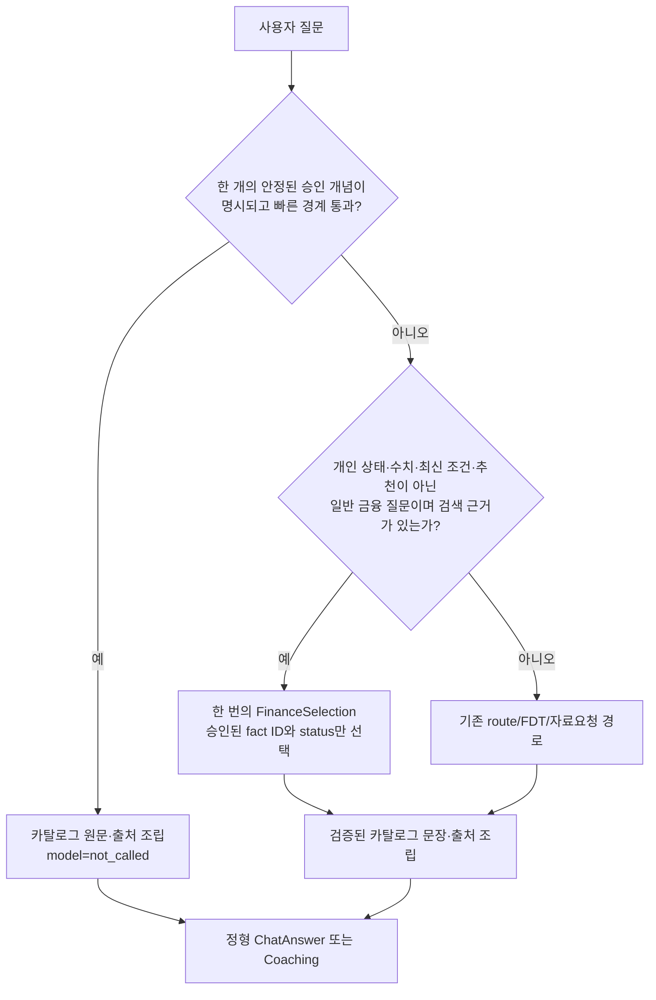

# R26 일반 금융 챗봇 응답 경로와 정확도 보호

검증일: 2026-09-16  
적용 범위: `ai/coaching`의 일반 금융 질문 분기와 고정 지식 카탈로그만

## 목표

개인 예측·위험 분석만 빨라져도 일반 금융 질문이 `의도 분류 → 근거 선택`을 직렬로 기다리면
사용자는 챗봇이 느리다고 느낀다. R26은 답변 문장을 모델이 새로 만들게 하는 대신, 승인된
카탈로그 문장과 출처를 그대로 조립하는 기존 계약을 활용해 다음 세 경로를 분리한다.

모든 금액·기간·위험 확률·예측값은 이 그림의 어느 모델 경로에서도 만들지 않는다. 그런 요청은
FDT와 기간 계약으로 가며, 모델은 근거 ID나 설명만 보조한다.

## 실제로 바꾼 경계

### 1. 모델을 전혀 호출하지 않는 안정 카탈로그 답변

정확한 정의 문법뿐 아니라, 하나의 승인된 주제가 명시되고 다음 조건을 모두 통과한 안정 설명
문장은 고정 카탈로그 문장과 출처를 그대로 반환한다.

- 검색 결과의 ID가 완전하고 중복·미지 ID가 없다.
- 카탈로그 제목, 세 글자 이상 한국어 별칭, 또는 DSR·ETF 같은 약어 중 하나가 고유하게 가장 강한
  신호다. 본문 유사도만으로 직접 답을 선택하지 않는다.
- 개인 소유·잔액·소비·예측, 최신 규정·시장 조건, 수치 계산, 상품 선택·추천, 복수 주제는 제외한다.
- 대화 이력이 있는 후속 질문은 이 경로에서 제외한다. 이전 주제를 잘못 이어 붙이는 대신 기존
  대화 검증 경로가 판단한다.

한국어에서 `내면`, `내는`은 개인 소유 표현이 아니라 동사 어미일 수 있다. 이 문법을 `내`라는
개인 상태로 오인하면 안정된 일반 질문이 불필요한 모델 경로로 빠진다. R26은 실제 소유 경계만
인식하도록 이를 고쳤고, 개인 계좌·고정비·보험료 같은 조회 동사는 별도 개인 상태 경계에 남겼다.

### 2. 한 번의 근거 선택으로 충분한 일반 금융 질문

직접 응답 기준에 미치지 않더라도, 대화 이력·개인 상태·FDT 요청이 없고 승인 자료가 검색된
일반 금융 질문은 `FinanceSelection` 한 번으로 처리한다. 이 선택은 `answered`, `needs_source`,
`needs_data`, `out_of_scope`와 승인된 fact ID만 반환한다. 서비스가 결과를 엄격하게 검증한 뒤
원문 카탈로그 문장과 출처를 조립한다.

따라서 기존의 `route → FinanceSelection` 두 모델 호출 중 앞의 route 호출만 제거한다. 이 변경은
모델에게 더 긴 자유 서술을 맡기거나, 개인 수치를 모델로 옮기는 변경이 아니다.

## 고정 화면 결과와 의미

원문 질문·응답은 Git 제외 `artifacts/`에만 두고, 고정된 27개 일반 개념 바꿔 말하기와 12개
개인·최신·범위 경계 문항을 카탈로그 해시
`93ffb7d4670618752eb1554b39b3220f23944027f7fd5a163331b30c10b134d0`으로 실행했다.

| 확인 항목 | 결과 | 뜻 |
| --- | ---: | --- |
| 안정 직접 응답 | 8 / 27 | 모델 호출 없이 카탈로그 본문·출처·상태가 기대값과 일치한 문항 수 |
| 직접 응답의 본문·출처 검증 실패 | 0 / 8 | 잘못된 fact ID, 누락된 본문, 추가 문장이 없었음 |
| 한 번의 `FinanceSelection` 대상 | 23 / 27 | 모델이 실제로 정확히 답했다는 수치가 아니라, route를 먼저 호출하지 않는 경로 적합성 |
| 기존 전체 경로 유지 | 4 / 27 | 빠른 경계가 확신하지 못해 보수적으로 남긴 문항 수 |
| 개인·최신·범위 경계의 직접/단일선택 진입 | 0 / 12 | 개인 상태나 최신 조건을 일반 지식 답변으로 축소하지 않았음 |

집계 산출물의 SHA-256은
`DC7AD42837C689C2BD3BF2CA6129B47FB71FEB630EE734483AE673ED579FBBDC`다.

이 표의 `8 / 8`은 **고정 카탈로그의 원문 충실성**만 검증한다. `23 / 27`은 호출 토폴로지이며,
실제 모델의 의미 정확도·완료 시간·첫 유효 응답 시간을 뜻하지 않는다. 실제 고객의 금융 예측
정확도와도 무관하다.

## 다음 모델 실험의 채택 기준

일반 경로에서 더 작은 선택 모델, 더 큰 보조 모델, 비동기 실행 후보를 기본값으로 바꾸기 전에는
같은 동결 질문·근거·출력 상한으로 기준 경로와 후보를 비교한다.

1. C1·C4·C8에서 첫 유효 응답과 완료 시간의 중앙값·P95, 오류·대체율을 각각 기록한다.
2. 숨김 의미 평가에서 필요한 근거·상태·금지 주장·복수 주제 완전성을 함께 채점한다.
3. 후보는 기준 대비 의미 통과율이 낮아지지 않고, 근거 없는 개인 수치·현재 조건 확정은 0건이어야
   한다.
4. 실제 모델 실행 결과가 없는 동안에는 이 문서의 호출 감소를 초 단위 응답 속도 개선으로 표현하지
   않는다.

이후에도 예측 결과는 발급 시점의 FDT snapshot을 저장한 뒤 만기 실제 거래·잔액으로 정산해야 한다.
일반 대화의 근거 선택 성능이 미래 잔액 예측의 정확도를 대신 증명하지 않는다.

## 회귀 검증

- `tests/test_deterministic_finance_fast_path.py`: 안정 바꿔 말하기가 모델을 호출하지 않고 카탈로그
  출처를 보존하는지, 한국어 동사 어미와 개인·최신·계산·복수 주제 경계가 빠른 경로를 통과하지
  않는지 확인한다.
- `tests/test_interactive_latency_fast_path.py`: 일반 서술형 질문이 `route → fact-selection` 두 번이
  아니라 하나의 bounded `FinanceSelection`으로 끝나는지, 개인 조회·계산·추천 요청은 제외되는지
  확인한다.
- `tests/test_knowledge_response.py`: 모델 호출 여부가 아니라 승인된 본문·출처·상태가 맞을 때만
  고정 지식 답변을 정답으로 집계하는지 확인한다.
