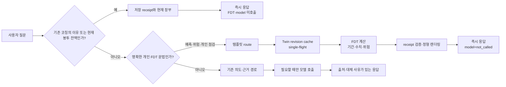

# R24 FDT 대화 지연 축소와 정확도 보호

검증일: 2026-09-16  
적용 범위: `ai/coaching`의 FDT 대화·캐시·응답 조립·회귀 검증만

## 사용자 관점의 문제와 이번 변경

한 번의 채팅에서 FDT 계산 뒤에 보조 설명 생성을 다시 기다리면, 금액·기간·위험 판단은 이미
완료됐어도 사용자는 추가 지연을 겪는다. 명확한 개인 FDT 질문은 다음 순서로 처리하도록 바꿨다.

1. 예측·위험·구조화 목표/가정/최적화와 명시적 개인 소비·지출 점검은 모델 분류를 건너뛴다.
2. 수치 요청은 기존의 `검토 + 수치 예측` 두 계산 대신 하나의 수치 FDT 실행만 한다.
3. 검증된 FDT receipt는 금액을 바꿀 수 없는 보조 문장을 위해 모델 호출을 기다리지 않는다.
4. 같은 Twin revision과 같은 수치·review 요청은 immutable cache와 single-flight로 한 번만 계산한다.
5. 이미 전달한 코칭의 발생 이유나 현재 봉투 잔액만 묻는 후속 질문은 저장 receipt와 현재 장부를
   분리해 읽고, 새로운 FDT·모델 요청을 만들지 않는다. 위험·확률·예측을 함께 묻는 경우는 이
   지름길에서 제외하고 정상 FDT 경로로 보낸다.
6. FDT worker 동시성은 서비스 설정 `fdt_max_concurrency`로 분리하고, 통제 부하에서 개별 요청
   중앙값이 더 낮았던 2를 기본값으로 둔다.

일반 금융 개념, 시장·제도 질문, 정의형 질문, 개인 FDT인지 단정할 수 없는 질문은 기존 분류
경로를 유지한다. 빠른 경로가 편의를 위해 질문 의도를 바꾸거나 수치를 만드는 구조는 아니다.

## 지연 측정의 범위

현재 개발 환경에는 배포 앱의 모델 endpoint 설정이 없었다. 따라서 이 문서의 밀리초는
**통제된 서비스·FDT 구성요소 실험**이며, 사용자가 관찰한 앱의 전체 지연이나 실제 고객의
응답 SLA가 아니다.

제공된 더미 원장 409건을 원문 복사 없이 해시와 집계만 사용해 30일 예측으로 측정했다.

| 항목 | 중앙값 | P95 | 해석 |
| --- | ---: | ---: | --- |
| Twin 생성 | 20.349ms | — | 입력 원장으로 Twin을 만드는 직접 연산 |
| 직렬화 Twin 재구성 | 19.870ms | — | cache가 없을 때의 재적합 비용 |
| cold 수치 FDT, 400 paths | 41.669ms | 65.857ms | 모델·앱·네트워크·저장 전체는 제외 |
| 같은 요청 cache hit | 11.755ms | 13.633ms | 결과는 JSON을 새로 복원해 호출자가 cache를 변형할 수 없음 |

기존 수치 대화와 새 수치 대화를 같은 30일·100 paths·seed 조건에서 12회씩 비교하면,
`검토 + 수치 예측` 중앙값은 45.863ms, `수치 예측 1회`는 27.672ms였다. 직접 경로에서는
중앙값이 **39.663%** 줄었다. 이 절감은 동일한 pinned `Engine.run` 결과를 반환하는지 별도
동등성 회귀로 확인했다.

앱에서 남는 지연은 요청마다 `X-Coaching-Trace: 1`로 확인한다. 응답 `Server-Timing`에는
payload 없이 `api`, `fdt`, `fdt_compute`, `fdt_wait`, `model`, `limiter`, `tokenize`,
`generation`만 기록한다. `fdt`는 제한기 대기와 엔진 실행의 합, `fdt_compute`는 worker 안의
실제 엔진 실행, `fdt_wait`는 둘의 차이다. 따라서 화면에서 오래 걸렸다는 사실만으로 엔진 계산과
대기·생성 시간을 섞어 해석하지 않게 했다.

새로 추가한 R25 계산 화면에서는 작은 계약 fixture에서 30일·400 paths 예측은 34.721ms,
동일 조건 위험 분석은 23.008ms, 90일·400 paths·27개 후보 최적화는 171.293ms였다. 이는
단일 프로세스의 FDT 구성요소 확인이며 앱·DB·네트워크·모델 생성 시간이나 서비스 SLA가 아니다.
같은 R25의 실제 TCP 통제 QA에서 저장 코칭 이유 후속 질문은 HTTP 200, `model=not_called`,
`Server-Timing=[api]`로 끝났고 FDT·모델 metric 및 route/write/judge 호출 증가가 모두 없었다.

제공 더미 원장의 서로 다른 risk 요청 16개를 동시에 넣는 7회 반복 화면에서는 FDT worker 수 2가
wall 중앙값 703.710ms, 요청 중앙값 376.366ms였고, 4는 각각 719.151ms, 393.393ms였다. 반면
P95 중앙값은 2가 656.191ms, 4가 621.024ms로 4가 약간 낮았다. 채팅의 개별 요청 체감을 우선해
기본값은 2로 정했지만, 이는 계산식·path 수·예측 결과를 바꾸지 않는 **대기열 한도**일 뿐 배포
환경의 보편적 최적값이나 SLA가 아니다. 배포 trace에서 `fdt_wait` P95가 악화되면 같은 설정을
1~8 범위에서 다시 비교해 조정한다.

## 정확도를 희생하지 않은 이유

이번 변경은 예측값을 새로 학습하거나 수정하지 않는다. FDT 결과와 cache 결과를 원본
`Engine.run`과 정확히 비교하고, 모델이 결과 뒤의 금액·기간·위험 결론을 바꾸지 못하게 했다.
개인 review 빠른 경계는 다음처럼 좁게 제한했다.

| 문장 | 처리 |
| --- | --- |
| `내 소비 습관을 점검해줘` | FDT review, 모델 route/write 없음 |
| `내 지출을 분석해줘` | FDT review, 모델 route/write 없음 |
| `소비 습관을 점검하는 방법이 뭐야?` | 일반 개념 경로 유지 |
| `내년 소비를 분석해줘` | FDT 개인 review로 오인하지 않고 기존 경로 유지 |

즉, 빠른 경로는 개인 소유 표현과 소비·지출 대상, 점검·분석·진단·검토 동작을 모두 요구한다.
정의·방법 질문과 달력상의 `내년`은 빠른 FDT review에 들어가지 않는다.

## 예측 정확도 실험과 채택하지 않은 후보

더미 원장 409건을 개발 84개, 시간상 뒤 평가 59개로 나눴다. 실제 결과는 제품 FDT 함수와
별도의 raw source 계산 구현으로 만들었지만, 독립 인간 oracle이나 실제 고객 정답은 아니다.

평가 구간에서 현 FDT의 30일 총액 예측은 WAPE 1.041845, MAE 83,445.59원,
80% 구간 포함률 49.15%였다. WAPE는 실제 총액 대비 절대오차 비율, MAE는 건별 평균 절대오차,
포함률은 실제값이 예측 구간 안에 든 비율이다. 80% 구간 포함률이 49.15%인 것은 구간 보정이
아직 충분하지 않다는 뜻이며, 실제 고객 정확도를 주장할 근거가 아니다.

속도만을 위해 path 수를 400에서 50으로 낮추는 후보도 평가했다.

| 평가 59개 | 50 paths | 400 paths |
| --- | ---: | ---: |
| 직접 FDT 중앙값 | 32.824ms | 35.570ms |
| WAPE | 1.060176 | 1.041845 |
| MAE | 84,913.81원 | 83,445.59원 |
| 80% 구간 포함률 | 44.07% | 49.15% |
| WIS80 | 658,044.47 | 615,446.78 |

WIS80은 구간이 실제값을 놓치거나 불필요하게 넓을 때 함께 불리해지는 구간 점수다. 50 paths는
약 2.7ms만 빨랐고 평가 오차·구간 품질이 더 나빠져 기본 path 수 변경 후보에서 제외했다.
개발 구간에서만 좋아 보인 후보를 채택하지 않았으며, 현 자연어 경로의 기존 path 정책도 이
실험만으로 바꾸지 않았다.

별도 합성 사용자·기간 분할의 R49/R50 후보에서는, 기본 FDT 대비 96개 시간상 뒤 평가에서
WAPE가 0.212932에서 0.177493, MAE가 17,825.52원에서 14,858.72원, 80% 구간 포함률이
65.63%에서 88.54%로 변했다. 사용자 묶음 bootstrap 10,000회에서도 WAPE·MAE·구간 점수의
차이 95% 구간은 모두 후보에 유리했고 포함률 차이도 양수였다. 다만 이는 독립적인 **합성**
oracle 결과다. 실제 고객 미래값이나 독립 인간 oracle이 아니므로 보정 후보를 기본 예측에
적용하지 않았다. 요청 중 과거 보정을 다시 계산하면 약 301ms가 더해질 수 있어, 실제 승격 전
설계도 settled-event에서 상태를 미리 갱신하고 요청에는 이미 준비된 보정만 적용하는 방식이어야 한다.

## 검증 증거

- `test_numeric_turn_latency_path.py`: 수치 질문이 review를 먼저 실행하지 않고, 수치 receipt를
  그대로 반환하는지 확인한다.
- `test_engine_execution_cache.py`: Twin 재구성·동일 review·수치 요청의 concurrent single-flight와
  cached result의 원본 FDT 동등성을 확인한다.
- `test_fdt_concurrency.py`: FDT worker 동시성의 기본값·허용 범위와 직접 생성 경계가 같은 상한을
  적용하는지 확인한다.
- `test_authoritative_fdt_turn_latency.py`, `test_interactive_latency_fast_path.py`: 명확한
  예측·위험·개인 review가 모델 route/write 없이 완료되고, trace에 `model` 시간이 없는지 확인한다.
- `test_interactive_latency_fast_path.py`: 실제 TCP에서 저장 코칭 이유 후속 질문이 FDT·모델
  metric 없이 `api` 시간만 남기는지, 위험을 함께 묻는 질문은 이 지름길에 들어가지 않는지 확인한다.
- `test_e2e.py`: 실제 TCP API의 24개 고정 시나리오에서 receipt·수치 결과·모델 호출 여부를
  함께 확인한다. FDT 완결 receipt가 모델 호출 없이 template 결과가 되는 새 분모를 사용한다.

원시 결과는 Git 제외 `artifacts/`에 보관한다. 원문 더미 거래·개인 식별 정보는 저장소에 넣지
않았다.

| 결과 | SHA-256 |
| --- | --- |
| 더미 원장 재생 | `B61C081FB5021D7F8EFAF0BC98351423501EEDDCE8AA1D81A2F45AF46184FAD6` |
| FDT 구성요소 지연 | `2B9B28529A81EFB42DD3F9C74DBED4F8C2142A11CB7BC98E8DEC3AD61CEB4DBF` |
| path 수 후보 평가 | `7CC9F3B5FCF4A656285262F912E9BEC102F19C6B758C9D518499031500E592D8` |
| 수치 대화 경로 비교 | `51A62686C01F91806220783ABBFF3CC73CB060559810D89DC3CCB527A982C810` |
| TCP E2E receipt 검증 | `39D7B14D10802C152590A25E833EF84F1434095903B12EEBD09DFC2809EA63DE` |
| R25 FDT 계산 화면 | `BA16E4D3F92597AEA785D49546F89DB827DE3152010BCDAD450F5CCD5A0E358E` |
| R25 TCP 저장 코칭 후속 질문 | `494CD3167FDEE170C0E4136D0F202206192E8041175C0F63DE8E46D14E1E9668` |
| R25 FDT 동시성 2 대 4 반복 화면 | `70A2BDB3C84BFA9F63FC420D2A5086F791C958D44715DF12D3A642E2C7C40A47` |

## 실제 고객 수준으로 올리기 위한 다음 검증

기본 모델 교체나 path 정책 변경 전에는 다음을 모두 통과해야 한다.

1. 예측 발급 시점의 Twin·기간·후보 버전을 고정해 저장한다.
2. 만기 후 실제 거래·잔액으로 정산하고, 같은 고객의 미래를 학습에 섞지 않는다.
3. 현 FDT와 후보를 같은 발급 시점·같은 고객 묶음에서 비교한다.
4. 고객별 bootstrap 신뢰구간으로 MAE·WAPE·WIS80·Coverage80과 잔액 부족 위험 점수를 함께 본다.
5. 점오차가 좋아도 구간 보정·위험 누락·특정 고객군 악화가 있으면 기본값을 바꾸지 않는다.

이 서비스에는 발급 등록·만기 정산·지표 조회 API가 이미 있으므로, 실제 연결 환경에서는
이 절차로 배포 앱의 지연과 미래 실제값을 함께 수집해야 한다. 그 전까지 이번 결과는
**FDT 응답 경로와 합성 더미 원장에 대한 구현·자체검증**이다.
