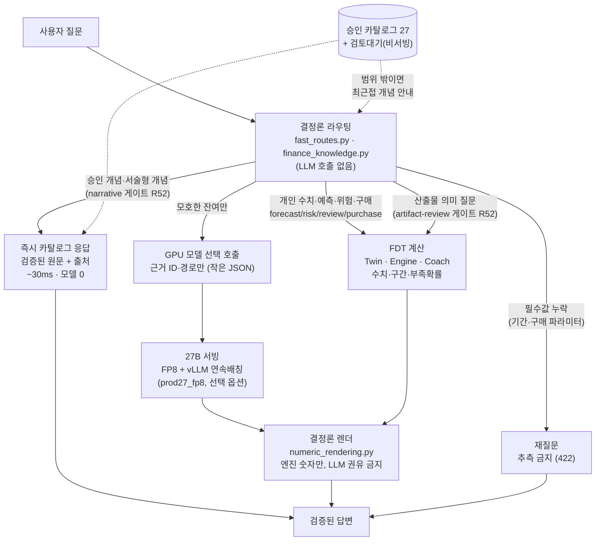
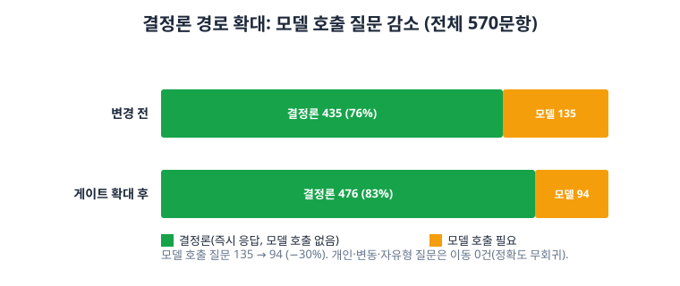
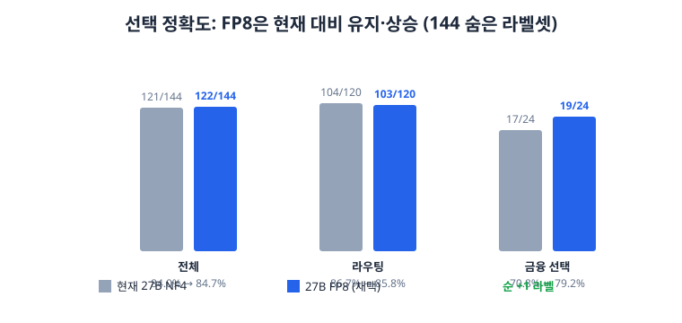

# 성능·기능 고도화 개요 (R50–R55)

챗봇 응답 지연·정확도·기능을 한 번에 끌어올린 작업의 종합 요약이다. 모든 채택은 실측으로 검증했고,
정확도 무회귀를 확인한 뒤에만 반영했다. 기준 구조는 [AI·FDT 전체 구조도](../architecture.md)를 따른다.

> GitLab에서 첫 로드에 Mermaid `Syntax error`가 보이면 새로고침하면 렌더된다(GitLab 렌더러 간헐 현상).

## 한눈에 보기 — 응답 흐름 (현재)

핵심: **지연 지배항은 FDT가 아니라 라우팅/선택 LLM 호출 1회**다. 그래서 ① 결정론 경로로 호출 자체를 없애고
② 남는 호출은 FP8+vLLM로 가속했다.

## 실험 결과

### 1. 응답 지연 — 동시 요청 최대 9.1배 단축 ([latency.svg](latency.svg))

| 동시 요청 | 현재(NF4/transformers) | FP8+vLLM | 배속 |
| --- | --- | --- | --- |
| 1 | 5.79s | 4.29s | 1.35x |
| 4 | 24.19s | 5.04s | 4.8x |
| 8 | 49.07s | 5.40s | **9.1x** |

vLLM 연속 배칭으로 부하가 걸려도 지연이 거의 오르지 않는다. 초기 보고 "동시 요청 수십 초 대기"의 직접 해답.

### 2. 결정론 경로 확대 — 모델 호출 제거 ([routing-split.svg](routing-split.svg))

전체 570문항 중 모델 호출 질문 **135 → 94 (−30%)**. 서술형 개념 41문항이 5.8s 모델 대신 즉시(~30ms) 응답.
개인·변동·자유형 질문은 이동 0(정확도 경계 유지, 재측정으로 검증).

### 3. 정확도 — 유지·상승 ([accuracy.svg](accuracy.svg))

144개 숨은 라벨셋(비교란: 동일 프롬프트·문법강제·greedy): 전체 NF4 121/144 → **FP8 122/144(순 +1)**.
route:review는 결정론 게이트로 24 → 36 전망(forecast/risk 40/40 무회귀).

## 이번 작업 (MR 반영 커밋)

| 커밋 | 내용 | 검증 |
| --- | --- | --- |
| `56ff6c8` | FP8 vLLM 서빙(9.1x)·결정론 게이트 확대·예측 게이트 판정가능성·시각화 | 1216 tests |
| `345542a` | 자연어 일시불 구매 what-if Phase 1 (현금+단일카드, 판정 경계버그 수정) | 1228 tests |
| `d0884b2` | 카탈로그 확장 안전 기반(충돌 가드·검증·비서빙 대기)·out_of_scope 개선 | 1349 tests |
| `bacea95` | 카탈로그 후보 8건 검토 패킷(미서빙, candidates) | — |

### 채택·기각 판정
| 항목 | 효과 | 판정 |
| --- | --- | --- |
| FP8-27B + vLLM(`prod27_fp8` 태그) | 동시 8요청 9.1x, 정확도 +1 | 채택(선택 옵션 배선, 배포는 후속) |
| 결정론 게이트 확대(서술형·review·구매) | 모델 호출 제거, 즉시 응답 | 채택 |
| 예측 승격 게이트 판정가능성 복구 | 표본 dev84/eval42, 현재 FDT가 게이트 통과 | 채택 |
| 선형어텐션 커널 설치 | 동시 8요청 7%, 출력 50% 변화(수치 비투명) | 기각 |

## 세부 문서
- 서빙 환경: vLLM 0.19.0 + torch 2.10.0+cu128 (CUDA-12 드라이버; vLLM ≥0.27은 CUDA-13 요구로 현재 불가). [운영 설정](../operations.md)의 `prod27_fp8` 태그.
- 예측 게이트/보정 기록: [validation.md](../validation.md). 카탈로그 기여 절차: [catalog-contribution.md](../catalog-contribution.md).
- 원자료: `artifacts/`의 R50–R53 안전 집계 JSON(원시 거래·질문·인증값 미포함).

## 미완료(후속 트랙)
- FP8 운영 배포 + 스테이징 스모크(팀 배정 GPU, Device2).
- 구매 판정 reserve 반영(현재 "0원 안 됨" → "비상금 보호"로 격상, 팀 합의 B-4).
- 다회차 할부(엔진 작업 Phase 2). 카탈로그 후보 8건 사람 검증 후 finance.json 승격.
