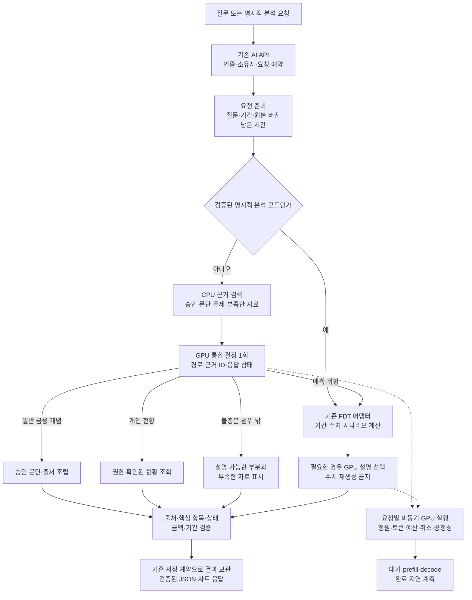
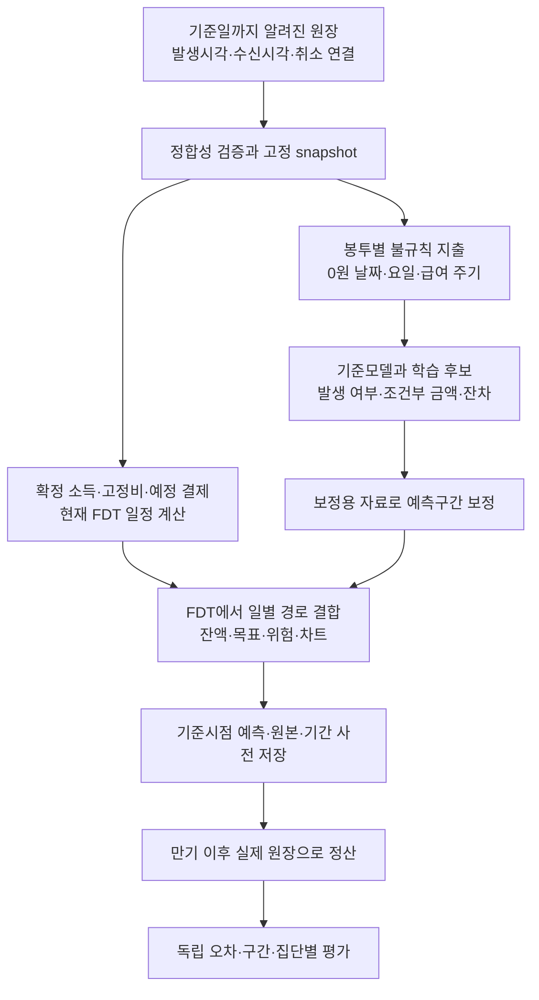

# 답변 정확도·동시 처리·예측 개선 설계 (R21)

2026-09-15. 기준 코드 `a7fc0bd2651c53fa7dcb2fa7434290578964bae3`.
**상태: 설계안. 아래 목표는 달성 수치가 아니며, 구현·GPU 비교·승격은 후속 작업이다.**

우선 같은 27B 모델에서 일반 금융 질문의 두 번 추론을 한 번으로 합치고,
요청별로 GPU 작업이 끝나는 즉시 반환하는 구조를 시험한다. 그다음 검색·입력 재사용을
개선하고, 남은 오류를 학습 대상으로 삼는다. 미래 예측은 서비스의 실제 봉투 소비와
기간을 목표로 별도 검증한다. 답변을 잘 설명하는 것과 미래 금액을 잘 맞히는 것은 다른 목표다.

## 1. 현재 근거와 우선순위

| 확인한 사실 | 의미 | 먼저 할 일 |
| --- | --- | --- |
| R20 첫 동결 확인 5/12→10/12, 수정 후 알려진 32질문·96응답 통과 | 현재 질문의 개선 증거이며 새 고객·미공개 질문의 정확도 보증은 아니다 | 새 평가를 동결하고 회귀와 분리 |
| R20 v4 C8 중앙값 19.46초, P95 26.76초 | 답변 보완 후 동시 처리 지연이 남음 | 정확도가 같은 v4를 다음 속도 비교의 기준으로 사용 |
| `Dialogue.turn()`의 일반 질문은 `route()` 후 금융 `write()` | 일반 금융 답변에 GPU 순차 왕복 두 번 | 분류와 근거 선택을 한 번의 구조화 출력으로 비교 |
| `BatchDispatcher.run()`이 `await generate(active)` 후 다음 묶음을 받음 | 앞 배치 전체의 완료를 기다리는 장벽이 있음 | 네이티브 비동기 추론과 비교 |
| 기존 vLLM 실험도 이 배처 아래에서 동기 `LLM.generate()` 호출 | 엔진 변경만으로 배치 간 대기 장벽이 없어지지는 않음 | HTTP/API 외부 배처와 엔진 내부 스케줄러 역할 분리 |
| R20 vLLM은 prefix cache OFF, chunked prefill ON | chunked prefill을 새 기능처럼 켜는 실험은 중복 | 입력 재사용과 토큰 예산을 각각 비교 |
| SQLite는 예약 후 추론하고 짧은 commit만 수행 | 긴 DB 쓰기 트랜잭션이 원인이라는 근거는 없음 | DB 교체부터 하지 않고 지연을 계측 |
| R19 추가학습은 단순 기준모델을 넘지 못함 | 큰 모델·추가학습만으로 예측 개선을 보장 못함 | 총출금과 서비스 소비 타깃의 불일치부터 해결 |

현재 코드는 [대화 흐름](../src/coaching_service/dialogue.py),
[금융 근거 선택](../src/coaching_service/finance_knowledge.py),
[추론 클라이언트](../src/coaching_service/llm.py), [배처](../scripts/gpu_batching.py),
[실행 수명](../scripts/gpu_execution.py), [저장 경계](../src/coaching_service/repository.py)에서 확인했다.
지연의 몇 %가 각 단계에서 발생하는지는 아직 측정하지 않았다. 위 구조는 원인 후보이지
GPU 계산·대기·토큰화의 기여도를 확정한 프로파일이 아니다.

## 2. 제안하는 요청 흐름

그림은 제안 구조다. FDT는 현재처럼 Python API 내부의 팀 엔진을 어댑터로 사용한다.
새 FDT 서버나 프런트엔드·백엔드 변경을 전제하지 않는다.
점선은 GPU 호출이 실행되는 내부 경계이며 추가 모델 호출을 뜻하지 않는다.

| 실제 질문 | 처리 방식 | 정상 경로의 GPU 호출 목표 | 정확도 보존 조건 |
| --- | --- | ---: | --- |
| “복리와 단리는 어떻게 달라?” | 경로와 두 개념의 근거를 함께 선택하고 승인 본문 조립 | 1회 | 설명 누락·틀린 전제·출처 검사 |
| “그건 말고 리볼빙은?” | 제외한 주제와 남은 문맥을 반영한 통합 결정 | 1회 | 후속 질문·주제 전환 회귀 |
| “내 계좌 잔액은?” | 경로 결정 후 소유자의 저장된 현황 조회 | 1회 이하 | 타인 자료 접근 금지, 기준일 표시 |
| 명시적 `forecast` 분석 요청 | 기존 기간 해석→FDT→필요한 설명 선택 | 1회 이하 | 기존 수치·기간·차트 동일성 |
| “이번 달 말까지 돈이 부족할까?” | 경로 결정→월말 기간 검증→FDT→설명 선택 | 최대 2회 | 관측 마감 이후만 예측, 잔액 계산은 FDT |
| “오늘 최고 금리와 복리 원리를 알려줘” | 근거 있는 개념은 설명, 최신 자료 부족을 별도 표시 | 1회 | 최신 금리 생성 금지, 부분답변 상태 유지 |

오류 복구 호출은 이 정상 호출 수에 숨기지 않고 별도 집계한다. 모든 요청에 판사 모델이나
여러 에이전트를 붙이지 않는다. 추가 판단은 검증 실패·불확실한 경우에 한정한다.

## 3. 먼저 지연을 나누어 측정한다 — P0

요청 전체의 하나의 추적 ID 아래에 예약/조회, CPU 검색, API 추론 슬롯 대기,
token preflight, worker 대기, GPU prefill, GPU decode, 응답 검증, 저장을 기록한다.
GPU 호출마다 operation, 입력·출력 토큰 수, 실제 배치/활성 요청 수, 취소·거절·fallback을 남긴다.
원문 질문·거래·인증값을 성능 로그에 넣지 않는다.

- 클라이언트 예정 전송 시각→실제 전송→최종 검증 응답을 모두 측정한다.
- 서로 다른 호스트의 시계를 빼지 않는다. 단계별 시간은 같은 프로세스의 monotonic clock으로,
  전체 응답시간은 부하 클라이언트로 잰다. 겹친 구간을 더해 총 지연으로 만들지 않는다.
- TTFT는 첫 토큰 시간이다. 현재 사용자는 검증된 최종 JSON을 받으므로 **최종 응답시간**이
  주 지표다. 검증 전 토큰 스트리밍으로 체감 속도만 개선했다고 집계하지 않는다.
- 현재 작업별 30초 제한과 전체 예약 수명을 재사용하되, 새 통합 요청은 하나의 남은 시간 예산을
  공유한다. 재시도·단계 추가마다 전체 제한이 늘어나는 구조를 피한다.

P0 통과 조건은 프로파일에서 전체 요청 수, 단계별 호출 수, 시간 초과·취소 수가
클라이언트 원문과 일치하는 것이다. 실제 대기 비중이 작으면 스케줄러보다 입력·모델 계산을 먼저 개선한다.

## 4. 같은 모델로 호출과 대기를 줄인다 — P1/P2

### P1: 분류·근거 선택 통합

새 내부 결정 계약은 경로, 근거 ID, 응답 상태, 필요한 자료를 함께 반환한다.
기존 `FinanceSelection`과 `Routing`을 그대로 두 번 실행하는 대신, 한 결과를 두 기존 계약에
변환하는 어댑터를 둔다. 기존 API 응답·근거 해시·세션 저장 형식은 유지한다.

CPU에서 검색한 승인 자료만 입력한다. 개인 데이터·금액은 이 단계에 넣지 않는다.
일반 금융 질문이면 결과를 바로 검증·조립하고, 개인/예측이면 권한과 자료를 확인한 뒤
해당 경로로 넘긴다. 경로 결과는 권한도, 개인 금융 수치를 확정하는 근거도 아니다.
처음에는 새 결정 결과를 shadow로 비교해 실제 응답은 v4로 유지한다.
지원하지 않는 복잡한 혼합 질문은 부분답변/추가자료로 표시하며 강제로 단일 의도로 축소하지 않는다.
통합 결정이 모든 질문에 많은 자료를 붙여 prefill을 늘릴 수 있으므로, 호출 수뿐 아니라
입력 토큰·최종 응답시간도 비교한다. 1회 호출 자체를 성능 개선으로 판정하지 않는다.

주제 ID 최대 3개와 답변 2,400자 제한은 현재 계약이다. 더 많은 개념을 요구한 질문에서
앞의 세 개만 선택하고 answered로 표시하면 안 된다. 지원 범위를 표시하거나 제한 확장 후보를
별도로 검증한다. 일반 거절을 늘려 토큰 수와 응답시간을 줄이는 후보는 탈락한다.

### P2: 배치 단위 완료 장벽 제거

실험 후보는 기존 인증·모델 등록·token preflight를 담당하는 얇은 AI gateway 뒤에
vLLM의 비동기 실행 엔진을 둔다. 요청을 하나씩 제출하고 각각 완료·취소를 받는다.
Transformers 경로의 `BatchDispatcher`는 유지하고, vLLM 경로는 그 배처로 다시 묶지 않는다.

네이티브 OpenAI 호환 서버와 비동기 엔진 직접 연결 중, **기존 토큰 계약을 재현하는 경로**를
먼저 선택한다. `/v1/tokenize`의 현재 사용자 정의 응답·prompt hash와 vLLM API는 그대로
동일하다고 가정하지 않는다. 동일 tokenizer, chat template, 스키마 지시 삽입, 모델 revision을
고정하고 8,192/8,193 경계와 실제 생성 입력 token ID 일치를 확인한다.

요청 ID별 abort, 결과 역순 도착, 한 요청 취소 중 다른 요청 계속 실행, deadline 이후 결과
미저장, 엔진 재시작을 시험한다. 큐 정원과 전체 token/KV 예산은 유지하며, 긴 요청이
짧은 요청 때문에 영원히 밀리지 않도록 대기 시간이 길수록 우선순위를 높이는 정책을 둔다.
공정성 정책을 구현하기 전에는 엔진 기본 정책을 기준으로 먼저 측정한다.

JSON schema를 실제 constrained decoding으로 적용하는 후보도 별도 비교한다.
JSON 형태 제약은 사실 정확도나 질문의 완전성을 보장하지 않는다.
서버·스키마 옵션은 [vLLM 0.19 서버](https://docs.vllm.ai/en/v0.19.0/serving/openai_compatible_server/)와
[구조화 출력 문서](https://docs.vllm.ai/en/v0.19.0/features/structured_outputs/)를 기준으로 호환성을 검증한다.

## 5. 검색과 입력 재사용을 개선한다 — P3

현재 27개 승인 자료에서는 큰 벡터 DB를 도입하기보다 다음 후보를 먼저 비교한다.

1. 기존 본문 BM25 + 전체 소규모 목록 선택을 기준으로 유지한다.
2. CPU 임베딩 검색과 BM25 결과를 합치고, 필요한 주제의 근거가 상위 목록에 모두 남는지 검사한다.
3. 검색이 모호하면 현재 전체 목록 경로로 되돌아간다. 검색 점수나 모델의 자신감 문장을
   확률로 간주하지 않고 별도 calibration 자료로 경계값을 정한다.
4. 여러 주제를 각각 짧게 포함하는 근거 묶음과 전체 문단 전달을 비교한다. 예외·범위·주의 문장을
   빼는 요약은 금지한다. 근거 부족 때 자료를 늘리는 복구는 최대 1회, 남은 시간 안에서만 수행한다.

정렬이 고정된 시스템 지시·스키마·공통 승인 자료를 앞에, 질문·개인 문맥을 뒤에 배치하는
prefix cache 후보를 시험한다. [vLLM APC 문서](https://docs.vllm.ai/en/v0.19.0/features/automatic_prefix_caching/)에
따르면 같은 앞부분의 prefill을 재사용하는 기능이며 decode를 줄이지는 않는다.
전체 자료의 고정 prefix는 cache hit를 늘리는 대신 입력을 키울 수 있어, 상위 자료만 넣는
방식과 각각 cold/warm 조건으로 비교한다. cache ON이 항상 빠르다고 가정하지 않는다.

공통 자료 cache와 개인 응답 cache를 구분한다. 최초 후보는 개인 응답 cache를 만들지 않는다.
개인 KV가 생기는 경로는 owner 단위 격리/salt를 검증하거나 공유를 끈다. 기존 멱등키 결과
재사용은 보존한다. 조회 날짜·자료 만료·원본 버전·기간·모델 변경 뒤 낡은 결과를 재사용하지 않는다.

출력 상한도 operation별로 측정한다. route/근거 ID 선택의 출력 분포를 보고 짧은 상한 후보를
정하되, `finish_reason=length`, 누락, 잘못된 상태가 늘면 탈락한다. 이미 짧게 끝나는 응답은
상한만 낮춘다고 decode가 줄지 않는다. chunked prefill은 현재 켜져 있으므로 새 후보는
`max_num_batched_tokens` 2,048/4,096/8,192 등의 **예산 비교**다.
각 설정의 지연 교환관계는 [vLLM 튜닝 문서](https://docs.vllm.ai/en/v0.19.0/configuration/optimization/)를 참고한다.

## 6. 모델·학습은 오류가 남는 역할에 한정한다 — P4

| 후보 | 학습/실험 대상 | 채택 전 필수 조건 |
| --- | --- | --- |
| 현재 Qwen/Qwen3.8-27B NF4 | 같은 가중치에서 P1~P3만 변경 | 정확도 하락 없이 최종 응답시간 개선 |
| CPU 분류/검색 모델 | 질문 의도, 근거 관련성, 개인 자료 필요 여부 | 잘못된 빠른 경로 진입률과 전체 호출 비용 개선 |
| Qwen3-8B 비교 후보 | 통합 JSON 결정 또는 제한된 근거 선택; 필요하면 LoRA | 최종 문장·출처·상태 기준 비열등성 및 지연 개선 |
| 27B 추가학습 | 반복되는 의미 선택 오류가 충분히 모인 뒤 | zero-shot·프롬프트 수정·학습 후보의 동일 평가 비교 |

8B는 이미 우수한 모델로 선정한 것이 아니다. [공식 모델 카드](https://huggingface.co/Qwen/Qwen3-8B)로
사용 조건과 실행 방식을 확인한 비교 후보다. 지식·금리·실제 고객 잔액을 가중치에 외우게 하지 않고,
입력 근거에서 경로·ID·자료 부족 상태를 선택하도록 학습한다.

학습 라벨은 버전 고정된 근거와 검증 규칙으로 만들고 의미 판단은 별도로 검토한다.
27B 답을 그대로 정답으로 삼지 않는다. 개발·보정·최종 평가 질문은 학습에 넣지 않고
같은 질문의 바꿔 쓰기와 대화 가족도 같은 분할에 둔다. 학습량·seed·early stopping 기준을 기록한다.

한 팀 GPU에서 27B와 8B를 함께 상주시킬 수 있다고 가정하지 않는다. 우선 독립 실행으로
비교하며, 두 모델의 가중치·KV·최대 입력·C8 부하에서 여유 메모리를 실측한 경우에만 동시 상주를
검토한다. 요청마다 모델을 올렸다 내리는 방식은 속도 개선 구조에서 제외한다.
실행 에이전트의 모델/추론 강도를 낮추는 계획이 아니라 제품 추론 모델의 비교 설계다.

## 7. 미래 예측의 타깃부터 맞춘다 — P5

서비스에서 필요한 정답은 단순 은행 총출금이 아니라 **봉투별 실제 소비와 잔액 경로**다.
금융 원장 의미를 먼저 고정하고, 확정 일정과 불규칙 지출을 분리한다.

계좌 간 이체, 카드 승인과 대금 출금, 환불·취소, 현금 인출을 소비와 구분한다.
카드 소비가 결제일에 다시 소비로 더해지지 않도록 소비 원장과 현금 흐름을 따로 평가한다.
기준일 당시 알 수 없었던 지연 수신·취소는 입력에 소급 삽입하지 않는다.

현재 `ResolvedPeriod`와 `exclude_tag=NONE` 등 집계 정책을 그대로 사용한다.
기준일 마감이 2026-09-15이면 rolling 30일은 09-16~10-15,
이번 달 남은 예측은 09-16~09-30이다. 월 전체 평가는 이미 관측한 09-01~09-15와
미래 부분을 구분해 결합한다. 기준일이 월말인 요청의 미래 0일, 윤년, 목표일까지의 종료일,
고정비/변동비 및 제외 소비의 집계 차이는 기존 계약으로 확인한다.
현행 공휴일 조정 미지원은 별도 요구가 확정되기 전 임의로 보완하지 않는다.

후보는 현재 FDT, 최근 28/90/365일 평균, 요일 기준, 지출 발생 여부와 발생 시 금액을 나눠
추정하는 모델, FDT의 오차만 학습하는 잔차 모델, Chronos-2 원본/추가학습으로 제한해 시작한다.
거래가 없는 날과 자료 자체가 없는 날을 구분하고, 신규 고객은 장기 이력이 필요한 경로로 보내지 않는다.
분위수 출력을 합한다고 총액 분위수가 되지는 않는다. 봉투 사이 동시 지출·급여일의 상관을
반영한 경로 샘플을 FDT에서 결합하고 총소비와 잔액 구간을 별도로 보정한다.

기간을 달력 월·rolling 30일·목표일까지로 나눠 평가하고 고객별 시간 순서를 지킨다.
개발/보정/최종 고객과 날짜를 분리하며 최종 자료는 한 번만 연다.
MAE, WAPE, WIS, 구간 포함률·폭, 잔액 부족 사건의 Brier score와 calibration을 기록한다.
잔액 부족 사례가 적으면 사건 정확도는 판정 보류한다. WAPE의 분모가 0인 집단은 미정의로 표시하고
MAE를 함께 제시한다. 전체 평균뿐 아니라 저소비·변동 소득·신규 고객·월별 악화도 확인한다.

새 최종 자료에서 기준모델 대비 MAE 10% 감소, paired 오차 차이의 95% 구간 상단<0,
80% 예측구간의 포함률·폭/WIS 조건을 사전 고정한다. 포함률만 맞추려고 구간을 무작정 넓힌
후보는 채택하지 않는다. R19 조건은 시작점이며 서비스 원화·봉투 타깃에서 조건을 확정한 뒤
결과를 열어야 한다. 정답은 만기 실제 거래이며 FDT·LLM이 만든 미래값이 아니다.

## 8. 정확도와 속도를 함께 통과시키는 평가

### 자료와 채점

R20의 32질문은 영구 회귀로 둔다. 새 개발 400 / 보정 200 / 최종 600개 고유 질문을
구성하는 것을 초기 계획으로 한다. 최종은 단일 개념, 바꿔 말하기, 틀린 전제, 비교,
다중 주제, 대명사 후속, 주제 전환, 일반 계산, 최신 자료, 개인 자료 부족, 예측 의도,
지시 오염의 12종류 × 50개로 균형을 맞춘다. 실제 서비스 비중은 별도 자료로 보고한다.

최종 자료와 정답은 구현 담당자가 튜닝 중 열지 않고, 문제 가족·출처·검토 주체·노출 이력을
기록한다. 별도 AI가 작성한 자료는 인간 독립 정답으로 부르지 않는다. 금융 전문가 검토와
동의받은 실제 사용 질문이 확보되기 전에는 각각 합성 검증·사용자 질문 검증으로 구분한다.

질문별 필수 의미, 금지 주장, 요구 자료, 상태, 출처를 먼저 고정하고 실제 답변으로 채점한다.
주 지표는 **제출한 전체 질문 중 필요한 내용을 정확히 전달한 비율**이다.
대답할 수 있는 질문의 거절, 시간 초과, 깨진 응답도 실패에 포함한다.
추가로 검색 근거 재현율, 답한 질문의 오류율, 불필요한 거절률, 다중 주제 완전성,
자료 부족 판단을 따로 기록해 거절로 정확도를 높이는 편법을 막는다.

### 부하와 반복

- 동일 v4 가중치·자료·질문·runtime을 기준으로 변경 하나씩 비교한다. 채택한 변경을 합친
  최종 후보도 다시 측정한다. Transformers 대비 수치만 골라 보고하지 않는다.
- 개발 중 C1/4/8 동시 도착파를 순서 교차 3회 반복한다. 각 조건의 질문과 출력 길이,
  cold/warm cache를 고정하며 단순 질문과 예측/차트 혼합 부하를 따로 보고한다.
- 최종 품질은 600개 고유 질문을 baseline/후보에서 한 번씩 실행하고, 미리 고른 종류별
  추가 200개를 C8에서도 확인한다. 반복 응답을 독립 질문 수로 부풀리지 않는다.
- 지속 부하는 완료를 기다리지 않고 예정 시각에 요청을 보내는 open-loop로
  0.1/0.25/0.5/1 req/s를 단계적으로 비교한다. 각 단계 15분·3반복이 초기 계획이며
  예비 계측 뒤 최종 시험 전에 고정한다. C8은 동시 요청 수이고 req/s는 도착률이다.
- 큐가 계속 증가하거나 정원·자원 기준을 넘으면 해당 단계는 과부하 실패로 기록하고
  더 높은 단계는 중단한다. 거절·취소·실패를 분모에서 빼지 않는다.
- 최소 2종 혼합 비율을 사전 고정한다. 예: 개념/개인조회/예측·차트 60/20/20 및 30/20/50.
  실제 트래픽을 관측하기 전에는 이 비율을 서비스의 실제 분포로 주장하지 않는다.

### 후보 채택 기준과 장기 목표

| 구분 | 제안 기준 | 판정 의미 |
| --- | --- | --- |
| 기존 계약 | 관련 회귀 전부 통과, FDT 수치·기간·차트 불일치 0 | 개선 과정의 기능 손실 방지 |
| 속도 후보의 답변 품질 | 최종 의미 통과율 차이의 paired 95% 구간 하한 ≥ -2%p | 2%p 비열등성 한도; 무조건 정확도가 같다는 뜻은 아님 |
| 정확도 향상 주장 | 의미 통과율 차이의 paired 95% 구간 하한 > 0 | 불확실성을 고려해 개선이 확인됨 |
| 심각한 오류 | 근거 없는 개인 금액·금리 확정, 타인 자료·출처 혼입 0 | 1건도 있으면 후보 보류 |
| 동시 지연 | 동일 품질 기준 v4 대비 C8 중앙값과 P95 각각 20% 이상 감소 | 느린 일반 거절을 기준으로 삼지 않음 |
| 다른 조건 | C1/C4 중앙값·P95가 5% 넘게 악화하지 않음 | C8만 개선하는 편중 방지 |
| 자원·실패 | OOM 0, 누적 큐 증가 없음, timeout/거절/fallback 악화 없음 | 실패를 빨리 반환하는 후보 제외 |
| 장기 서비스 목표 | 일반 금융 C1 중앙값 ≤ 2초, C8 중앙값 ≤ 10초 / P95 ≤ 15초 | 희망 목표이며 현재 달성·보장 수치가 아님 |

paired 비교는 같은 질문의 두 응답을 짝짓고 대화/질문 가족을 cluster로 재표집한다.
지연의 불확실성은 도착파·실행 단위로 평가한다. 각 조건의 반복 개선 방향과 bootstrap 구간을
함께 확인한다. 표본이 적어 비열등성/향상을 입증하지 못하면 보류하고 기준을 낮추지 않는다.
속도 후보도 의미 통과율의 점추정이 v4보다 낮으면 채택하지 않는다. 비열등성 한도는
의도적으로 2%p 정확도를 희생해도 된다는 예산이 아니다. 12종류별 누락·거절 악화도 검토한다.
지연은 세 반복 모두 개선 방향이고 paired 95% 구간에서도 악화가 배제돼야 한다.
장기 목표와 채택 기준은 최종 평가를 보기 전에 확정하는 초기 설계값이다.

## 9. 실행 순서와 코드 소유 범위

| 순서 | 산출물과 대상 | 완료 확인 |
| --- | --- | --- |
| P0 | `llm.py`, `gpu_execution.py`, 벤치마크의 단계별 timing 계약 | 요청 수·시간·실패 원문 대조 |
| P1 | `dialogue.py`, `finance_knowledge.py`, `llm_contract.py`의 통합 결정 어댑터 | 정상 일반 금융 1회 호출, 기존 계약 및 의미 회귀 |
| P2 | AI `scripts/`의 비동기 vLLM adapter와 수명 관리 | 취소·역순 완료·경계 입력·혼합 부하 비교 |
| P3 | `knowledge_retrieval.py`, 입력 조립, 자료 버전별 cache 정책 | 근거 재현율·누락·cold/warm 지연 |
| P4 | `benchmarks/` 학습/비교 실행기, 모델 선택 보고서 | 학습 분할·source hash·최종 품질/속도 조건 |
| P5 | `benchmarks/forecast/`, 기존 `forecast_validation*`, FDT 외부 후보 adapter | 독립 원장 정답, 새 만기 관측, 기간별 예측 오차 |

P0→P1을 첫 구현 단위로 삼는다. P2는 P0에서 큐/배치 장벽의 기여가 확인될 때 우선한다.
P5의 데이터 정의·만기 관측은 P1~P4와 독립적으로 시작할 수 있지만 팀 GPU 추론 부하 시험과
모델 학습은 동시에 실행하지 않는다. 기존 serving과도 경쟁시키지 않고 허용된 격리 시간·자원에서
시험하며 배정된 장치 범위를 넘지 않는다.

AI 코드·테스트·설계 보고서만 MR에 포함한다. 시험 질문 원문, 거래, wheel, 모델 가중치,
로그, HTML 미리보기는 git-ignored artifacts 또는 별도 검증 저장소에 보관한다.
원천 DB·앱·FCM·JWT 연동이 필요한 변경은 담당자에게 계약으로 인계한다.

각 단계는 기준 버전과 후보 플래그를 남기고 임시 endpoint에서 먼저 확인한다.
승격 조건 통과 전 기본 경로를 바꾸지 않는다. 이후 운영 canary를 적용한다면 요청 수뿐 아니라
의미 실패·기간 불일치·P95·큐 누적·메모리로 복귀 조건을 고정하고 이전 wheel/config를 보관한다.
새로운 shadow 호출의 GPU 비용도 부하에 포함하며 고객 원문을 외부 모델로 전송하지 않는다.

## 10. 검토할 때 먼저 볼 항목

1. 일반 금융의 2회 호출을 합친 결과가 예측 경로의 권한/자료 확인을 건너뛰지 않는가?
2. vLLM 이름만 바꾸고 외부 동기 배치 장벽을 그대로 남기지 않았는가?
3. 검색 목록·출력 상한 축소로 필수 의미와 예외 설명이 빠지지 않는가?
4. 속도 비교가 같은 의미 품질·모델·자료·부하를 사용하며 실패도 포함하는가?
5. 월말과 rolling 기간, 소비와 출금, 관측과 미래를 구분했는가?

설계 자체의 검증은 현재 코드 연결·기준 수치·상대 링크·도식 확인이다. 이 문서 작성은
실행 코드 구현이나 새로운 성능 개선의 증거가 아니다. 외부 금융 전문가/Fable5 감사는 별도다.
기존 결과는 [R20](answer-quality-latency-r20.md), [R19 실행 비교](performance-forecast-r19.md),
[R19 예측 추가학습](forecast-retraining-r19.md), [현재 구조](architecture.md)를 참고한다.
