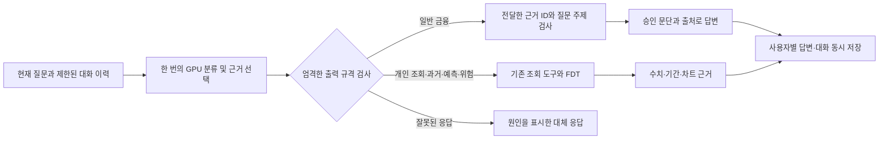

# R21 답변 정확도와 동시 처리 검증

검증일: 2026-09-15. 관련 작업은 S15P21A408-110이며 실제 월말 소비 예측 검증은
S15P21A408-104로 구분한다. [설계](quality-performance-design-r21.md)의 P0/P1 구현이다.

현재 판정: 추론 서버에서 비교한 통합 호출 후보 v1·v2는 각각 알려진 32질문 중 2개가
기존 답변 기준을 충족하지 못해 채택하지 않았다. 기존 R20 v4는 같은 환경에서
다시 확인했다. 후속 v4의 batch size 1 후보는 공개 회귀의 품질·정리 조건을 통과했고
동시 요청 지연도 크게 줄였다. 다만 코드 기본 batch size 0과 중간값 2의 실제 비교, 반복과
미공개 검증이 남아 있다. 이후 새 기준/후보 교차 3쌍은 가용성 576/576을 기록했지만, 마지막
후보에서 독립 검토되지 않은 응답 projection 3개가 발견되어 전체 후보를 불합격 처리했다.
상세 분모·지연·중단 근거는 [통합 후보 불합격 기록](r21-joint-candidate-rejection.md)에 보존했다.
비동기 추론 P2는 실제 감독 환경에 필요한 Python 함수가 없어 실행하지 않았다. 운영 적용·성능
개선 확정 상태가 아니다.

2026-09-16에는 통합 호출 후보와 별개로, 승인된 한 개 금융 개념의 정확한 정의 요청만
카탈로그 문장과 출처로 응답하는 D1 경로를 동결 비교했다. 이 범위에서는 96/96 정형·의미
규격을 통과하고 본문 모델 작업은 0이어서 기본값으로 반영했다. 범위 밖의 질문은 기존
모델·FDT 경로를 유지하며, 자세한 측정 정의와 제외한 주장은
[D1 빠른 경로 기록](deterministic-finance-fast-path-r21.md)에 둔다.

## 1. 바뀐 실행 경로

일반 금융 질문은 기존에 같은 GPU 모델을 두 번 호출했다. 첫 호출이 질문을 분류하고,
두 번째 호출이 승인 금융 자료에서 설명할 근거를 골랐다. 후보는 질문의 분류와 근거 선택을
한 응답으로 받아 이 직렬 의존을 없앤다. 선택된 ID는 기존 근거 검사를 거치고, 기존의 승인
문단·출처로 렌더한다. 모델의 자유 생성 금액이 계좌·예측·차트에 들어가지 않는다.
현재 GPU worker는 JSON Schema를 입력 지시문에 포함하고 서비스가 결과를 엄격히 검사한다.
문법 강제 디코딩이 켜져 있다는 뜻은 아니며, 규격 위반은 실제 응답에서도 집계한다.

명시적인 `analysis.mode=forecast/risk`는 기존처럼 분류를 생략한다. FDT의 계산·기간,
로그인 사용자별 소유권, 멱등성, 오류 상태와 외부 API 응답 계약은 유지한다.
기존 모델 어댑터의 `write/judge/route` 인터페이스도 바꾸지 않았다.

`ModelConfig.combined_dialogue`는 비교 실험용 선택 항목이며 기본값은 `false`다.
원래 경로와 후보를 동일 자료에서 비교할 수 있게 둔다. 후보를 활성화한 GPU 실험과
운영 설정 변경 여부는 별도로 기록한다.

## 2. 구현 검증

처음에는 금융 질문과 맞지 않는 nested 상태를 생성 Schema가 허용하는 문제가 독립 리뷰에서
발견됐다. 이를 `answered/needs_source`로 제한하고 통합 프롬프트를 분리했다.
일반 분류 경로의 프롬프트는 R20 v4와 문자열·해시가 동일하다.

v3 프롬프트와 이후 계측 오류 수정까지 반영한 전체 테스트를 다시 실행해 **911건 통과**를 확인했다.
기존 Starlette 의존성의 deprecation 경고 1건이다.
전체 서비스·테스트 Ruff와 서비스 타입 검사는 통과했다. 신규 계측·판정 테스트 파일도
별도 타입 검사에서 오류·경고가 없다. 독립 코드 리뷰의 지적을 수정 후 재검증했다.

다음 시험은 프로그램 계약 검증이며 실제 GPU 답변 품질과는 다른 근거다.

| 시험 | 확인한 결과 |
| --- | --- |
| 동일 금융 질문의 실제 API 호출 | 기존 2회, 후보 1회; 승인 문장 동일 |
| 같은 멱등성 키 재시도 | 재생성 없이 같은 답변·ID; 내용 변경은 409 |
| 다른 사용자로 세션 조회 | 404, 대화와 답변 미노출 |
| 금융 질문에 미래 기간 객체 혼합 | 422; 세션에 실패한 대화 미저장 |
| 명시적 forecast/risk + 실제 FDT fixture | 분류 0회, 설명 1회; 수치 결과 정상 |
| 잘못된 JSON·중복 키·미승인 ID·모순 상태 | 추가 모델 재시도 없이 거부 |
| 취소·토큰 초과·전송 시간 초과 | 원인 구분, 자원 반환, 다음 요청 정상 |

## 3. 지연 수치의 의미

측정 시작과 끝을 고정해야 호출 감소를 실제 속도 향상으로 판단할 수 있다.

| 항목 | 정확한 범위 | 의미하지 않는 것 |
| --- | --- | --- |
| API 전체 지연 | 메시지 POST 시작부터 마지막 JSON 수신까지 | 사용자 앱·외부 네트워크 지연, 첫 토큰 시간 |
| limiter 대기 | 모델 동시 요청 제한의 획득 대기 | GPU 내부 대기열 전체 |
| token preflight | 실제 토큰 예산 HTTP 사전 검사 왕복 | 문자열 길이 검사만 수행한 시간 |
| generation HTTP | 생성 요청 전송부터 응답 본문 읽기·검증까지 | 순수 GPU 계산 시간 |
| inference total | 모델 호출 진입부터 정리·반환까지 | 라우팅 뒤 도메인 규격 검사·DB 저장 전체 |
| 중앙값 | 요청의 절반이 이 시간 이하에서 완료 | 모든 사용자의 최대 지연 |
| P95 | 이번 요청 표본에서 95% 위치의 지연, 선형 보간 | 장기간 운영의 확정 SLA |

계측에는 임의 요청 UUID, 작업 종류, 시간과 결과 분류만 들어간다. 질문·거래·사용자 ID·
URL·토큰·예외 원문·답변 텍스트는 계측 필드에 없다. `capture_inference_metrics()`를
명시한 범위에서만 수집하며, 기본 실행에서는 clock·UUID 생성과 로그 I/O를 하지 않는다.

`outcome=success`는 전송과 응답 envelope를 받았다는 뜻이다. 이후 도메인 JSON 검사에서
거절될 수 있으므로 답변 정확도·모델 답변 채택률로 집계하지 않는다. 실제 응답의
`status`, `wording_source`, `fallback_reason`, 본문과 출처를 별도로 검사한다.

응답을 받은 뒤 연결 정리에서 예외가 전파되는데도 `success`가 남는 경계 오류를
추가로 재현해 수정했다. 명시적인 실패·시간 초과 분류는 유지하고, 앞서 기록한 성공보다
실제로 전파된 실패·시간 초과·취소를 우선한다. 실제 모델 어댑터의 정리 실패 뒤 다음 요청도
정상 처리됨을 포함해 관련 25개 시험을 통과했다. 기존 GPU 실험의 동결 파일은 바꾸지 않았고,
이 계측 수정과 같은 v3 프롬프트를 포함한 새 빌드를 v4로 구분했다.

## 4. GPU 비교 조건과 독립성

비교 모델은 R20의 고정된 27B NF4이며 가중치를 바꾸거나 새로 학습하지 않는다.
같은 vLLM 0.19 환경, 입력 상한 8,192토큰, worker 배치 상한 4, API 동시성 상한 8,
동시 요청 수 1·4·8에서 비교한다. 토큰 사전검사와 원래 서비스 보존 조건을 유지한다.

기존 32질문은 이미 내용을 보고 수정한 회귀 자료다. 한 실행의 96응답은
32질문을 세 동시성에서 반복한 것이며 96개의 독립 금융 문제로 해석하지 않는다.
기존 수동 검토와 동일한 사례·본문·출처·상태는 해당 검토를 재사용하고, 달라진 응답은
별도 검토 전까지 미판정으로 둔다. 제품이나 FDT가 스스로 맞다고 정한 값을 정답으로 쓰지 않는다.

최초 반복 순서는 후보1 → 기준1 → 기준2 → 후보2 → 후보3 → 기준3으로 고정했으나,
후보1에서 답변 상태 회귀를 발견해 해당 후보의 반복·채택 절차를 중단했다.
기준1 측정과 프롬프트를 수정한 별도 후보 v2의 비교도 완료했다.
서로 다른 프롬프트·worker의 실행을 한 후보의 반복 측정으로 합치지 않는다.

첫 후보의 실제 측정은 다음과 같다. 각 칸은 **중앙값 / P95, 초**이며 동시성마다
동일한 32개 회귀 질문을 한 번씩 요청했다. 기준1은 같은 환경에서 기존 R20 v4를
이번에 다시 실행한 결과다. 비교가 한 번이므로 반복 검증된 개선을 주장하지 않는다.

| 동시 요청 수 | 이번 기준1(R20 v4, batch 4) | R21 v1 후보1 | R21 v2 | R21 v4(batch 4) |
| --- | --- | --- | --- | --- |
| 1 | 2.30 / 2.88 | 2.15 / 2.67 | 2.15 / 2.65 | 2.14 / 2.74 |
| 4 | 11.36 / 15.40 | 12.31 / 13.38 | 11.72 / 14.04 | 10.15 / 16.18 |
| 8 | 18.86 / 27.42 | 13.86 / 25.42 | 13.63 / 24.76 | 13.77 / 25.83 |

기준1의 96응답은 이전에 검토한 R20 v4의 답변 유형·상태·본문·출처·근거와 동일했다.
기준1과 후보1 모두 worker 스모크 73건, 임시 프로세스 종료 및 기존 서비스 식별자
보존을 확인했다. 원문 archive 내부 파일의 SHA-256도 대조했다.

96건 모두 HTTP 200이었지만, 답변 본문·상태를 비교하니 개념만으로 답할 수 있는
2질문에서 추가 자료를 불필요하게 요구했다. 기존 검토와 같은 78응답은 검토를 재사용하고,
달라진 18응답은 AI가 본문을 검토했다. 같은 질문의 세 동시성 응답은 검토 대상 필드의
해시가 일치했다. 결과는 **알려진 32질문 중 30개 통과(반복 응답 90/96)**이며,
인간 전문가 승인 또는 미공개 검증 정확도가 아니다. 동시 4건 중앙값도 악화됐다.
따라서 v1은 채택하지 않았다.

v2는 거짓 일반화를 개념으로 반박할 수 있는 질문, 계산 원리를 묻는 후속 질문과
실제 개인 수치·최신 자료를 요청하는 질문을 구별하도록 일반 지시문을 보완했다.
불필요한 주변 근거를 최대 개수까지 채워 넣지 않도록 했다. 이 수정에는 기존 회귀 질문만
사용했으며 새 600문항은 구현 담당자에게 열지 않았다.

v2의 실제 GPU 결과에서도 **30/32(90/96)**만 기존 기준을 충족했다. 이번에는 앞선
재질문 문제가 해결됐지만, 근거를 줄이는 지시 때문에 복합 질문의 일부가 빠졌다.
현금 부족의 원인과 예산 수정 방법을 함께 물었는데 원인만 설명했고, 대출 원금·이자의
구분과 분할상환 구조를 묻는 질문에서는 분할상환 설명만 남았다. 본문이 짧아졌다는
이유로 이를 개선으로 인정하지 않았다. v2도 채택하지 않았다.

v2는 동시 8건 중앙값이 이번 기준1보다 27.7% 짧았지만 P95 개선은 9.7%에 그쳤다.
원문 96응답 외에 대화 이력 준비 6응답을 포함한 모델 호출은 102회였다.
스모크·정리 검증은 통과했지만 답변 누락과 P95 목표 미달을 가리지 않는다.

v4는 질문의 각 부분에 필요한 정의·원리·주의사항을 선택하도록 보완한 v3 프롬프트와
응답 정리 실패를 바로 집계하는 계측 수정을 포함한다. 96건 HTTP 200, worker 스모크
73건, 원서비스 보존·임시 프로세스 종료를 확인했다. 기존 검토와 같은 응답은 86개이며
달라진 10응답(4질문)은 독립 검토에서 모두 기존 R20 의미 기준을 충족했다. `confirm03`의
분산 설명과 `dev15`의 ETF 정의는 오류는 아니지만 필요한 정보보다 길어 별도 간결성 개선
대상으로 남긴다. 이 검토는 공개된 회귀 질문의 의미 판정이며, 새 질문 일반화·인간 전문가
승인·실제 고객 금융 예측 정확도를 뜻하지 않는다. v3 빌드 자체는 GPU에서 실행하지 않았다.

v4의 동시 8건 중앙값은 기준1보다 26.98% 줄었지만 P95 개선은 5.79%이고, 동시 4건
P95는 5.07% 늘었다. 호출 수 감소만으로 최적화를 채택할 수 없는 결과다.
동시 8건의 limiter 대기 중앙값은 0.040ms, 토큰 사전검사는 19.52ms,
generation HTTP는 13,714.05ms였다. 현재 병목은 API 입장 제한보다 생성 요청의
왕복 구간에 집중되어 있다. 이 구간에는 worker 대기·토큰화·GPU 계산·응답 검증이
포함되므로 전부 GPU 계산 시간으로 해석하지 않는다.

워밍업을 포함한 v4의 112개 생성 요청은 76배치로 처리됐다. 배치 크기 1·2·3·4의
실행 시간 중앙값은 각각 1.95·8.87·10.97·11.26초다. 질문·길이·동시성이 서로 달라
이 통계만으로 큰 배치가 원인이라고 확정할 수 없다. 같은 질문·모델·후보에서 배치 상한만
변경하는 별도 비교가 필요하며, VRAM 여유만 보고 배치를 키우지 않는다.

그 별도 비교에서 v4의 batch size만 4에서 1로 바꾼 B1은 공개 회귀의 **96/96 의미
판정 승계**을 통과했다. 96/96 HTTP 200, 스모크 73건, 요청 계측 102/102 결속,
원서비스 식별자 보존과 임시 자식 종료도 확인했다. B1은 v4와 같은 인덱스의 95개 응답이
같았고, 나머지 `confirm04` 한 응답은 v4의 다른 동시성에서 이미 통과한 본문과 같았다.
달라진 9개 응답도 v4에서 독립 검토를 통과한 본문·상태·출처·근거 projection과 바이트 단위로
같았다.

| 동시 요청 수 | v4 batch 4 | B1 batch 1 | B1의 v4 대비 변화 |
| --- | --- | --- | --- |
| 1 | 2.14 / 2.74초 | 2.16 / 2.81초 | 중앙값 +0.98%, P95 +2.72% |
| 4 | 10.15 / 16.18초 | 5.21 / 9.06초 | 중앙값 -48.62%, P95 -43.99% |
| 8 | 13.77 / 25.83초 | 9.24 / 16.88초 | 중앙값 -32.86%, P95 -34.65% |

여기서 B1은 batch 4와의 단일 변수 비교다. 반면 제품 코드의 기본값은 `COACH_GPU_BATCH_SIZE=0`이며,
이 값은 batch dispatcher를 사용하지 않고 worker의 동시 요청 제한도 다르게 적용한다. 따라서
현재 수치만으로 B1이 기본 운영값보다 빠르다고 말할 수 없다. 기본값 0과 중간값 2를 같은
조건에서 별도로 재측정하고, 선택 후보와 기준을 교차 반복해야 한다.

P2 비교는 **기존 R20 v4 API를 그대로 두고 비동기 GPU 엔진만 변경하는 방식**으로 설계했다.
원래 답변 경로와 추론 스케줄러 변경의 효과를 분리한다. P1의 설명 누락을 보완한 v3는
별도 후보로 동결했으며, P2 기준 비교에는 섞지 않는다. 비동기 후보의 CPU 14개 검증과
독립 코드 리뷰는 통과했으나 실제 GPU 초기화·요청 취소·자식 프로세스 정리·속도는
GPU 스모크와 비교 실행의 결과로 판단해야 한다.

P2는 총 입장 슬롯 16개 중 최대 4개를 생성에 사용한다(대기만 16개라는 뜻이 아니다).
같은 가중치·토큰화·입출력 한계·prefix cache 해제를 유지하되, 외부 묶음의 padding
토큰 상한 16,384를 없애고 vLLM의 iteration 토큰 상한 8,192와 생성 동시성으로
제어한다. 두 상한의 의미가 같지 않으므로 이를 동일한 메모리 제약이라고 표현하지 않는다.
추가 EngineCore 프로세스의 소유·장치·종료와 실제 최대 VRAM을 따로 검증한다.

모델을 실행하는 고정 Linux Python 3.12.6에는 `os.pidfd_open`과
`signal.pidfd_send_signal`이 모두 없어 CPU 사전검사가 중단됐다. 필요한 Python 함수가
없다는 것을 확인한 것이며, 커널이 기능을 지원하지 않거나 GPU가 고장났다고 확인한 것은 아니다.
임시 프로세스의 정확한 식별자를 파일 디스크립터로 붙잡는 검증이 실행되지 않았으므로
이 검사로 P2 GPU 시험을 진행하지 않았다. PID 번호로만 종료하는 대체 처리는 넣지 않았다.
모델·서비스 의존성 import와 검증 소스의 소유·읽기 권한은 확인했다.
프로세스 도구·실행 연결 코드의 독립 검토 통과와 실제 서버에서의 실행 가능성을 구분한다.
이후 실제 실행 경계를 대조해 별도 감독 Python도 확인했다. 실행기의 감독 인터프리터와
검증한 경로가 같음을 대조했고, 그 환경에서도 두 함수가 모두 없었다. 따라서 기존
Python API를 사용하는 P2 경로는 차단 상태다. 이 검사는 커널 호출 전에 끝났으며
보고서의 `blocked 13`은 도구의 상태 코드이지 Linux 권한 오류 번호가 아니다.
네이티브 함수 제공자의 가능성은 별도 비공개 CPU 시제품으로 조사하며, 실제 CPU 검증과
독립 리뷰 전에는 GPU 실행이나 프로세스 제어 경로에 연결하지 않는다.

GPU 실행 전에는 검증용 도구도 재검토했다. HTTP 스모크의 주소를 정확한 로컬 IP와
허용 포트로 제한해 인증값이 잘못된 외부 주소로 전송되는 경우를 막았다. 관련 CPU
15건이 통과했다. 실제 TCP를 사용하는 CPU 시험에서는 요청 취소, 다른 요청과 후속
요청의 정상 완료, 해당 요청의 중단과 슬롯 반환을 확인했다. 향후 GPU 스모크가
클라이언트 요청 겹침과 정상 응답만 관찰한다면, 서버 내부 중단·슬롯 반환까지
직접 관찰했다고 확대하지 않는다.

P2의 첫 결과를 보기 전에 검증 순서를 고정했다. 초기 스모크·32질문 파일럿의
안전성과 답변 기준을 통과한 뒤, 새로 **후보→기준 / 기준→후보 / 후보→기준**을
실행한다. 기존 기준1과 파일럿은 이 세 반복에 포함하지 않는다. 각 반복에서 동시 8건의
중앙값과 P95가 모두 20% 이상 줄고, 동시 1·4건의 중앙값과 P95는 각각 5%를 넘게
악화되지 않아야 반복 성능 기준 통과로 판단한다. 현재는 실행 전 기준이며 달성 결과가 아니다.
단발 결과, 짧은 부하 시험과 장기간 운영 SLA도 구분한다.

새 검증 자료는 별도 담당 AI가 작성하고, 구현 담당자는 튜닝 중 문제와 정답을 열지 않는다.
600문항은 120문제 가족·60작성 틀에 속하며 같은 승인 자료 27개를 공유한다.
가족별 재표집도 이 합성 프레임에 조건부인 분석이다. 이를 600개 또는 120개의
독립 실사용자 금융 문제로 해석하지 않는다. 같은 승인 자료에 기반한 검증의 순환성도 남는다.
자동으로 확인 가능한 경로·상태·자료 참조·형식과 인간의 금융 의미 검토를 분리한다.
인간 미심사는 오답 0점이나 승인으로 바꾸지 않고 미심사로 표시한다.
이는 독립 인간 전문가의 금융 정답 승인이나 실제 고객의 미래 예측 검증을 대체하지 못한다.

평가기 독립 리뷰에서는 동결된 문항과 무관한 점수 행이나 문자열 `"false"`를
정상 점수로 받아들이는 결함도 발견해 수정했다. 실제 문항 600개의 ID·분류 메타데이터,
문항 파일 해시, 엄격한 Boolean 타입과 행별 결과·집계를 함께 대조한다.
검증 자료와 평가 도구는 응답 수집 전에 동결하며, 이 리뷰 통과는 **평가 준비 완료**이지
후보 모델이 600문항을 통과했다는 뜻이 아니다.

## 5. 재현 자료와 적용 범위

실행 코드는 `src/coaching_service`, 자동 회귀는 `tests`, 설명은 `docs`에 둔다.
GPU 원문 응답·세션·로컬 실행기·빌드 결과는 별도 비공개 연구 폴더와 git-ignored
`artifacts`에 보관한다. 프런트엔드·백엔드 담당자 코드는 이 변경에 포함하지 않는다.

| 증거 | SHA-256 |
| --- | --- |
| R20 v4 기준 wheel | `7940a668beb6b920d6f89848deb1a340b7232a939ffeac56dcce2953c0e34d7e` |
| R21 v1 후보 wheel | `553be6f4ac666af6dad4a0798a81dd856368cc926f60cfb912c43b5497ccd53e` |
| 후보 동결 manifest | `44c0fd5e13fb6c790845f6bf04bdd60ca65fa7215caf9459b7b6fdfbea27b017` |
| R21 v1 후보1 GPU 원문 archive | `8eb810eea3e78eccc53e9bbf16fda66730ded807d4e7a9429fba86fbf6dc1f58` |
| 이번 기준1 GPU 원문 archive | `fd701ff197a679b2e7fa4be98934ba6eb5fe2a97c56de786629bf8ebc9a77ea5` |
| R21 v2 후보 wheel | `7b0be72ea39e78e21cc71924ceb3f264733df3c2b4f55b4423d90e3a7764432a` |
| R21 v2 동결 manifest | `191eda91d4fca114475bd37a1bba2a38a2b8f7f231878f3bf663081773d716b4` |
| R21 v2 GPU 원문 archive | `2b7086e7d846ac3341e323790cb52536c737d67d91a6ab68ed55ac610aebad0d` |
| R21 v3 후보 wheel | `b808d913b11971c982cac8e5cafa251805c5ab70d154c2518526ad8da1f258b1` |
| v3 프롬프트·계측 수정 v4 wheel | `93f509276c3982490ac1e6b5893317c071cb9b4243e491b3b583fcba46840a87` |
| v4 동결 manifest | `8dff9c4f794c41d2f03849bb0c735e78b79d95ffc2bb7be9bb1f1dcfbcd50284` |
| R21 v4 GPU 원문 archive | `e0b92e0e9468717a3941f0bf4b98e99092c65ec45702ed002a2177f4d588e79d` |
| R21 v4 batch 1 GPU 원문 archive | `7dfb5a2d037a49b6d3505cff8c4504caf36f3ae7305d9a0baff404ab651ad7d4` |
| R21 v4 batch 1 최종 검증 기록 | `b790efc50a5de21a51335f83a99a5d9898ceb108bbf2583a68f00df1fa7b79e1` |
| P2 기존 API 결속 runtime 동결 manifest | `854ae0fd68dc35bc653ef1bfbbd407420e1c8755167ec53aa115723cf97d997f` |
| P2 실행 순서·반복 판정 사전 기록 | `431931c6f95dabefdad7ea4efe49f7382ca1e48cd66d655cecd652e275f8d758` |
| 미공개 600문항·평가기 동결 manifest | `9b99ff3b5a776ad3cae2ac61eb109d0d57633167f2e1aef4c4450075987633c3` |
| 600문항 runtime 비교 실행기 동결 manifest | `fb9f70f16db3fab5808f8c30e00a77b9f06b9db42454ee099d075d656a58d797` |
| 원격 Python 기능 확인 원문 wire | `681a49ee82affea988ea51a82b306caff38df00a7ad6de16dc9666e1662f9fd6` |
| 실제 감독 Python 기능 확인 원문 wire | `e6d5b550b641e49bb97dd5bb004848c57e65de4e02c94557482a9e54a962e3b9` |
| 계측 수정 포함 전체 911건 테스트 원문 | `09c7d778245607c585ed46444babecd597d23809ba05385da6df80cdb95a6452` |

실제 월말 소비·잔액 예측을 높였다는 주장은 이번 호출 최적화의 결과에 포함하지 않는다.
당시 입력과 예측을 고정해 저장하고 나중에 확정된 거래·잔액과 비교하는
[실고객 검증 절차](real-customer-validation.md)는 계속 필요하다.
