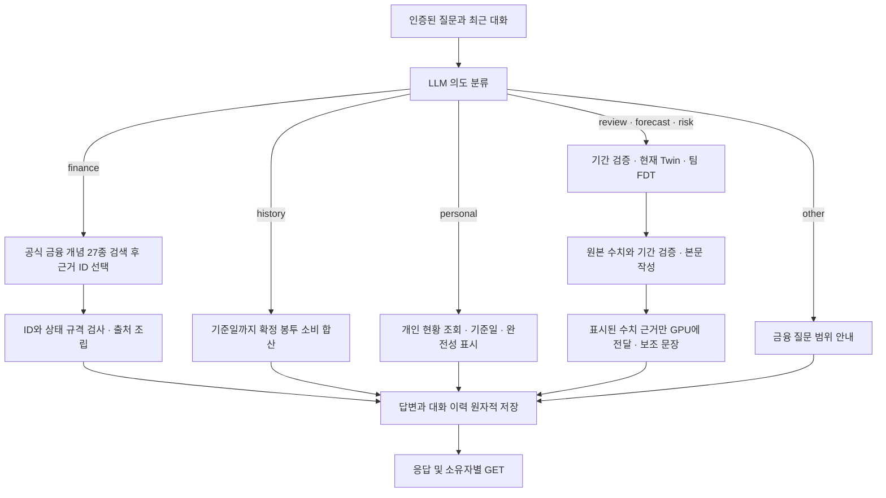

# 금융 질문·소비 조회·예측 대화 API

일반 금융 개념은 거래 연결이나 이전 코칭 없이 질문할 수 있습니다. 개인 소비 조회는 연결된 확정 거래를 합산하고, 미래 질문은 기존 팀 FDT를 호출합니다. 세 경로의 응답 근거와 상태를 구분해 표시해야 합니다.

## 클라이언트 호출

모든 경로는 기존 사용자 인증을 적용합니다. POST에는 `Idempotency-Key`가 필요합니다. 같은 키·본문의 재전송은 저장된 결과를 반환하며, 다른 본문으로 키를 재사용하면 409입니다.

| 목적 | 요청 | 응답·재조회 |
| --- | --- | --- |
| 금융 개념 단건 | `POST /v1/finance/questions`에 `{"question":"복리가 뭐야?"}` | `ChatAnswer`; `GET /v1/answers/{id}` |
| 먼저 대화 시작 | `POST /v1/sessions`에 `{}` | `Session`; `coaching_id=null` 허용 |
| 기존 코칭에서 시작 | `POST /v1/sessions`에 `{"coaching_id":"기존 ID"}` | 기존 소유자 검사 유지 |
| 이어서 질문 | `POST /v1/sessions/{id}/messages`에 `{"question":"이번 달 내 지출은 얼마야?"}` | `ChatAnswer` 또는 기존 `Coaching` |
| 예측 질문 | 같은 메시지 API에 `{"question":"이번 달 말까지 잔액 예측해줘"}` | `Coaching`; `GET /v1/coaching/{id}` |
| 대화 이력 | `GET /v1/sessions/{id}` | 전달된 질문·답변 원문; 다른 사용자는 조회 불가 |

**메시지 응답이 이제 두 형식입니다.** 클라이언트가 모든 응답에 `receipt`가 있다고 가정하면 수정해야 합니다. `answer_type`이 있으면 `ChatAnswer`, `receipt`가 있으면 기존 `Coaching`으로 처리합니다. 기존 코칭·차트의 응답 필드는 유지했습니다. 최신 스키마는 실행 중인 `/docs`와 `routes.py`, `chat_answers.py`에 있습니다.

`ChatAnswer`는 `id`, `answer_type`, `status`, `text`, `wording_source`, `model`, `fallback_reason`, `evidence`, `created_at`을 반환합니다.

새로 저장되는 assistant 메시지는 `response: {"kind":"chat" 또는 "coaching", "id":"원본 답변 ID"}`도 보존합니다. `chat`은 `/v1/answers/{id}`, `coaching`은 `/v1/coaching/{id}`로 조회해 재접속 후에도 출처·자료 상태·예측 기간을 복원합니다. 참조와 원본 답변은 같은 트랜잭션에 저장되며 각 GET은 같은 소유자 검사에 따릅니다. 사용자 메시지의 참조는 허용하지 않습니다. 이전 버전에 저장한 메시지는 `response=null`이며 본문에서 원본 ID를 추측하지 않습니다.

| 상태 | 화면에서 해석할 뜻 |
| --- | --- |
| `answered` | 해당 경로가 답변을 만들었음. 질문 해결의 독립 심사나 예측 정확도 점수가 아님 |
| `needs_source` | 등록 근거가 없거나 최신 상품·금리·규정 확인이 필요함 |
| `needs_data` | 개인 자료가 없거나 조회 결과를 확정할 자료가 부족함 |
| `needs_clarification` | 과거 소비 질문의 기간·필터 문법을 지원하지 않음; 임의 조건으로 합산하지 않음 |
| `out_of_scope` | 금융 외 질문 |
| `unavailable` | 모델 실패 또는 근거 선택 규격 위반; 실제 원인은 `fallback_reason` 확인 |

`wording_source=llm`인 금융 개념 응답은 LLM이 허용된 근거 ID를 선택했고 서버가 설명과 출처를 조립했다는 뜻입니다. `engine`인 소비 조회는 확정 원장 집계입니다. `template`은 실패·범위·자료 안내입니다. HTTP 200, 근거 ID의 유효성, 질문을 해결한 비율은 각각 따로 집계합니다.

## 현재 지원 범위

일반 개념은 [공식 자료 27종을 검색](knowledge-retrieval.md)해 이번 질문에 필요한 최대 8개를 GPU에 전달하고, 모델이 최대 3개 근거 ID를 선택합니다. 버전·출처·재검토 기한을 검사하고 이번 입력에 없던 ID의 채택을 막습니다. **실시간 웹 검색이나 모든 금융 주제에 답하는 챗봇은 아닙니다.** 최신 금리·대출 한도·개인 상품 추천·미지원 개념은 자료 보완 경로로 안내합니다. 검색된 자료 중 의미상 잘못 선택하는 오류까지 규격 검사가 모두 막지는 못합니다.

소비 조회는 오늘·어제·이번 달·지난달·현재까지와 7봉투 범주를 지원합니다. 예를 들어 “이번 달 내 지출은 얼마야?”는 **Twin 기준일이 속한 달의 1일부터 기준일 마감까지** 연결된 확정 봉투 소비를 합산합니다. 서버 시계의 오늘이나 미래 예측값을 쓰지 않습니다. 취소·미확정·제외 거래, 고정비, 본인계좌 이체, 카드대금 정산, 현금 인출, 대출 상환은 이 집계에 포함하지 않습니다. 제삼자 이체형 소비는 원 엔진의 봉투 매핑을 따릅니다.

`coverage=unknown`은 전체 계좌·월 전체의 거래 수집 완전성을 확인하지 못했다는 뜻입니다. 관측이 없으면 0원으로 단정하지 않습니다. 가맹점·결제수단·제외 조건·여러 기간 비교 등 미지원 필터가 있으면 `needs_clarification`으로 반환합니다.

확정 소비 이력 조회는 봉투 소비에 한정합니다. 계좌·자산·부채·예정 결제는 기존 Twin의 snapshot, 보험·등록 소득·고정비·목표는 인증된 백엔드의 개인 현황 자료를 조회하는 `personal` 경로로 분리합니다. [개인 현황 계약](personal-context.md)에 지원 범위와 결측·불완전 자료의 표시를 설명합니다. 실제 연동 없이 개인 금액을 추정해 답하지 않습니다.

구조화된 `period`는 **미래 예측 기간** 계약입니다. `finance`·`history`·`personal`·`other` 의도에 이를 주고 명시적 `analysis`가 없으면 `422 period_not_supported_for_intent`로 거절합니다. 과거 소비 필터로 해석하거나 조용히 무시하지 않습니다. 명시적 `analysis`는 일반 의도 분기보다 우선하며 기존 금융 계산·기간 검사를 받습니다.

## 처리 구조

금융 개념 단건 API는 의도 분류 단계를 생략하고 바로 근거 선택을 호출합니다. 대화 의도 분류는 최근 4개 메시지를 각각 최대 800글자까지 사용하고, 예측 보조 문장은 최근 2개 메시지를 사용합니다. 저장된 전체 이력과 원본 receipt는 줄이지 않습니다. 세션은 24시간, 최대 20회 질문·답변의 기존 제한을 유지합니다.

월말 예측의 중복 JSON을 보조 작성기에 다시 보내던 경로는 수정했습니다. 숫자는 먼저 검증해 본문에 표시하고, GPU에는 그 표시 내용을 한 번만 전달합니다. 실제 토크나이저의 입력 한도 검사를 계속 적용합니다. 큰 원본의 기존 불완전 근거 차단과 잘못된 수치·보장 문구의 거절도 유지합니다.

실제 GPU 비교, 지연, 회귀 증거와 Jira 잔여 작업은 [응답 검증 보고서](chat-response-validation.md)에 있습니다.
